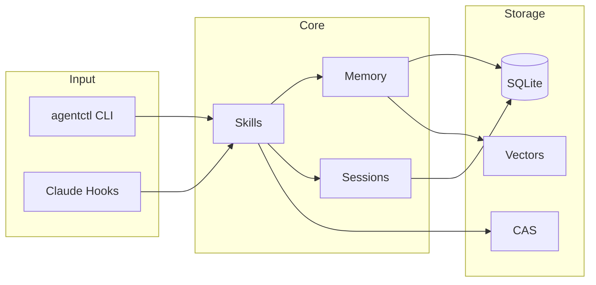

# AGENTS.md — AI Assistant Guide

**Target Audience:** AI coding assistants (Claude, Cursor, Copilot) and human
contributors

---

## Quick Links

| Resource                                           | Purpose                                          |
| -------------------------------------------------- | ------------------------------------------------ |
| [README.md](README.md)                             | Overview, quick start                            |
| [.claude/CLAUDE.md](.claude/CLAUDE.md)             | Claude Code hooks, commands, environment         |
| [docs/general/](docs/general/)                     | Detailed documentation                           |
| [docs/general/gotchas.md](docs/general/gotchas.md) | Common pitfalls                                  |
| [docs/codemaps/](docs/codemaps/)                   | Codemap documentation (**GREAT PLACE TO START**) |

---

## TL;DR

1. **Start with a tree** — `agentctl run code/semantic_search --input '{"query": "your task", "format": "tree"}'`
2. **Envelope contract is sacred** — never change `meta.*` fields without spec
   updates
3. **WASI = `network:"none"`** — Core v1 mandates isolation
4. **Large outputs → CAS** — use `data.summary` + `data.artifact`
5. **Check gotchas first** — read
   [docs/general/gotchas.md](docs/general/gotchas.md)
6. **`--dry-run` required** for state-changing commands

---

## Architecture Overview



**Detailed docs:** [docs/general/architecture.md](docs/general/architecture.md)

---

## Getting Oriented (Session Start / Post-Compaction)

Use the semantic tree to understand the codebase structure:

```bash
# Full repo tree with LLM-generated file summaries
agentctl run code/semantic_search --input '{"format": "tree"}'

# Focused tree for your task (recommended)
agentctl run code/semantic_search --input '{"query": "storage memory", "format": "tree", "limit": 25}'
```

**Output includes:**
- Hierarchical directory structure with relevance scores
- LLM-generated summaries for each file (via Devstral)
- Root summary synthesizing the codebase area

**Tree options:**
- `tree_depth: 0` — unlimited depth (default: 2)
- `tree_max_children: 50` — max items per directory
- `tree_include_summaries: false` — disable summaries for faster output

---

## Branching & PR Workflow

1. **Create branch** from `main`
2. **Open PR** — never push directly to `main`
3. **CI must pass** — lint, vet, tests, race
4. **Approval required** — at least one human
5. **Squash merge** to main

```bash
# Standard workflow
git checkout -b feat/my-feature
# ... make changes ...
make check  # fmt, lint, vet, test
git push -u origin feat/my-feature
gh pr create
```

---

## Key Conventions

### JSON Envelopes

All I/O uses canonical envelopes:

```json
{
  "version": 1,
  "status": "ok",
  "command": "skill/name",
  "data": { ... },
  "meta": { "ts": "2026-01-12T12:00:00Z" },
  "error": {}
}
```

- `meta.ts` **MUST** be present (RFC3339 UTC)
- `status:"ok"` → `error` fields empty
- `status:"error"` → `error.code` and `error.message` required
- **stdout** = envelopes only, **stderr** = logs only

### Large Outputs

Use CAS for large results:

```json
{
  "data": {
    "summary": "Brief description (≤2KB)",
    "artifact": "sha256:abc123..."
  }
}
```

### Security

- **WASI**: `network:"none"` (no exceptions)
- **Exec**: workspace-confined, rlimits enforced
- **Paths**: must go through `policy.PathValidator`
- **Secrets**: mount at `/run/secrets/<name>`, redact in logs

---

## Engineering Principles

These principles keep agentctl **safe, deterministic, and testable**.

| Principle             | Rule                                                         | Why                                             |
| --------------------- | ------------------------------------------------------------ | ----------------------------------------------- |
| **Functional Core**   | Business logic = pure functions (no IO, env, clock, globals) | Unit tests stay fast; behavior is deterministic |
| **Imperative Shell**  | IO + wiring in thin shell only                               | Isolates effects; skills can swap runtimes      |
| **Plan/Apply**        | State changes split into `Plan() → Apply()`                  | Enables `--dry-run`; safer refactors            |
| **Explicit Deps**     | Inject clock/UUID/config as parameters                       | Reproducible tests; stable golden files         |
| **Boundary Parsing**  | Validate envelopes at edge; domain types inside              | No stringly-typed bugs in core                  |
| **Context Threading** | `context.Context` through all calls                          | Clean cancellation; timeout safety              |

### Preferred Shape

```go
// Core (functional) - pure, testable
func Plan(input DomainInput) (Plan, error) {
    // Business logic only - no IO, no time.Now(), no env reads
}

// Shell (imperative) - IO lives here
func Apply(ctx context.Context, deps Dependencies, plan Plan) (Result, error) {
    // Perform effects: DB writes, file ops, network calls
}
```

### Dependency Direction

```
skills/ → internal/adapters/skillslib/ → internal/platform/
              ↓ (never reverse)
        internal/domain/  ← pure, no IO imports
```

- Core/domain packages must NOT import `os`, `database/sql`, or adapter packages
- Envelope/transport types stay at boundaries, domain types inside

---

## Testing Requirements

```bash
make test        # Unit tests
make test-race   # Race detection
make lint        # golangci-lint
make check       # All of the above
```

- New features need unit + golden tests
- Coverage target: 85%
- Golden files in `testdata/*.json`
- **Determinism:** Golden tests must be reproducible
  - Sort keys/arrays in output
  - Inject timestamps via clock interface (no `time.Now()` in core)
  - Use stable IDs or inject UUID generator
- Prefer testing the **functional core** with table-driven tests (no IO)
- Use fakes/adapters for shell tests; keep integration tests focused

---

## Hard Fails (AUTO-REJECT)

| Pattern                                                         | Why                          |
| --------------------------------------------------------------- | ---------------------------- |
| Changing `meta.*` or envelope fields                            | Wire contract break          |
| `network:` not `"none"` in WASI manifest                        | Core v1 isolation            |
| Non-JSON stdout from CLI/skills                                 | Envelopes-only forever       |
| Missing `--dry-run` on state-changing cmd                       | Safety valve                 |
| CGO build without `-tags=libsqlite3`                            | Duplicate SQLite symbols     |
| IO mixed into core logic (time.Now, env reads, DB in pure func) | Untestable; nondeterministic |

### Code Smells (Flag in Review)

These aren't auto-reject but should be called out:

| Smell                                                  | Why It Matters                            |
| ------------------------------------------------------ | ----------------------------------------- |
| `time.Now()`, `rand`, UUID generation in core logic    | Breaks determinism; use injected deps     |
| `map[string]any` deep in domain logic                  | Stringly-typed bugs; parse at boundary    |
| Core packages importing `os`, `database/sql`, adapters | Architecture violation; invert dependency |
| Non-deterministic output ordering                      | Flaky golden tests; sort before emit      |
| Unbounded goroutines / missing `ctx` cancellation      | Resource leaks; hang on shutdown          |
| Giant in-memory buffers when CAS exists                | OOM risk; stream to CAS                   |

---

## Code Intelligence Tools

Use these skills for code exploration, search, and analysis.

### Quick Reference

| Task                      | Skill                  | Example                                            |
| ------------------------- | ---------------------- | -------------------------------------------------- |
| Find code semantically    | `code/semantic_search` | `--input '{"query": "auth middleware"}'`           |
| Search + extract snippets | `code/smart_search`    | `--input '{"query": "error handling"}'`            |
| Extract from known files  | `code/snippet_extract` | `--input '{"query": "...", "candidates": [...]}'`  |
| Get stored codemap        | `codemap/get`          | `--input '{"id": "01KES..."}'`                     |
| Generate new codemap      | `codemap/generate`     | `--input '{"query": "trace auth flow"}'`           |
| Full function bodies      | `code/context_ripgrep` | `--input '{"pattern": "func.*Auth", "path": "."}'` |

### code/semantic_search — Vector Search

Find code by meaning, not just text matching.

```bash
# Basic search
agentctl run code/semantic_search --input '{"query": "database connection pooling"}'

# With scope filter (symbols, sessions, memory, codemaps)
agentctl run code/semantic_search --input '{"query": "auth", "scopes": ["symbols"]}'

# Limit results
agentctl run code/semantic_search --input '{"query": "error handling", "limit": 5}'
```

**Output:** Ranked candidates with `path`, `symbol`, `line`, `score`.

### code/smart_search — End-to-End Search

Auto-generates candidates from indexes, then extracts relevant snippets. Use
when you don't have specific files.

```bash
# Find and extract code about a topic
agentctl run code/smart_search --input '{"query": "how does session restore work"}'

# With file pattern filter
agentctl run code/smart_search --input '{"query": "error types", "glob": "*.go"}'
```

**Output:** Extracted snippets with full context (function bodies, surrounding
code).

### code/snippet_extract — Extract from Known Files

Use when you already have candidate files (from semantic_search or manual list).

```bash
# Extract snippets from specific candidates
agentctl run code/snippet_extract --input '{
  "query": "authentication logic",
  "candidates": [
    {"path": "internal/auth/handler.go", "line": 45},
    {"path": "internal/auth/middleware.go", "line": 12}
  ]
}'

# With masked mode (structure only)
agentctl run code/snippet_extract --input '{
  "query": "API endpoints",
  "candidates": [{"path": "cmd/server/routes.go"}],
  "mode": "masked"
}'
```

**Modes:** `snippets` (default), `masked` (structure), `flow` (control flow).

### codemap/get — Retrieve Stored Codemap

Fetch a previously generated codemap by ID.

```bash
# Get full codemap with traces
agentctl run codemap/get --input '{"id": "01KES88RGGVWG0T33WY7NH3AFR"}'

# List available codemaps first
agentctl run codemap/list --input '{"limit": 10}'
```

**Output:** Full codemap with traces, mermaid diagrams, annotations, file
references.

### codemap/generate — AI-Powered Code Mapping

Generate semantic code traces using an AI agent.

```bash
# Generate codemap for a topic
agentctl run codemap/generate --input '{"query": "trace the authentication flow"}'

# With workspace scope
agentctl run codemap/generate --input '{
  "query": "how does session management work",
  "workspace": "/path/to/repo"
}'
```

**Output:** Structured codemap with multiple traces, each containing ASCII
trees, mermaid diagrams, and annotated code paths.

### code/context_ripgrep — Full Function Bodies

Search patterns and return complete surrounding blocks (functions, methods,
classes).

```bash
# Find functions matching pattern
agentctl run code/context_ripgrep --input '{"pattern": "func.*Handle", "path": "."}'

# With file type filter
agentctl run code/context_ripgrep --input '{
  "pattern": "class.*Service",
  "path": "src/",
  "glob": "*.py"
}'
```

**Output:** Full function/method bodies containing the match, not just the
matching line.

### Pipeline Pattern

Chain tools for comprehensive code understanding:

```
semantic_search → snippet_extract → counsel
   "where"           "what"          "meaning"
```

```bash
# 1. Find candidates
agentctl run code/semantic_search --input '{"query": "error handling"}' > candidates.json

# 2. Extract snippets
agentctl run code/snippet_extract --input "$(cat candidates.json | jq '{query: "error handling", candidates: .data.results}')"

# 3. Or use smart_search for steps 1+2 combined
agentctl run code/smart_search --input '{"query": "error handling"}'
```

---

## Common Tasks

### Adding a Skill

1. Create `skills/my_skill/` with `main.go` and `skill.yaml`
2. Implement with JSON envelope I/O
3. Add `config.LoadDotEnv()` if using API keys
4. Build:
   `CGO_ENABLED=0 go build -o ~/.agentctl/skills/my/skill/bin ./skills/my_skill`

**Detailed docs:** [docs/general/skills.md](docs/general/skills.md)

### Adding a Hook

1. Create script in `configs/hooks/`
2. Register in `.claude/settings.json`
3. Output context injection text (or nothing)

**Detailed docs:** [docs/general/hooks.md](docs/general/hooks.md)

### Working with Memory

```bash
agentctl memory put --name "gotcha-x" --type "gotcha" --summary "..."
agentctl memory search "query"
```

**Detailed docs:** [docs/general/memory.md](docs/general/memory.md)

---

## Error Codes

```
EARG, ERUNTIME, EPOLICY, ENOTFOUND, ETIMEOUT, EPARSE,
EENVELOPE, EIO, ECANCELED, ECACHE_MISS
```

Always include `data.hint` to help users fix the problem.

---

## Quick Reference

```yaml
Project: agentctl
Language: Go 1.24+ (CGO off by default)
CLI: Cobra + Viper
I/O: JSON envelopes (version: 1)
  Storage: SQLite + CAS (~/.agentctl/)
  Runners: Exec (default), WASI (isolated)
  Lint: golangci-lint + gofumpt
  Tests: go test ./... -race
```

---

## Detailed Documentation

| Topic        | Document                                                     |
| ------------ | ------------------------------------------------------------ |
| Architecture | [docs/general/architecture.md](docs/general/architecture.md) |
| Skills       | [docs/general/skills.md](docs/general/skills.md)             |
| Hooks        | [docs/general/hooks.md](docs/general/hooks.md)               |
| Memory       | [docs/general/memory.md](docs/general/memory.md)             |
| Sessions     | [docs/general/sessions.md](docs/general/sessions.md)         |
| Storage      | [docs/general/storage.md](docs/general/storage.md)           |
| Gotchas      | [docs/general/gotchas.md](docs/general/gotchas.md)           |

---

**You are here to help us ship a safe, deterministic CLI.** Prefer small,
well-tested changes; when in doubt, ask for a human decision.
