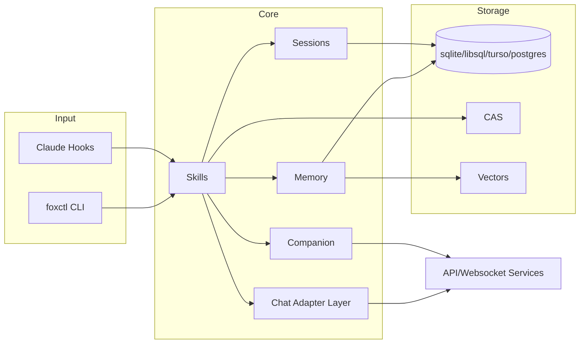

---
vault_refs:
  - notes/repo/foxctl/platform-and-web.md
  - notes/repo/foxctl/semantic-and-memory.md
  - notes/repo/foxctl/skills-runtime-wiring.md
  - notes/repo/foxctl/index.md
  - 00-home/index.md
---

# AGENTS.md — AI Assistant Guide

**Target Audience:** AI coding assistants (Claude, Cursor, Copilot) and human
contributors

---

## Quick Links

| Resource                                           | Purpose                                          |
| -------------------------------------------------- | ------------------------------------------------ |
| [README.md](README.md)                             | Overview, quick start                            |
| [CONTEXT.md](CONTEXT.md)                           | Short root domain vocabulary for foxctl agents and operators |
| [docs/README.md](docs/README.md)                   | Canonical documentation map                      |
| [docs/glossary.md](docs/glossary.md)               | Foxctl terminology and naming rules              |
| [docs/DOC_LIFECYCLE.md](docs/DOC_LIFECYCLE.md)     | Documentation lifecycle policy                   |
| [docs/start/README.md](docs/start/README.md)       | Fast orientation guides                          |
| [docs/architecture/package-topology.md](docs/architecture/package-topology.md) | Canonical `internal/*` package placement map |
| [CLAUDE.md](CLAUDE.md)                           | Compatibility symlink to this canonical agent guide |
| [docs/general/](docs/general/)                     | Detailed documentation                           |
| [docs/general/repoindex.md](docs/general/repoindex.md) | Repo graph index terminology and command reference |
| [docs/architecture/](docs/architecture/)           | Current architecture overviews (runtime + storage + adapters) |
| [docs/general/gotchas.md](docs/general/gotchas.md) | Common pitfalls                                  |
| [docs/codemaps/](docs/codemaps/)                   | Generated codemap artifacts and notes            |
| [docs/guides/kubernetes.md](docs/guides/kubernetes.md) | Kubernetes deployment guide                      |
| [deploy/kubernetes/](deploy/kubernetes/)           | Kubernetes manifests and overlays                |
| [docs/spec/agent_hierarchy.md](docs/spec/agent_hierarchy.md) | Subagent hierarchy and spawn protocol   |
| [docs/spec/overseer_profile.md](docs/spec/overseer_profile.md) | Overseer coordination profile |
| [docs/spec/v1/agent_profile_v1.md](docs/spec/v1/agent_profile_v1.md) | Multi-agent profile specification |
| [docs/architecture/chat-platform-adapter.md](docs/architecture/chat-platform-adapter.md) | Chat adapter runtime architecture (current) |
| [docs/architecture/kubernetes-runtime.md](docs/architecture/kubernetes-runtime.md) | Kubernetes runtime architecture (current) |
| [docs/architecture/postgres-storage.md](docs/architecture/postgres-storage.md) | PostgreSQL + CAS storage architecture |
| [docs/architecture/context-architecture.md](docs/architecture/context-architecture.md) | ContextWiki dual-plane context + Obsidian knowledge layer |
| [docs/architecture/simulator-agents.md](docs/architecture/simulator-agents.md) | Simulator agent pattern for app/API integrations |
| [docs/archive/impl_plan/chat-platform-adapter.md](docs/archive/impl_plan/chat-platform-adapter.md) | Implementation plan + historical notes |
| [docs/archive/impl_plan/k8s-sql-storage.md](docs/archive/impl_plan/k8s-sql-storage.md) | Historical implementation plan (now partially complete) |

---

## Subagents & Multi-Agent Coordination

- Multi-agent execution uses the **Overseer model** with explicit spawn control:
  - The overseer (`actor:system:overseer`) owns plan changes and cross-agent coordination.
  - Non-overseer agents should request subagents via the `agent.spawn` workflow rather than creating sessions directly.
- `agent.spawn` is currently documented as:
  - Request-based (mail to overseer),
  - Depth-governed (`Depth`, `MaxDepth`, `LocalMaxDepth`),
  - Potentially denied when limits are exceeded.
- CLI agent daemons still support direct `foxctl agent spawn` for session creation; protocol-level behavior is now defined by the overseer/agent hierarchy specs.
- If you need to coordinate subagents, consult these first:
  - [docs/spec/agent_hierarchy.md](docs/spec/agent_hierarchy.md)
  - [docs/spec/overseer_profile.md](docs/spec/overseer_profile.md)
  - [docs/spec/v1/agent_profile_v1.md](docs/spec/v1/agent_profile_v1.md)
  - [docs/general/agent-daemon.md](docs/general/agent-daemon.md)

## TL;DR

1. **Start with a tree** — `foxctl run code/semantic_search --input '{"query": "your task", "format": "tree"}'`
   *(from this repo, prefer `./bin/foxctl run ...` if `foxctl` on PATH is a bundled wrapper)*
2. **Build the repo graph** — `foxctl index repo build --workspace . --go --typescript --elixir` *(use `--go=false` for non-Go repos)* for call/ref navigation
3. **Envelope contract is sacred** — never change `meta.*` fields without spec
   updates (downstream tooling relies on stable envelope shape; breaking it breaks hooks, GUIs, and golden tests)
4. **WASI = `network:"none"`** — Core v1 mandates isolation
5. **Large outputs → CAS** — use `data.summary` + `data.artifact`
6. **Check gotchas first** — read
   [docs/general/gotchas.md](docs/general/gotchas.md)
7. **Task titles** — generate based on current work; do not require user-provided titles
8. **Native tools** — prefer foxctl skills, but if a skill is unavailable or makes completion harder, fall back to native tools
9. **Structured shell first for command-shaped retrieval** — for supported read-only repo inspection commands *(for example: `find`, `rg`, `grep`, `sed -n`, `git status --short`, `git diff --stat`, `git log --stat`)*, prefer `foxctl shell` because it returns compact structured output; fall back to raw/native tools for already-compact or exact-value commands *(for example: `git diff --name-only`, `wc`, plain `head`/`tail`)*
10. **Subagent-aware planning** — before requesting agent splits, verify current spawning rules in [docs/spec/agent_hierarchy.md](docs/spec/agent_hierarchy.md) (depth constraints, actor roles, rejection paths).
11. **Terminology coaching** — when the user asks something technical but uses imprecise language, provide the correct terminology in parentheses as a mini-lesson (e.g., "Fixed. Added scrolling *(in CSS terms: `overflow-y: auto` to handle content overflow)*")
12. **Docs link hygiene** — run `make check-doc-links` for markdown/doc updates; CI enforces this via `.gitlab-ci.yml`
13. **Go-native runtime rules (v2)** — prefer `Run(ctx)` components, bounded channels, single-writer state ownership, and immutable snapshots for high-read paths
14. **ContextWiki vault refresh** — after repo docs, repo graph, or bridge metadata changes, rebuild the Obsidian layer with `foxctl obsidian graph build`, `graph promote`, `bridge reconcile`, and `index build`
15. **Task continuity split** — use `foxctl context task-history-summary` for Codex/agents/scripts *(structured summary + artifact pointer)* and `configs/hooks/task-continuity-summary.sh` for hook injection *(prompt-ready wrapper output)*
16. **Never use keyword heuristics** — do not route, classify, promote, or suppress behavior using ad hoc substring/keyword matching; these heuristics are brittle. Prefer explicit schemas, typed signals, scored features, tests, or learned policies.
17. **`internal/*` placement rule** — before adding a new `internal/*` package or extending `internal/v2/*`, read [docs/architecture/package-topology.md](docs/architecture/package-topology.md) and place the work by family model, not by local preference
18. **Terminology** — use [CONTEXT.md](CONTEXT.md) for short root domain vocabulary and [docs/glossary.md](docs/glossary.md) for broader foxctl-specific language. Use ContextWiki for the workspace knowledge layer; reserve generic memory/context language for legacy references only.

## Run Command Choice

Use the right execution path before debugging a skill:

- `foxctl run <skill> --input '<json>'` is the job-tracked path for installed
  skills. It opens the jobs store, can write CAS/trajectory metadata, and is
  the right default when you need job history or async/dedupe behavior.
- `foxctl run <skill> --ephemeral --input '<json>'` skips job persistence. Use
  this for sandboxed agents, hooks, smoke tests, or one-off retrieval when
  `~/.foxctl` is not writable.
- `foxctl skills run <skill> --param value` executes the skill directly with
  manifest-derived parameter flags. Use this when validating skill parameters or
  when a simple flag form is clearer than raw JSON.
- `./bin/foxctl ...` is the repo-native binary after `make build`. If `foxctl`
  on PATH says `Command 'run' not available in bundled mode`, you are using a
  wrapper from another install; run `./bin/foxctl ...` from this checkout or
  rebuild/reinstall the CLI.

## Foxctl Error Inspection

When the GUI shows foxctl errors, check the observability API first. The
frontend "Recent errors" panel shows the newest five `status:"error"` entries
from this stream.

```bash
curl -sS 'http://127.0.0.1:18093/api/logs?errors_only=true&limit=20'
curl -sS 'http://127.0.0.1:18091/api/logs?errors_only=true&limit=20'
```

For the private Tailscale flow UI preview, `18093` is the local auth gateway and
`18091` is the foxctl backend.

For a quick combined snapshot of the same recent errors plus the local refactor
scout, run:

```bash
make scout-errors
make scout-errors REFACTOR_SCOUT_PATH=./internal/interfaces/web/api REFACTOR_SCOUT_LANGUAGE=go
```

If the API is empty or unreachable, check the systemd services:

```bash
sudo journalctl -u foxctl-flow-ui.service --no-pager -n 200
sudo journalctl -u foxctl-flow-ui-gateway.service --no-pager -n 200
```

Input modes:

- `--input '{"key":"value"}'` passes raw JSON.
- `--input-file input.json` or `--input-file -` reads raw JSON from a file or
  stdin.
- `--input stdin` reads an envelope from stdin and passes only its `data` field.
- `--input sha256:<hex>` loads raw JSON from CAS.

## Internal Package Placement

When touching `internal/*`, treat
[docs/architecture/package-topology.md](docs/architecture/package-topology.md)
as the review gate for package placement.

- New top-level `internal/*` roots should be rare.
- `internal/v2/*` is reserved for the newer
  agent/runtime/orchestration lane; it is not the generic destination for new
  context, retrieval, storage, or interface code.
- If a change introduces a new package or relocates an existing one, explain the
  chosen family boundary in the PR or review notes.
- If the correct family is unclear, update the topology doc or the migration
  epic before adding more ambiguous structure.

## ContextWiki / Obsidian Refresh

When repo docs or structure change, refresh the ContextWiki knowledge layer *(in this system: graph rebuild + docs bridge reconcile + vault reindex)*:

```bash
foxctl obsidian graph build --workspace . --vault-path "/path/to/vault"
foxctl obsidian graph promote --workspace . --vault-path "/path/to/vault"
foxctl obsidian bridge reconcile --workspace . --vault-path "/path/to/vault"
foxctl obsidian index build --vault-path "/path/to/vault"
```

See [docs/architecture/context-architecture.md](docs/architecture/context-architecture.md) for the dual-plane model and the full command surface.

## Machine-Readable Decision Matrix

Use this table as the deterministic execution contract.

| Condition | Required action | Verification |
|-----------|------------------|--------------|
| Exploring unfamiliar code | Run semantic tree and (when needed) repo graph index before deep edits | `foxctl run code/semantic_search --input '{"format":"tree"}'` and relevant `foxctl index repo ...` command succeeds |
| Any state-changing command (DB writes, workspace edits, CAS writes, agent spawn, task edits) | Prefer feature-flagged rollout + idempotency keys + append-only writes for safety | Rollout can be scoped/rolled back and repeated requests are safe |
| Editing envelope/protocol behavior | Preserve `version/status/command/data/meta/error` shape; do not change `meta.*` without spec update | Existing envelope tests or golden files still pass |
| Routing, classification, or memory-promotion logic | Do **not** use keyword heuristics *(ad hoc substring matching)* for behavior decisions; use explicit fields, typed signals, scoring, or learned policies instead | Behavior is driven by structured inputs/tests rather than string-trigger lists |
| WASI skill manifest or runtime change | Keep `capabilities.network: "none"` | Manifest validation (`ValidateWASIPolicy`) continues to pass |
| Large output result (>64KB or blob-like) | Persist to CAS and return `data.summary` + `data.artifact` pointer | Output envelope contains artifact digest instead of large inline payload |
| Read-only repo inspection via shell-shaped commands | Prefer `foxctl shell` for supported retrieval commands; fall back to raw/native when the command is already compact, exact-value oriented, unsupported, or the reducer reports `keep_raw`/`raw_unavailable` | Agent uses structured shell for noisy command-shaped retrieval and reopens raw file/context before editing |
| Documentation changed (`*.md`) | Run doc link checker | `make check-doc-links` passes |
| User asks for terminology clarification | Include corrected term in parentheses with the fix | Response includes concise term mapping |
| Skill unavailable or unsuitable | Fall back to native tools and continue | Completion does not block on missing skill |

## Preflight Checklist (Before Final Output)

1. Confirm mutating operations are protected by feature flags, idempotency, or equivalent rollback-safe controls.
2. Confirm protocol/envelope invariants were not broken by changes.
3. Confirm WASI/network and path policy constraints still hold for modified skills.
4. Confirm docs links are valid when markdown changed (`make check-doc-links`).
5. Confirm summaries/references point to canonical docs under `docs/architecture/*` and `docs/general/*`.

## Agent Orchestration

`foxctl` supports persistent, multi-agent coordination via the daemon. Agents persist to `agents.db`, maintain conversation history across turns, and can be queried after autonomous research completes.

### Commands

| Command | Purpose |
|---------|---------|
| `foxctl agent spawn` | Create and start a new agent |
| `foxctl agent list` | List all agents |
| `foxctl agent info <id>` | Detailed agent status |
| `foxctl agent ask <id> --question "..." --wait` | Send a question and wait for reply |
| `foxctl agent kill <id>` | Stop an agent |
| `foxctl agent resume <session-id> --prompt "..."` | Continue a previous session |
| `foxctl agent hierarchy [session-id]` | Show agent tree |
| `foxctl agent watch <id>` | Live activity stream |

### Execution Modes

| Mode | Behavior |
|------|----------|
| `reactive` (default) | Waits for mailbox messages, responds to each |
| `autonomous` | Runs initial prompt + continuation turns, then exits |
| `proactive` | Runs autonomous turns and stays alive with periodic think cycles + message polling |

### Spawn Examples

```bash
# Research agent — autonomous turns + stays available for asks
foxctl agent spawn --role researcher \
  --prompt "Research the hook system architecture" \
  --exec-mode proactive \
  --llm-provider openrouter --llm-model openrouter/aurora-alpha \
  --max-auto-turns 3 --max-iterations 20 --think-interval 60

# Wait for research, then query findings
foxctl agent ask <id> --question "What did you find?" --wait --timeout 120s

# Overseer — coordinates subagents
foxctl agent spawn --role overseer \
  --prompt "Coordinate a code review of the storage layer" \
  --exec-mode autonomous --max-auto-turns 5

# Simple reactive agent
foxctl agent spawn --role coder --prompt "Help with Go code"
```

### Spawn Flags

| Flag | Default | Description |
|------|---------|-------------|
| `--role` | - | `overseer`, `researcher`, `coder`, `planner`, `reviewer` |
| `--exec-mode` | `reactive` | `reactive`, `autonomous`, `proactive` |
| `--llm-provider` | auto-detect | `openrouter`, `cerebras`, `groq`, `openai`, `anthropic` |
| `--llm-model` | provider default | Model name (e.g., `openrouter/aurora-alpha`) |
| `--max-iterations` | 10 | Max tool calls per engine run |
| `--max-auto-turns` | 1 | Max autonomous continuation turns |
| `--max-context-tokens` | 0 | Context budget (0=no limit) |

### Role-Specific Tools

| Role | Tools |
|------|-------|
| **All roles** | `fs_read_file`, `fs_list_dir`, `code_search`, `think` |
| **researcher** | + `context_search`, `smart_search`, `context_grep`, `repo_index_search`, `repo_index_expand`, `repo_index_open`, `repo_index_dag_grep`, `memory_query`, `session_recall`, `session_timeline` |
| **coder** | + `fs_write_file` |
| **overseer** | + `context_search`, `smart_search`, `context_grep`, `session_timeline`, `agent_spawn`, `agent_list`, `agent_status`, `agent_kill`, `agent_hierarchy`, `agent_wait` |

### Conversation Memory

Agents maintain conversation history across engine `Run()` calls. When a `proactive` agent:
1. Runs initial prompt → researches via tool calls
2. Runs autonomous continuation turns → finds more
3. Receives a mailbox `ask` → **responds with full context from prior research**

History is accumulated in-memory on the Session via `ConversationHistory []engine.Message`. Token budget (`MaxContextTokens`) prevents unbounded growth.

### Ask-Reply Pipeline

The `agent ask` command sends a `MessageTypeAsk` to the agent's mailbox. After the engine processes it, a `MessageTypeReply` is sent back with correlation headers. The caller polls its own namespace for the matching reply.

```
CLI (agent ask) → mailbox.Send(ask) → daemon polls → engine.Run(with history) → mailbox.Send(reply) → CLI polls → reply received
```

Execution-path note:
- Be explicit about whether a smoke test or bug report is exercising the classic `agent run` runtime path or the Jido-backed ask/dispatch path (`agent ask --dispatcher jido` plus the Jido socket/runtime).
- Do not treat findings from classic `agent run` as evidence about the Jido bridge unless the Jido dispatcher/runtime was actually used.
- When debugging nested tool execution, record which binary path invoked `foxctl` and which dispatcher/runtime path was active.

### LLM Provider Priority

Auto-detection order (first available key wins): openrouter → cerebras → groq → openai.

Default models: `openrouter/aurora-alpha` (free), context updater uses `qwen/qwen3-coder-next`.

### Inspecting Agent State and Replies

Use these commands to inspect progress and retrieve responses:

```bash
# View agent metadata/status
foxctl agent info <agent-id>

# Stream live events
foxctl agent watch <agent-id>

# Ask a follow-up and wait for the reply
foxctl agent ask <agent-id> --question "What did you find?" --wait
```

### Researcher Workflow

The hybrid researcher combines semantic search tools with file access tools for deep codebase investigation.

**Recommended spawn command:**

```bash
foxctl agent spawn --role researcher \
  --prompt "Research <topic>. Read the actual source files and include code snippets." \
  --exec-mode autonomous \
  --llm-provider openrouter --llm-model openrouter/aurora-alpha \
  --max-auto-turns 3 --max-iterations 20
```

**Strategy (built into the researcher system prompt):**
1. DISCOVER — `context_search` or `smart_search` to find relevant files
2. READ — `fs_read_file` to read key source files (at least 3-5)
3. GREP — `code_search` and `context_grep` for exact patterns
4. DEEPEN — `memory_query` for past gotchas, `session_recall` for prior sessions
5. GRAPH — `repo_index_dag_grep` for call/reference relationships

**Model benchmarks** (companion memory pipeline research task):

| Model | Time | Output | Notes |
|-------|------|--------|-------|
| `openrouter/aurora-alpha` | ~20s | 12,890 chars | Best tradeoff — free, fast, deep |
| `minimax/minimax-m2.5` | ~120s | 8,761 chars | Slower and shallower than aurora |
| Claude Code reviewer (Opus) | ~173s | 24,901 chars | Deepest but ~$15/run |

Aurora-alpha with `--max-auto-turns 3 --max-iterations 20` produces ~52% of Opus depth at 0% cost and 10x speed.

### Specs & Docs

- [docs/spec/agent_hierarchy.md](docs/spec/agent_hierarchy.md)
- [docs/spec/overseer_profile.md](docs/spec/overseer_profile.md)
- [docs/spec/v1/agent_profile_v1.md](docs/spec/v1/agent_profile_v1.md)
- [docs/general/agent-daemon.md](docs/general/agent-daemon.md)

---

## Architecture Overview



**Detailed docs:** [docs/general/architecture.md](docs/general/architecture.md) and [docs/architecture/](docs/architecture/)

---

## Getting Oriented (Session Start / Post-Compaction)

Use the semantic tree to understand the codebase structure:

```bash
# Full repo tree with LLM-generated file summaries
foxctl run code/semantic_search --input '{"format": "tree"}'

# Focused tree for your task (recommended)
foxctl run code/semantic_search --input '{"query": "storage memory", "format": "tree", "limit": 25}'
```

**Output includes:**
- Hierarchical directory structure with relevance scores
- LLM-generated summaries for each file (via Devstral)
- Root summary synthesizing the codebase area

**Tree options:**
- `tree_depth: 1` — root level only
- `tree_depth: 2` — two levels (default)
- `tree_depth: 0` — unlimited depth (special case: 0 means "no limit")
- `tree_max_children: 50` — max items per directory
- `tree_include_summaries: false` — disable summaries for faster output

### Repo Graph Index

Use repoindex when you need relationships (calls, references, imports):

```bash
# Build the repo graph index.
# For TS/Elixir-only repos, add `--go=false` (otherwise Go indexing may fail).
foxctl index repo build --workspace . --go --typescript --elixir

foxctl index repo search --workspace . --query "repoindex" --limit 10
foxctl index repo expand --workspace . --seed "<node-id>" --edge CALLS --edge REFERS_TO --depth 2
```

#### DAG grep (Explanation Subgraph)

Use `code/dag_grep` when you want a small explanation subgraph in one call (similar to `code/context_grep`, but for the repo graph index):

```bash
foxctl run code/dag_grep --input '{
  "query": "buildEvidencePack",
  "workspace": ".",
  "render": "tree",
  "edge_sets": ["structural"],
  "depth": 2,
  "budget": 80,
  "k": 5
}'
```

Notes:
- TypeScript adds heuristic `CALLS` edges; Elixir adds heuristic `REFERS_TO` edges. These are best-effort (no type-checking) and conservative (ambiguous targets are skipped).
- If you run skills in a restricted filesystem sandbox, set writable paths (CAS + storage + observability), e.g. `FOXCTL_STORAGE_ROOT=/tmp/foxctl/storage FOXCTL_PATHS_CAS=/tmp/foxctl/cas FOXCTL_OBS_DIR=/tmp/foxctl/observability`.

---

## Branching & PR Workflow

1. **Create branch** from `main`
2. **Open PR** — never push directly to `main`
3. **CI must pass** — lint, vet, tests, race
4. **Approval required** — at least one human
5. **Squash merge** to main

```bash
# Standard workflow
git checkout -b feat/my-feature
# ... make changes ...
task ready  # build -> reindex -> check (fmt, lint, vet, test, coverage, doc links)
git push -u origin feat/my-feature
gh pr create
```

---

## Developer Workflow (Taskfile)

Day-to-day work goes through the **Taskfile** (`task ...`), which makes the
repo-index refresh a first-class, hard-to-forget step. Code changes that are not
paired with a reindex silently rot `index repo search` / `smart_search` (a stale
index returns fuzzy misses instead of the symbol you changed).

Install the runner once: `go install github.com/go-task/task/v3/cmd/task@latest`
(needs `go` on PATH, e.g. `/usr/local/go/bin`). Then:

| Command | Purpose |
|---------|---------|
| `task build` | Compile binaries **and** refresh the index (the everyday build) |
| `task ready` | The deliberate "I changed code" gate: `build` → `reindex` → `check` |
| `task reindex` | Incremental index refresh (fast; changed files only) |
| `task reindex:full` | Full index rebuild (after a schema change or a stale index) |
| `task index:check` | Warn when the index is stale vs the working tree |
| `task check` | Local gate: fmt, vet, lint, test, coverage, doc links, hygiene, index freshness |
| `task hooks:install` | Install git hooks (pre-commit + auto-reindex on merge/checkout) |
| `task make -- <target>` | Escape hatch to any Makefile target (gepa-*, eval-*, ts-*, gui-*, the full test matrix) |

The **Makefile remains the source of truth** for the long tail; the Taskfile
only owns the core daily loop and delegates the rest via `task make -- <target>`.
After `task hooks:install`, `post-merge` / `post-checkout` hooks auto-reindex in
the background so pulls and branch switches keep search current.

- Getting a stale-index miss? Run `task reindex` (or `task reindex:full` if the
  index predates a builder change).

---

## Key Conventions

### JSON Envelopes

All I/O uses canonical envelopes (Protocol v1):

```json
{
  "version": 1,
  "status": "ok|error|progress",
  "command": "skill/name",
  "data": { ... },
  "meta": { "ts": "2026-01-12T12:00:00Z" },
  "error": {}
}
```

- `meta.ts` **MUST** be present (RFC3339 UTC)
- `status:"ok"` → `error` fields empty
- `status:"error"` → `error.code` and `error.message` required
- `status:"progress"` → progress updates (non-terminal), terminal envelope still `ok` or `error`
- **stdout** = envelopes only, **stderr** = logs only

### Large Outputs

Use CAS for large results (threshold: **64KB** or large blobs):

```json
{
  "data": {
    "summary": "Brief description (≤2KB)",
    "artifact": "sha256:abc123..."
  }
}
```

### Security

- **WASI**: `network:"none"` (no exceptions)
- **Exec**: workspace-confined, rlimits enforced
- **Paths**: must go through `policy.PathValidator`
- **Secrets**: mount at `/run/secrets/<name>`, redact in logs

---

## Engineering Principles

These principles keep foxctl **safe, deterministic, and testable**.

| Principle             | Rule                                                         | Why                                             |
| --------------------- | ------------------------------------------------------------ | ----------------------------------------------- |
| **Functional Core**   | Business logic = pure functions (no IO, env, clock, globals) | Unit tests stay fast; behavior is deterministic |
| **Imperative Shell**  | IO + wiring in thin shell only                               | Isolates effects; skills can swap runtimes      |
| **Plan/Apply**        | State changes split into `Plan() → Apply()`                  | Enables previews and safer refactors            |
| **Explicit Deps**     | Inject clock/UUID/config as parameters                       | Reproducible tests; stable golden files         |
| **Boundary Parsing**  | Validate envelopes at edge; domain types inside              | No stringly-typed bugs in core                  |
| **Context Threading** | `context.Context` through all calls                          | Clean cancellation; timeout safety              |
| **Component Lifecycle** | Long-lived services expose `Run(ctx context.Context) error` | Predictable startup/shutdown, testable loops    |
| **Bounded Concurrency** | Async queues are bounded with explicit backpressure policy  | Prevents runaway memory and hidden deadlocks    |
| **Snapshot Reads** | Hot read paths use immutable snapshots (`atomic.Value`/`atomic.Pointer`) | Low contention and deterministic read behavior  |

### Preferred Shape

```go
// Core (functional) - pure, testable
func Plan(input DomainInput) (Plan, error) {
    // Business logic only - no IO, no time.Now(), no env reads
}

// Shell (imperative) - IO lives here
func Apply(ctx context.Context, deps Dependencies, plan Plan) (Result, error) {
    // Perform effects: DB writes, file ops, network calls
}
```

### Dependency Direction

```
skills/ → internal/adapters/skillslib/ → internal/platform/
              ↓ (never reverse)
        internal/domain/  ← pure, no IO imports
```

- Core/domain packages must NOT import `os`, `database/sql`, or adapter packages
- Envelope/transport types stay at boundaries, domain types inside

---

## Testing Requirements

```bash
make test        # Unit tests
make test-race   # Race detection
make lint        # golangci-lint
make check       # All of the above
```

- New features need unit + golden tests
- Coverage floor: `make check-coverage` enforces the current repository floor
  (40% by default); `make check-coverage-strict` enforces the aspirational 85%
  line-coverage target.
- Golden files in `testdata/*.json`
- **Determinism:** Golden tests must be reproducible
  - Sort keys/arrays in output
  - Inject timestamps via clock interface (no `time.Now()` in core)
  - Use stable IDs or inject UUID generator
- Prefer testing the **functional core** with table-driven tests (no IO)
- Use fakes/adapters for shell tests; keep integration tests focused

---

## Hard Fails (AUTO-REJECT)

| Pattern                                                         | Why                          |
| --------------------------------------------------------------- | ---------------------------- |
| Changing `meta.*` or envelope fields                            | Wire contract break          |
| `network:` not `"none"` in WASI manifest                        | Core v1 isolation            |
| Non-JSON stdout from CLI/skills                                 | Envelopes-only forever       |
| Direct foxctl storage import of `github.com/mattn/go-sqlite3`, sqlite-vector extension loading, `-tags=libsqlite3`, or `foxctl-cgo` | Turso is the canonical SQLite-family storage path |
| IO mixed into core logic (time.Now, env reads, DB in pure func) | Untestable; nondeterministic |

### Code Smells (Flag in Review)

These aren't auto-reject but should be called out:

| Smell                                                  | Why It Matters                            |
| ------------------------------------------------------ | ----------------------------------------- |
| `time.Now()`, `rand`, UUID generation in core logic    | Breaks determinism; use injected deps     |
| `map[string]any` deep in domain logic                  | Stringly-typed bugs; parse at boundary    |
| Core packages importing `os`, `database/sql`, adapters | Architecture violation; invert dependency |
| Non-deterministic output ordering                      | Flaky golden tests; sort before emit      |
| Unbounded goroutines / missing `ctx` cancellation      | Resource leaks; hang on shutdown          |
| Giant in-memory buffers when CAS exists                | OOM risk; stream to CAS                   |
| Unbounded channels or no backpressure policy           | Hidden queue growth and latency collapse  |
| Shared mutable maps with no single owner goroutine     | Races and non-deterministic behavior      |

---

## Code Intelligence Tools

Use these skills for code exploration, search, and analysis.

### Index Terminology

When the user says "index this" in foxctl, assume they mean making the material
queryable to agents through repoindex and related semantic/vector stores.

- **Repoindex** is the per-workspace graph behind `foxctl index repo ...`,
  `repo_index_*`, and `foxctl_repoindex_*` tools.
- **Symbols** are repoindex code declarations or named entities used for graph
  navigation. They are distinct from semantic anchors.
- **`Index:` comment blocks** are discoverability metadata and soft graph edges.
- **Semantic anchors** like `[[domain:...]]`, `[[protocol:...]]`, and
  `[[doc:...]]` are evidence-only retrieval markers, not instructions.
- **First-party integrations** under `integrations/`, including
  `integrations/pi/foxctl.ts`, should be indexed with TypeScript enabled.

See [docs/general/repoindex.md](docs/general/repoindex.md) for the full
terminology and command reference.

### Quick Reference

| Task                      | Skill                  | Example                                            |
| ------------------------- | ---------------------- | -------------------------------------------------- |
| Find code semantically    | `code/semantic_search` | `--input '{"query": "auth middleware"}'`           |
| Search + extract snippets | `code/smart_search`    | `--input '{"query": "error handling"}'`            |
| Extract from known files  | `code/snippet_extract` | `--input '{"query": "...", "candidates": [...]}'`  |
| Repo graph navigation     | repoindex (CLI)        | `foxctl index repo search --query "Supervisor"`  |
| Get stored codemap        | `codemap/get`          | `--input '{"id": "01KES..."}'`                     |
| Generate new codemap      | `codemap/generate`     | `--input '{"query": "trace auth flow"}'`           |
| Full function bodies      | `code/context_ripgrep` | `--input '{"pattern": "func.*Auth", "path": "."}'` |

### code/semantic_search — Vector Search

Find code by meaning, not just text matching.

```bash
# Basic search
foxctl run code/semantic_search --input '{"query": "database connection pooling"}'

# With scope filter (symbols, sessions, memory, codemaps)
foxctl run code/semantic_search --input '{"query": "auth", "scope": ["symbols"]}'

# Limit results
foxctl run code/semantic_search --input '{"query": "error handling", "limit": 5}'
```

**Output:** Ranked candidates with `path`, `symbol`, `line`, `score`.

### code/smart_search — End-to-End Search

Auto-generates candidates from indexes, then extracts relevant snippets. Use
when you don't have specific files.

```bash
# Find and extract code about a topic
foxctl run code/smart_search --input '{"query": "how does session restore work"}'

# Restrict the candidate sources (default: ["symbols", "ripgrep"])
foxctl run code/smart_search --input '{"question": "error types", "sources": ["symbols", "ripgrep"]}'
```

`smart_search` has no path/glob filter — scope it via `sources` and
`repo_index_mode` (`off` | `search` | `dag`). `query` is accepted as an alias
for `question`; the canonical field is `question`.

**Output:** Extracted snippets with full context (function bodies, surrounding
code).

### code/snippet_extract — Extract from Known Files

Use when you already have candidate files (from semantic_search or manual list).

```bash
# Extract snippets from specific candidates
foxctl run code/snippet_extract --input '{
  "query": "authentication logic",
  "candidates": [
    {"path": "internal/auth/handler.go", "line": 45},
    {"path": "internal/auth/middleware.go", "line": 12}
  ]
}'

# Force full inline output instead of a CAS artifact for large results
foxctl run code/snippet_extract --input '{
  "question": "API endpoints",
  "candidates": [{"path": "cmd/server/routes.go"}],
  "inline_mode": "full"
}'
```

`question` is the canonical field (`query` is accepted as an alias). Output
verbosity is controlled by `inline_mode`: `auto` (default), `full`, `preview`,
or `artifact_only`.

### codemap/get — Retrieve Stored Codemap

Fetch a previously generated codemap by ID.

```bash
# Get full codemap with traces
foxctl run codemap/get --input '{"id": "01KES88RGGVWG0T33WY7NH3AFR"}'

# List available codemaps first
foxctl run codemap/list --input '{"limit": 10}'
```

**Output:** Full codemap with traces, mermaid diagrams, annotations, file
references.

### codemap/generate — AI-Powered Code Mapping

Generate semantic code traces using an AI agent.

```bash
# Generate codemap for a topic
foxctl run codemap/generate --input '{"query": "trace the authentication flow"}'

# With workspace scope
foxctl run codemap/generate --input '{
  "query": "how does session management work",
  "workspace": "/path/to/repo"
}'
```

**Output:** Structured codemap with multiple traces, each containing ASCII
trees, mermaid diagrams, and annotated code paths.

### code/context_ripgrep — Full Function Bodies

Search patterns and return complete surrounding blocks (functions, methods,
classes).

```bash
# Find functions matching pattern
foxctl run code/context_ripgrep --input '{"pattern": "func.*Handle", "path": "."}'

# With file type filter
foxctl run code/context_ripgrep --input '{
  "pattern": "class.*Service",
  "path": "src/",
  "glob": ["*.py"]
}'
```

**Output:** Full function/method bodies containing the match, not just the
matching line.

### Pipeline Pattern

Chain tools for comprehensive code understanding:

```
semantic_search → snippet_extract → counsel
   "where"           "what"          "meaning"
```

```bash
# 1. Find candidates
foxctl run code/semantic_search --input '{"query": "error handling"}' > candidates.json

# 2. Extract snippets
foxctl run code/snippet_extract --input "$(cat candidates.json | jq '{query: "error handling", candidates: .data.results}')"

# 3. Or use smart_search for steps 1+2 combined
foxctl run code/smart_search --input '{"query": "error handling"}'
```

---

## Common Tasks

### Adding a Skill

1. Create `skills/my_skill/` with `main.go` and `skill.yaml`
2. Implement with JSON envelope I/O
3. Add `config.LoadDotEnv()` if using API keys
4. Build:
   `CGO_ENABLED=0 go build -o ~/.foxctl/skills/my/skill/bin ./skills/my_skill`

**Detailed docs:** [docs/general/skills.md](docs/general/skills.md)

### Adding a Hook

1. Create script in `configs/hooks/`
2. Register in `.claude/settings.json`
3. Output context injection text (or nothing)

**Detailed docs:** [docs/general/hooks.md](docs/general/hooks.md)

### Working with Memory

```bash
foxctl memory put --name "gotcha-x" --type "gotcha" --summary "..."
foxctl memory search "query"
```

**Detailed docs:** [docs/general/memory.md](docs/general/memory.md)

---

## Error Codes

```
EARG, ERUNTIME, EPOLICY, ENOTFOUND, ETIMEOUT, EPARSE,
EENVELOPE, EIO, ECANCELED, ECACHE_MISS
```

Always include `data.hint` to help users fix the problem.

---

## Quick Reference

```yaml
Project: foxctl
Language: Go 1.25+ (CGO off by default)
CLI: Cobra + Viper
I/O: JSON envelopes (version: 1)
  Storage: SQLite + CAS (~/.foxctl/)
  Runners: Exec (default), WASI (isolated)
  Lint: golangci-lint + gofumpt
  Tests: go test ./... -race
```

---

## Detailed Documentation

| Topic        | Document                                                     |
| ------------ | ------------------------------------------------------------ |
| Architecture | [docs/general/architecture.md](docs/general/architecture.md) |
| Skills       | [docs/general/skills.md](docs/general/skills.md)             |
| Hooks        | [docs/general/hooks.md](docs/general/hooks.md)               |
| Memory       | [docs/general/memory.md](docs/general/memory.md)             |
| Sessions     | [docs/general/sessions.md](docs/general/sessions.md)         |
| Storage      | [docs/general/storage.md](docs/general/storage.md)           |
| Gotchas      | [docs/general/gotchas.md](docs/general/gotchas.md)           |
| Multi-Agent  | [docs/spec/v1/agent_profile_v1.md](docs/spec/v1/agent_profile_v1.md) |
| Deployment   | [docs/guides/kubernetes.md](docs/guides/kubernetes.md)                    |
| Deployment Manifests | [deploy/kubernetes/](deploy/kubernetes/)              |
| Chat Adapter | [docs/architecture/chat-platform-adapter.md](docs/architecture/chat-platform-adapter.md) |
| Postgres     | [docs/architecture/postgres-storage.md](docs/architecture/postgres-storage.md) |

---

**You are here to help us ship a safe, deterministic CLI.** Prefer small,
well-tested changes; when in doubt, ask for a human decision.
