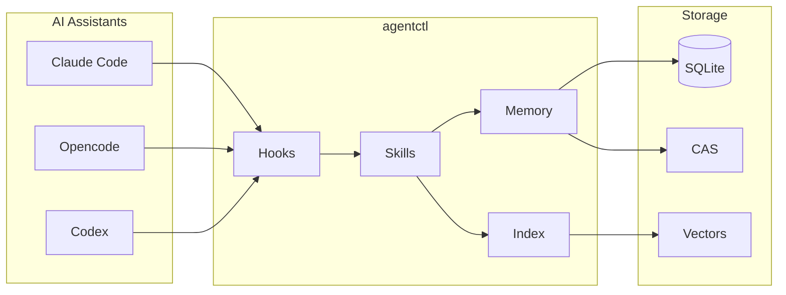
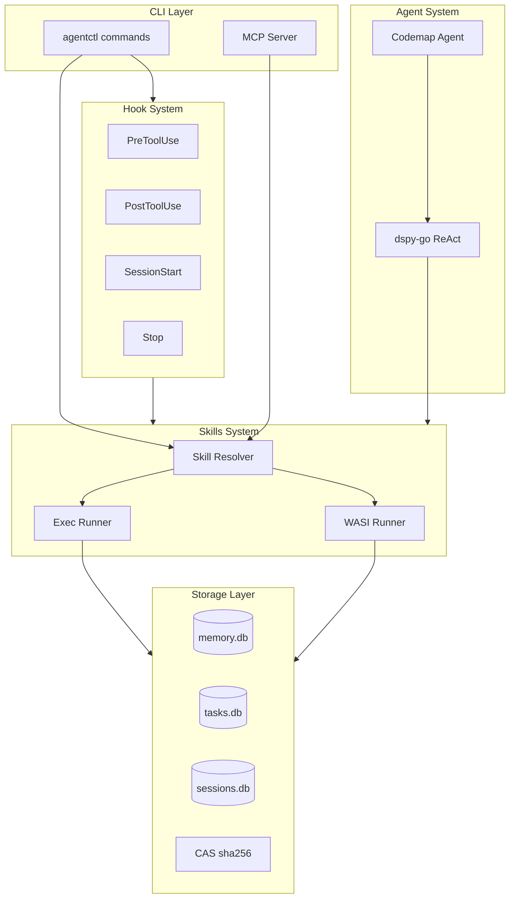
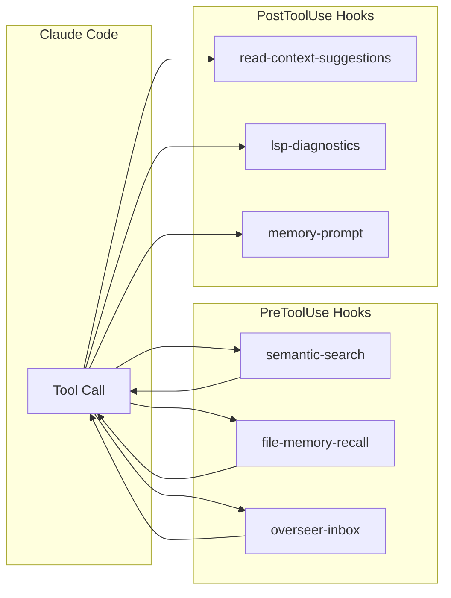
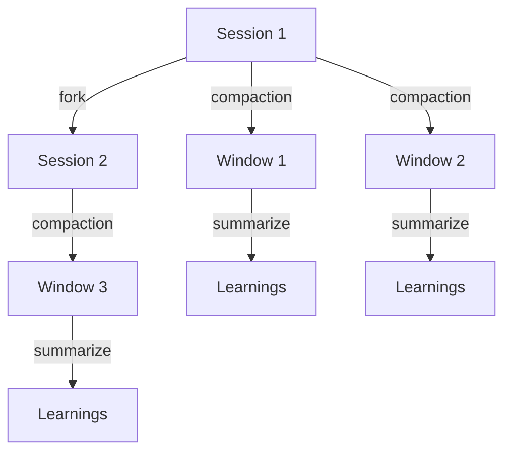

---
vault_refs:
  - notes/repo/agentctl/platform-and-web.md
  - notes/repo/agentctl/semantic-and-memory.md
  - notes/repo/agentctl/skills-runtime-wiring.md
  - notes/repo/agentctl/index.md
  - 00-home/index.md
---

# agentctl

> **AI Agent Toolkit** — Skills, memory, hooks, and orchestration for AI coding assistants

[](https://goreportcard.com/report/github.com/jkatigb/agentctl)

[](https://golang.org/dl/)

**agentctl** provides infrastructure for AI coding assistants: discoverable skills,
persistent memory, hook-based context injection, semantic code search, and
multi-agent orchestration.

---

## What is agentctl?



**Core capabilities:**

- **Skills** — Discoverable tools (code analysis, semantic search, LSP, mobile automation)
- **Hooks** — Context injection at tool boundaries (PreToolUse, PostToolUse, SessionStart)
- **Memory** — Persistent gotchas, decisions, and learnings with vector search
- **Sessions** — Context preservation across compaction with lineage tracking
- **Codemaps** — AI-generated semantic code traces with mermaid diagrams
- **MCP Server** — Expose skills as MCP tools via SSE for any client
- **ACA + Vault** — Dual-plane context architecture with a workspace control plane and an Obsidian knowledge layer

---

## Architecture



### Directory Structure

```
agentctl/
├── cmd/agentctl/           # CLI (Cobra commands)
├── internal/
│   ├── domain/             # Core types (envelope, skill, policy)
│   ├── storage/            # SQLite, CAS, vector stores
│   ├── execution/          # Skill runners (exec, WASI)
│   ├── codemap/            # Codemap agent system
│   ├── codecontext/        # Code snippet extraction
│   └── platform/           # Config, workspace, logging
├── skills/                 # Skill implementations
├── configs/
│   ├── hooks/              # Claude Code hooks
│   ├── skills/             # Skill documentation
│   └── agents/             # Agent profiles
├── packages/               # TypeScript (GUI, TUI, API)
└── docs/                   # Specifications and guides
```

---

## Agents

Agents are mailbox-driven workers. Spawn a profile, run it in the foreground, and ask questions through the mailbox interface.

```bash
# Spawn a chat companion
agentctl agent spawn \
  --chat \
  --name "Stormscribe" \
  --slug "stormscribe" \
  --llm-provider openrouter \
  --llm-model "z-ai/glm-4.7-flash"

# Run the agent daemon
agentctl agent run <agent-id>

# Ask a question with memory continuity
agentctl agent ask <agent-id> --conversation-id story-loop --question "..." --wait

# Rename the agent later
agentctl agent rename <agent-ref> --name "Stormscribe" --slug "stormscribe"

# Stop the agent
agentctl agent kill <agent-id>
```

See `docs/general/agent-daemon.md` for engine routing and execution modes.

### V2 Routing Flags

Agent command routing defaults to v2 for supported commands (`spawn`, `ask`,
`run`, `list`, `kill`) when `AGENTCTL_V2_COMMANDS` is unset/empty.

```bash
# Default behavior (unset/empty): v2-primary routing for supported commands
unset AGENTCTL_V2_COMMANDS

# Global fallback to v1 handlers
export AGENTCTL_V2_COMMANDS=none

# Scoped routing override
export AGENTCTL_V2_COMMANDS=spawn,ask
```

---

## Quick Start

### Installation

```bash
git clone https://github.com/jkatigb/agentctl.git
cd agentctl
make build
make skills-install

# Set up hooks for Claude Code
./scripts/init.sh
```

### Environment Setup

```bash
# Required for semantic search
export VOYAGE_API_KEY=...

# Optional: For codemap generation
export ANTHROPIC_API_KEY=...
# or
export OPENROUTER_API_KEY=...
```

### Basic Usage

```bash
# Run a skill
agentctl run code/symbols --input '{"path": "main.go"}'

# Semantic code search
agentctl run code/semantic_search --input '{"query": "error handling", "limit": 10}'

# Task management
agentctl todo add --title "Implement feature" --description "Details..."
agentctl todo list -f table

# Memory operations
agentctl memory put --name "gotcha-auth" --type "gotcha" --summary "Watch out for..."
agentctl memory search "authentication"

# Generate a codemap
agentctl codemap generate "trace user authentication flow"
```

### ACA / Obsidian Refresh

`agentctl` now includes the ACA *(AgentCTL Context Architecture)* knowledge layer described in [docs/architecture/context-architecture.md](docs/architecture/context-architecture.md). When repo docs or repo structure change, refresh the Obsidian layer with:

```bash
agentctl obsidian graph build --workspace . --vault-path "/path/to/vault"
agentctl obsidian graph promote --workspace . --vault-path "/path/to/vault"
agentctl obsidian bridge reconcile --workspace . --vault-path "/path/to/vault"
agentctl obsidian index build --vault-path "/path/to/vault"
```

That regenerates repo graph notes, refreshes docs↔vault bridge drafts, and rebuilds the local vault search index.

---

## Skills

Skills are the primary interface for AI assistants to interact with code and infrastructure.

| Category | Skills | Description |
|----------|--------|-------------|
| **Code Analysis** | `code/symbols`, `code/complexity`, `code/imports` | Extract symbols, measure complexity, analyze imports |
| **Code Search** | `code/semantic_search`, `code/smart_search`, `code/context_ripgrep` | Vector search, smart candidate generation, full function bodies |
| **Code Editing** | `code/smart_write`, `code/snippet_extract` | Symbol-based editing, code extraction |
| **Testing** | `test/run` | Run tests with coverage |
| **LSP** | `lsp/gopls` | Go language server operations |
| **Mobile** | `mobile/ios`, `mobile/android` | Simulator/emulator automation |
| **Sessions** | `session/restore`, `session/summarize`, `session/recall` | Context preservation |
| **Memory** | `memory/put`, `memory/search`, `memory/query` | Persistent knowledge |
| **Codemaps** | `codemap/generate`, `codemap/search` | Semantic code traces |
| **Game Engines** | `build/unity`, `unity/packages`, `unity/scenes`, `unity/input` | Unity project management |

```bash
# List all available skills
agentctl skills list

# Get skill details
agentctl skills info code/semantic_search
```

---

## Hook System

Hooks inject context at tool boundaries in AI coding sessions.



### Active Hooks

> **Canonical source:** [docs/general/hooks.md](docs/general/hooks.md)

| Event | Hook | Purpose |
|-------|------|---------|
| PreToolUse | `semantic-search` | Vector search on Grep/Glob |
| PreToolUse | `file-memory-recall` | Surface memories before editing |
| PreToolUse | `overseer-inbox` | Human-in-the-loop messages |
| PostToolUse | `read-context-suggestions` | Suggest context after reading code |
| PostToolUse | `lsp-diagnostics` | Show LSP errors after editing |
| SessionStart | `session-restore` | Restore context on resume |
| PreCompact | `session-summarize` | Extract learnings before compaction |
| Stop | `todo-continuation` | Block stop if tasks remain |
| UserPromptSubmit | `skill-advisor` | Suggest skills based on prompt |

---

## Memory System

Persistent knowledge storage with vector search.

```bash
# Store a gotcha
agentctl memory put \
  --name "gotcha-session-archives" \
  --type "gotcha" \
  --summary "Session JSONL files are gzipped in archives"

# Search memories
agentctl memory search "session archives"

# Types: gotcha, decision, pattern, learning, reference
```

### Memory Types

| Type | Purpose | Example |
|------|---------|---------|
| `gotcha` | Pitfalls and warnings | "Skills must call config.LoadDotEnv()" |
| `decision` | Architectural choices | "Using Voyage AI for embeddings (better benchmarks)" |
| `pattern` | Code patterns | "TOCTOU-safe file reading pattern" |
| `learning` | Discovered knowledge | "Session lineage via parent_session_id" |

---

## Session Management

Sessions track context across compaction boundaries.



```bash
# View session chain
agentctl sessions chain

# Restore context
agentctl run session/restore --input '{"session_id": "..."}'

# Summarize session learnings
agentctl run session/summarize --input '{"session_id": "..."}'
```

---

## Codemaps

AI-generated semantic code traces.

```bash
# Generate a codemap
agentctl codemap generate "trace the skill execution flow"

# Search existing codemaps
agentctl codemap search "authentication"
```

Codemaps include:
- **ASCII Trees** — Hierarchical file/function traces
- **Mermaid Diagrams** — Visual flowcharts
- **Annotations** — Detailed explanations with file:line references

---

## MCP Server

Expose skills as MCP tools for any client.

```bash
# Start MCP server
agentctl mcp serve

# Check status
agentctl mcp status

# Stop server
agentctl mcp stop
```

The MCP server exposes all available skills as MCP tools via SSE transport,
allowing any MCP-compatible client to discover and invoke them.

---

## GUI & TUI

### Web GUI

```bash
# Start API server + Web GUI
make gui-agent
# Open http://localhost:5174

# GUI only (requires API server already running)
bun run dev:gui
```

### Terminal UI

```bash
# Start TUI (requires API server)
AGENTCTL_API_URL=http://localhost:8090 bun run --cwd packages/tui dev
```

| Key | View | Description |
|-----|------|-------------|
| 1 | Jobs | Job queue with status |
| 2 | Tasks | Task list with dependencies |
| 3 | Insights | PageRank, critical path |
| 4 | Mailbox | Actor messages |
| 5 | Search | Full-text search |

---

## Development

```bash
# Build
make build              # Pure Go
make build-cgo          # With CGO (required for Turso)
make skills-install     # Build and install skills

# Test
make test               # Unit tests
make test-race          # Race detection
make lint               # Linting

# TypeScript
bun install             # Install deps
make gui-agent          # Start API + GUI
```

### CGO Build Note

Never use raw `CGO_ENABLED=1 go build` — it causes duplicate SQLite symbol errors.
Always use `make build-cgo` which includes `-tags=libsqlite3`.

---

## Storage

| Database | Path | Purpose |
|----------|------|---------|
| `memory.db` | `~/.agentctl/storage/` | Memories, codemaps, symbols |
| `tasks.db` | `~/.agentctl/storage/` | Task management |
| `sessions.db` | `~/.agentctl/storage/` | Session lineage |
| `trajectory.db` | `~/.agentctl/storage/` | Agent audit trail |
| CAS | `~/.agentctl/cas/sha256/` | Content-addressable storage |

---

## Documentation

| Document | Description |
|----------|-------------|
| [AGENTS.md](AGENTS.md) | AI assistant contribution guide |
| [docs/README.md](docs/README.md) | Canonical documentation map |
| [.claude/CLAUDE.md](.claude/CLAUDE.md) | Claude Code integration reference |
| [docs/spec/](docs/spec/) | Technical specifications |
| [docs/observability/](docs/observability/) | Wide events documentation |

---

## License

Apache License 2.0

---

<div align="center">

**agentctl** — Infrastructure for AI coding assistants

[Documentation](docs/README.md) • [Contributing](AGENTS.md) • [Specifications](docs/spec/)

</div>
