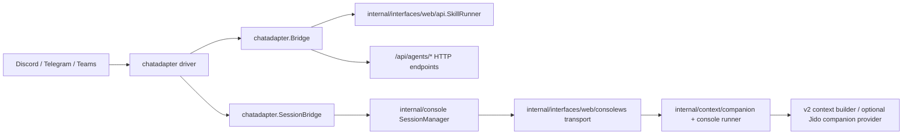

# Chat Platform Adapter Architecture

Current architecture snapshot for chat-platform integration in the web server
runtime.

## Scope and entry point

`foxctl web serve --chat <discord|telegram|teams>` enables one inbound chat
adapter in the web process.

The startup path lives in `internal/interfaces/web/server.go`:

1. The server builds a shared `chatadapter.Bridge`.
2. The selected adapter is created and connected.
3. Slash/text command handlers are wired into the bridge.
4. Natural-language message handlers are wired into a `SessionBridge` backed by
   the shared console session manager and websocket transport.

Missing credentials or platform validation failures prevent that adapter from
starting; the rest of the web server still exists as normal.

## Runtime flow

## Current command model

The shared bridge routes MVP command intents to either:

- skill execution through `api.SkillRunner`
- agent HTTP endpoints under `/api/agents/*`

Shared bridge-backed commands:

- `/search`
- `/todo`
- `/memory`
- `/logs`
- `/agent-spawn`
- `/agent-list`

Platform naming differences:

- Discord uses hyphenated slash commands such as `agent-spawn`.
- Telegram registers names that satisfy Telegram rules, such as `agent_spawn`,
  and normalizes them back into the shared bridge command names.
- Teams accepts text commands and parses the same MVP command set from message
  content.

## Platform behavior

- Discord
  - Uses explicit command registration from `discord.MVPCommands()`.
  - Supports commands, interactions, and natural-language message mode.
  - Binds a Discord-specific session bridge over the shared console session manager.

- Telegram
  - Uses explicit command registration from `telegram.MVPCommands()`.
  - Supports commands, callback interactions, and natural-language messaging.
  - Uses a Telegram-specific session bridge over the shared console session manager.

- Teams
  - Uses Bot Framework webhook ingestion at `POST /api/teams/messages`.
  - Wires command, interaction, and message handlers in the web server.
  - Uses conversation-reference persistence plus a shared generic session bridge.
  - Does not rely on slash-command registration in the same way as Discord and Telegram.

## Session and concurrency model

- Natural-language chat is routed through managed console sessions, not directly
  through the slash-command bridge.
- `chatadapter.SessionBridge` maps a platform conversation to a console session
  and streams edits/messages back to the platform.
- Turn-level concurrency is serialized through `companion.Locker`.
- For PostgreSQL-backed deployments, the lock backend can be PostgreSQL to avoid
  duplicate active turns across pods; otherwise it falls back to in-memory
  locking.

## API dependencies

The chat layer depends on current web-server routes rather than a separate daemon
API surface:

- `/api/agents`
- `/api/agents/{id}`
- `/api/agents/{id}/ask`
- `/api/agents/{id}/daemon/{start|kill|sessions}`
- `/api/events`
- `/api/teams/messages`
- `/ws/console/{id}`

## Jido and v2 notes

- Chat adapters do not talk to Jido directly.
- They indirectly benefit from v2/Jido-backed behavior through:
  - `/api/agents/*` handlers
  - companion context building
  - orchestration/event surfaces exposed elsewhere in the web server

## Extension Boundary

If chat adapters are later used for domain-specific workflows such as SRE
investigations, email handling, or document review, the boundary should remain:

- platform-native webhook parsing and auth stay in the Go adapter layer
- the adapter normalizes inbound messages or events into canonical Go-side
  commands or domain requests
- only after that normalization may the runtime forward canonical signals into
  Jido-backed orchestration

For example:

- Teams chat can continue to use `SessionBridge` for generic natural-language
  chat
- a bound Teams channel for investigations can route into a dedicated
  investigation controller or run service
- that controller may then emit runtime signals or workflow requests into Jido
  without teaching the chat adapter about cloud-specific logic

This keeps chat-platform ingress conservative while allowing richer workflow
engines behind the boundary.

## Operational characteristics

- Adapter startup is platform-specific; only one adapter is selected per
  `foxctl web serve` process.
- SSE hooks are available to adapters that render live agent state updates.
- Teams JWT verification can be skipped only in dev mode and requires
  `--dev-cors`.

## Cross-reference

- Current web/API map: `docs/general/api-server.md`
- Current runtime map: `docs/general/runtime-orchestration.md`
- Historical plan: `docs/archive/impl_plan/chat-platform-adapter.md`
