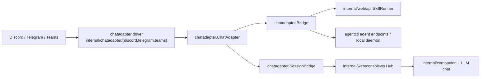

# Chat Platform Adapter Architecture

This is the current architecture snapshot for chat integration (implemented in web server runtime).

## Scope and entry point

`agentctl web serve --chat <discord|telegram|teams>` enables exactly one inbound adapter:

- `internal/web/server.go` reads `--chat`.
- `StartChatAdapter` in `internal/web/server.go` creates the selected adapter and connects it.
- Missing tokens or validation failures disable the adapter with warnings but do not fail server startup.

## Runtime flow

## Contract in code

The interface is defined in `internal/chatadapter/adapter.go`:

- `Connect`/`Disconnect`
- `Name`
- `RegisterCommands`
- `OnCommand`, `OnInteraction`, `OnMessage`

## Command and message flows

- `OnCommand` handlers route to `chatadapter.Bridge` in `internal/chatadapter/bridge.go`.
- `OnInteraction` is implemented for Discord/Telegram adapters; Teams currently does not register an interaction handler.
- The shared command map currently supports:
  - `/search`
  - `/todo` (`list|add|complete`)
  - `/memory`
  - `/logs`
  - `/agent-spawn`
  - `/agent-list`
- `FormatSkillOutput` formats canonical skill envelopes into platform-safe markdown/code blocks.
- `OnMessage` routes natural-language messages through `SessionBridge` into `consolews` sessions, enabling streaming replies.

## Session and concurrency behavior

- `chatadapter.SessionBridge` maps a platform `channel/user` tuple to a console session:
  - Channel-specific session reuse.
  - Streaming edits respect platform message-length limits.
  - Streaming cadence is configurable by platform.
- Turn-level concurrency is serialized via `companion.Locker`.
- For PostgreSQL-backed deployments (`AGENTCTL_DB_DRIVER=postgres` and a valid DSN), the lock backend is PostgreSQL (`companion.NewPgTurnLock`) to avoid duplicate active turns across pods.
- Without PostgreSQL, it falls back to in-memory locking.

## Platform-specific details

- Discord
  - Requires `DISCORD_BOT_TOKEN`.
  - Supports commands, interactions, and NL message mode.
  - Optional platform settings via `Discord` config section (channels, guild scoping, prompts).

- Telegram
  - Requires `TELEGRAM_BOT_TOKEN`.
- Supports command handlers, message handlers, and per-conversation/session bridge routing.

- Teams
  - Requires:
    - `TEAMS_TENANT_ID`
    - `TEAMS_CLIENT_ID`
    - `TEAMS_CLIENT_SECRET`
  - If `TEAMS_SKIP_JWT_VERIFY=true`, `--dev-cors` must be passed; otherwise startup is blocked.
  - Inbound webhooks are handled by `POST /api/teams/messages`.
  - Teams uses conversation-reference store:
    - PostgreSQL (`AGENTCTL_DB_DRIVER=postgres`) when available.
    - SQLite fallback otherwise.

## Operational characteristics

- Adapter registration is best-effort: failure to start one adapter stops only that adapter and logs warnings.
- Adapter command/interaction handlers are shared and call shared bridge logic.
- The adapter layer currently includes Discord, Telegram, and Teams only (Slack remains unimplemented in this branch).

## What this map is (not)

- This document is an architectural view (boundaries, data flow, runtime behavior).
- It intentionally omits phased implementation checklists and step-by-step rollout plans.

## Cross-reference

- Historical implementation plan: `docs/plans/chat-platform-adapter.md`
