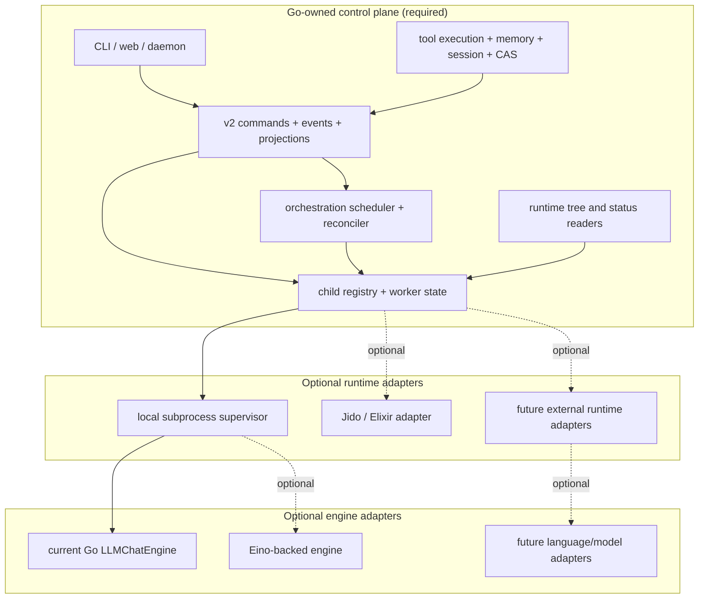

---
vault_refs:
  - notes/repo/foxctl/skills-runtime-wiring.md
  - notes/repo/foxctl/index.md
  - 00-home/index.md
---
# Go-native runtime first, optional Jido and pluggable backends

This note describes the target runtime shape for `foxctl`:
Go owns lifecycle, orchestration state, runtime trees, and tool execution. Jido becomes
an optional runtime substrate *(more precise than "LLM substrate": the process/runtime
layer, not the semantic system of record)*. Once those seams are owned in Go, other
external runtimes or language backends can plug in behind the same contracts.

| Field | Value |
|------|-------|
| Status | Target / dependency-ordered architecture |
| Canonical scope | Runtime ownership, optional runtime adapters, and later engine/backend pluggability |

## Why this exists

Today several important flows still depend on Jido-oriented runtime state:

1. Child spawn/reconcile for v2 orchestration.
2. Runtime tree inspection in web/API surfaces.
3. Some `agent ask` and execution-layer paths.

That makes Jido more than optional in practice even though the product direction is to
make it optional. The corrective architecture is:

1. **Go owns runtime facts first**: parent/child relationships, run state, worker
   health, and runtime tree shape all come from Go-managed stores and services.
2. **Jido becomes an adapter**: useful for operators who want BEAM/OTP supervision, but
   no longer the source of truth for orchestration or runtime inspection.
3. **Backend pluggability comes after parity**: once runtime contracts are stable in Go,
   other external runtimes or language backends can implement the same contracts.
4. **Engine pluggability is separate**: Eino may replace the current LLM loop later, but
   it does not solve runtime ownership by itself.

## Target ownership model

The key rule is that adapters execute work, but they do not own control-plane truth.

## What must be Go-owned before Jido is truly optional

| Concern | Current dependency | Required Go ownership |
|--------|--------------------|-----------------------|
| **Child spawn** | Jido bridge / `runtime.spawn_child` | Go `RuntimeSpawner` plus durable child/worker registry |
| **Child lifecycle** | Jido runtime state polling | Go supervisor state, heartbeats, exit records, and reconcile loop |
| **Runtime tree** | `runtime.get_children` / `runtime.state` | Tree and status derived from Go registry + projections |
| **Web/API runtime views** | Optional Jido client in handlers | API handlers read Go projections/registry directly |
| **`agent ask` default transport** | Mailbox or Jido dispatcher split | Go mailbox/daemon default; external adapters explicitly configured |
| **Execution layer selection** | `ExecutionLayerJido` remains special | Jido becomes one adapter choice rather than a privileged path |

Nothing in this table requires Elixir. It requires clear control-plane ownership in Go.

## Runtime vs engine

These are separate layers and should stay separate in planning:

### Runtime layer

Responsible for:

- spawning workers
- tracking parent/child relationships
- tracking worker health, exit status, and heartbeat
- reconciling runtime facts into v2 events and projections
- serving runtime trees to CLI/web/API consumers

This is the layer that must move first.

### Engine layer

Responsible for:

- LLM calls
- tool-call loop
- streaming and token accounting
- model/provider adapters

This layer can stay on the current `LLMChatEngine` while runtime ownership moves to Go.
Eino belongs here later, not as a prerequisite for runtime parity.

## Stable contracts for backend pluggability

If the goal is future language flexibility, define the seams in Go and keep adapters
behind them.

### Runtime adapter contracts

- `RuntimeSpawner` for child creation
- worker registry/state reader for status and trees
- reconcile input contract for append-only v2 event emission
- explicit lifecycle hooks for start, heartbeat, completion, failure, and cancel

### Engine adapter contracts

- `engine.AgentEngine` for the classic mailbox/runtime path
- `runner.Model` for the v2 synchronous turn pipeline
- shared Go-owned tool execution through `engine.ToolExecutor` or the v2 tool executor

### Policy and semantics stay in Go

- tool catalog and policy
- envelopes and event schemas
- memory/session/CAS semantics
- agent hierarchy policy
- orchestration decisions and projections

That allows Jido, another language worker, or a future engine to be an implementation
detail rather than a second source of behavior.

## Recommended dependency order

1. **Normalize runtime ownership in Go**
   Define the registry/state model for child workers, runtime trees, and lifecycle facts.
2. **Implement the default Go runtime adapter**
   Use subprocess-backed workers with bounded supervision and durable state.
3. **Move reconcile and web/API tree loading onto Go-owned state**
   Remove hard dependency on Jido runtime inspection for orchestration and agent views.
4. **Demote Jido to an optional adapter**
   Keep it available, but only when explicitly configured.
5. **Generalize backend adapter seams**
   Make it straightforward to plug in another external runtime or language worker.
6. **Only then swap or add engine implementations**
   Eino becomes a replaceable engine option once runtime ownership is already solved.

## Where Jido fits after the rewrite

Jido remains useful for:

- BEAM/OTP supervision
- operators who want Elixir-managed worker trees
- experimentation with external runtime substrates

Jido should no longer be required for:

- default orchestration dispatch
- runtime tree inspection
- parent/child registry truth
- web/API runtime state
- the canonical tool/memory/session path

## Where Eino fits after the rewrite

Eino remains a candidate for the engine layer because it can improve:

- model/provider abstraction
- tool-call orchestration
- streaming/callback patterns
- future graph/agent composition

But the dependency order matters:

- **first** fix runtime ownership and parity in Go
- **then** introduce engine pluggability
- **then** decide whether Eino should replace or complement the current engine

## Related docs

- [../plans/features/eino-go-native-runtime-plan.md](../plans/features/eino-go-native-runtime-plan.md) — implementation plan in dependency order.
- [../spec/runtime-backend-contracts.md](../spec/runtime-backend-contracts.md) — runtime backend contract for worker identity, lifecycle state, reconciler idempotency, and runtime-tree reads.
- [jido-hybrid-runtime.md](jido-hybrid-runtime.md) — current hybrid architecture and ownership split.
- [../general/runtime-orchestration.md](../general/runtime-orchestration.md) — current execution/orchestration surface map.
- [../spec/agent_hierarchy.md](../spec/agent_hierarchy.md) — authoritative spawn policy and hierarchy constraints.
