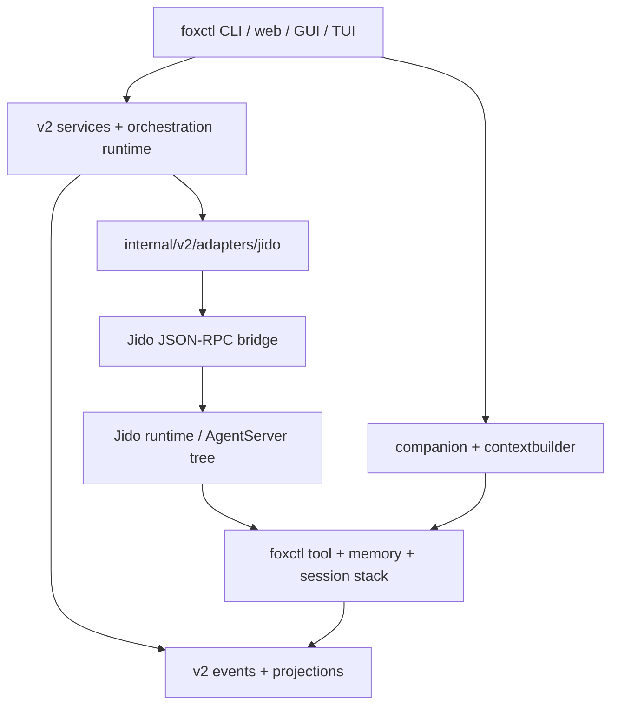

---
vault_refs:
  - notes/repo/foxctl/skills-runtime-wiring.md
  - notes/repo/foxctl/index.md
  - notes/repo/foxctl/platform-and-web.md
  - notes/repo/foxctl/semantic-and-memory.md
  - 00-home/index.md
---
# Jido Hybrid Runtime

This is the canonical architecture note for the current hybrid `foxctl` + Jido runtime shape.

## Metadata

| Field | Value |
|------|-------|
| Status | Current |
| Canonical scope | Ownership split between `foxctl` and Jido, transport boundaries, deployment shape |
| Last reviewed | 2026-03-20 |

## Why This Exists

The repo is currently not a single-runtime system.

- `foxctl` still owns tool semantics, memory/session retrieval, companion context assembly, and most Go-side control-plane state.
- Jido is now a viable runtime substrate for hierarchical orchestration, especially where BEAM process supervision and parent/child trees are the right primitive.

The purpose of the hybrid architecture is to avoid rewriting mature `foxctl` semantics in Elixir while still gaining BEAM-native orchestration.

## Ownership Split

### Jido Owns

- agent process lifecycle
- parent/child hierarchy
- runtime signal delivery
- subtree inspection and await behavior
- orchestration runtime substrate for overseer-style dispatch

### foxctl Owns

- `code_*` skills such as semantic search, smart search, context grep, and codemap-related context
- `memory_*` retrieval and persistence
- `session_*` recall and timeline retrieval
- layered companion context shaping
- kanban/control-plane state, v2 events, and projections

That split is deliberate. Jido is the runtime. `foxctl` remains the semantic system.

## Topology

## Runtime Boundaries

### Inside foxctl

Key packages:

- `internal/v2/adapters/jido`
- `internal/v2/runtime/orchestration`
- `internal/v2/services`
- `internal/context/companion`
- `internal/interfaces/web/api`

Those packages translate canonical Go-side requests into JSON-RPC runtime calls:

- `runtime.start_agent`
- `runtime.spawn_child`
- `runtime.signal`
- `runtime.await`
- `runtime.get_children`
- `runtime.state`

### Inside Jido

The bridge side exposes:

- `agent.ask`
- `foxctl.tool.run`
- `foxctl.companion.context`
- `foxctl.child.spawn`

Those actions are generic. They call back into `foxctl` instead of reimplementing code search or memory/session semantics inside Elixir.

## Socket Model

There are two Unix sockets in the clean production shape:

| Socket | Purpose |
|------|---------|
| `FOXCTL_JIDO_SOCKET` | JSON-RPC socket exposed by the Jido bridge |
| `FOXCTL_DAEMON_SOCKET` | `foxctl` daemon socket used by bridge-side `daemon_rpc` tool execution |

This separation matters:

- the Jido bridge socket is the runtime-control boundary
- the `foxctl` daemon socket is the semantic-execution boundary

Keeping them separate lets you isolate transport failures and keep tool/memory/session execution authoritative on the Go side.

## Tool Policy Hand-off

Jido start/spawn payloads now carry bridge-side tool execution policy through `plugin_config`.

Current shape:

- `plugin_config.binary`
- `plugin_config.workspace`
- `plugin_config.transport = daemon_rpc`
- `plugin_config.daemon = true`
- `plugin_config.tool_command.profile`
- `plugin_config.tool_command.allowed_tools`
- `plugin_config.tool_command.default_timeout_ms`

That payload is derived from the shared v2 catalog/profile model on the Go side, so Jido-facing agent startup inherits the same portable-core vs extension-tool boundary used by v2 runtime governance.

## Control-Plane Flow

Current intended flow:

1. `foxctl` enqueues or projects work into the kanban/control-plane model.
2. v2 orchestration decides dispatch and converts that into Jido runtime child-spawn requests.
3. Jido owns the live child tree and runtime lifecycle.
4. Jido children call back into `foxctl` for `code_*`, `memory_*`, `session_*`, and companion context.
5. Runtime outcomes reconcile back into append-only v2 events and projections.

This is why kanban, overseer policy, and Jido runtime fit together without collapsing into one implementation layer.

## Recommended Jido Patterns

The Jido learning guides point to four patterns that fit the current hybrid
architecture well, as long as the ownership split above remains intact.

### Sensors and real-time signals

Use Jido sensors and direct signal injection for runtime reactivity, but only
after `foxctl` has normalized external inputs into canonical domain events.

Good fit:

- Teams or other chat/webhook ingress handled in Go, then converted into
  canonical runtime signals
- cloud alert fan-in such as CloudWatch, Grafana, or deployment webhooks
- connector health and cluster status updates

Recommended signal shape:

- domain-prefixed and portable, for example:
  - `ops.teams.message`
  - `ops.alert.cloudwatch`
  - `ops.alert.grafana`
  - `ops.webhook.azuredevops`
  - `ops.connector.k8s.status`

That keeps webhook parsing, auth, and boundary validation on the Go side while
still letting Jido supervise reactive flows and context-aware routing.

### Plugins and composable agents

Use Jido plugins for reusable runtime-local capability packs:

- isolated state slices
- signal routes
- per-agent runtime config
- action bundles that orchestrate existing `foxctl` semantics

Good examples for future work:

- investigation run plugin
- approval gate plugin
- observability ingress plugin
- Kubernetes connector plugin
- email thread plugin
- document workflow plugin

Do not use plugins as a substitute for canonical Go-side stores such as
bindings, durable run history, approval records, or semantic retrieval state.

### Workflows and directives

Use Jido workflows when a domain needs deterministic multi-step execution with
shared runtime state and directive output.

Good fit:

1. resolve binding
2. create or resume run
3. retrieve context
4. collect bounded evidence
5. synthesize result
6. emit approval directive if a mutation is required
7. resume after approval and capture outcome evidence

The actions in those workflows should remain thin: they should call back into
`foxctl` services, tools, or APIs instead of reimplementing cloud- or
retrieval-specific semantics inside Elixir.

## Memory and Retention

The hybrid shape also preserves retention policy on the semantic side.

- Jido agents can carry `profile` and `memory_retention`.
- Bridge-side companion context uses those values to decide how much `memory/query`, `session/recall`, and `session/timeline` context to assemble.
- `foxctl` remains the place where retrieval quality evolves, including vector search, semantic recall, and timeline shaping.

That is important because retention behavior is not just runtime state. It depends on the retrieval stack you already have in Go.

Practical rule:

- Jido memory is runtime-local, checkpoint-oriented, and useful for transient
  working state
- `foxctl` memory remains the durable semantic system of record

That means Jido memory, thread, and lightweight retrieval features are useful
for live workflows and restores, but long-lived organization-facing knowledge
should continue to live in `foxctl` memory/session surfaces and ContextWiki / Obsidian.

## Future Workflow Domains

The same split that works for SRE workflows should also work for later workflow
domains such as:

- email agents
- document or Microsoft Word agents
- approval-driven business workflows

The runtime pattern should stay the same:

1. `foxctl` owns ingress normalization, policy, storage, and semantic tools
2. Jido owns live workflow execution, signals, parent/child trees, and
   directives
3. durable outcomes reconcile back into Go-side events, stores, and ContextWiki notes

## Deployment Shape

Recommended production shape:

1. run your Jido instance and bridge under one OTP supervision tree
2. point the bridge at an explicit `foxctl` binary and daemon socket
3. let `foxctl` own storage, CAS, memory/session indexes, and control-plane projections

In other words:

- Jido should be supervised like runtime infrastructure
- `foxctl` should be treated as the semantic backend

## Related Docs

- [docs/architecture/system-architecture.md](system-architecture.md)
- [docs/general/runtime-orchestration.md](../general/runtime-orchestration.md)
- [docs/general/companion-memory.md](../general/companion-memory.md)
- [docs/spec/agent_hierarchy.md](../spec/agent_hierarchy.md)
- [Jido guide: Foxctl Bridge](https://github.com/agentjido/jido/blob/main/guides/foxctl-bridge.md)
