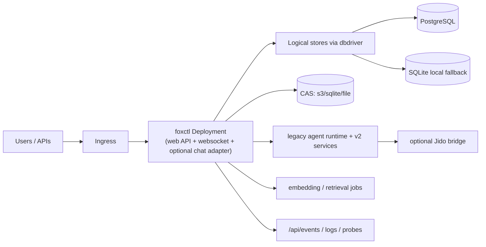

# Kubernetes Runtime Architecture (Current + In-Repo)

This page describes the in-repo Kubernetes topology and how it maps to the
current web/runtime behavior in code.

## High-level topology

## What is represented in-repo today

`deploy/kubernetes` currently contains three practical operational modes:

1. Base manifests
2. PostgreSQL overlay
3. Local overlay (k3s/dev variants)

## Base manifests

`deploy/kubernetes/base/` is the base set used as the foundation:

- `deployment.yaml`: `foxctl` pod with web service and readiness/liveness probes using `foxctl health` exec checks.
- `configmap.yaml`: defaulting to `FOXCTL_DB_DRIVER=turso` and CAS driver keys read by the runtime.
- `workspace-deployment.yaml`: optional dedicated workspace pod with git-sync sidecar for mounted source.
- `cronjobs.yaml`: scheduled companion workloads (rerank, sqlite maintenance), wired with the same CAS env style as base.
- `embedding-worker.yaml`: separate worker deployment for background embedding pipeline.

This base is useful as a starting point or historical template. Production
storage settings are normally supplied by an overlay.

## PostgreSQL production overlay (implemented)

`deploy/kubernetes/overlays/postgres/` updates the base to the storage and runtime model currently reflected in code:

- `configmap-patch.yaml`
  - `FOXCTL_DB_DRIVER: "postgres"`
  - `FOXCTL_POSTGRES_MAX_CONNS`, `FOXCTL_POSTGRES_REQUIRE_VECTOR`
  - `FOXCTL_CAS_DRIVER: "s3"` and `FOXCTL_CAS_S3_BUCKET`/region settings
- `deployment-patch.yaml`
  - Sets `FOXCTL_POSTGRES_DSN` from Kubernetes secret
  - Replaces probe model to HTTP:
    - `GET /healthz` (liveness)
    - `GET /readyz` (readiness)

This overlay matches current server behavior where:

- `foxctl web serve` exposes application routes under `/api`
- `/api/v1` is deprecated
- root-level `/healthz` and `/readyz` are used for probes

## Local overlay (dev)

`deploy/kubernetes/overlays/local/`:

- Runs a single pod and local state directories in `emptyDir`.
- Executes `foxctl web serve --port=8080` from the container command.
- Includes local PostgreSQL + pgvector statefulset (`local-postgres.yaml`) when local multi-component testing is desired.

## Runtime notes for Kubernetes

- The web pod is the main entrypoint for:
  - `/api/*`
  - `/ws/console/*`
  - optional chat adapter ingress
- The runtime behind that pod is hybrid:
  - legacy mailbox-driven agent runtime still exists
  - v2 projections/orchestration/context surfaces also exist
- Jido-backed orchestration requires additional `FOXCTL_JIDO_*` configuration;
  those variables are not broadly documented in the base manifests yet.

## Chat adapters in Kubernetes

Adapters are not selected in manifests. They are runtime CLI flags:

- `foxctl web serve --chat discord`
- `foxctl web serve --chat telegram`
- `foxctl web serve --chat teams`

Teams webhooks use `POST /api/teams/messages`; this endpoint must remain
reachable in whichever ingress/network policies are in use.

## Deployment architecture notes for multi-pod operation

- Shared control-plane state is required for horizontal scaling:
  - PostgreSQL-backed sessions/sessions-like stores
  - CAS in external object storage
  - Shared locks (companion turn lock via PostgreSQL when available)
- Local-only SQLite mode can still run for dev and smaller deployments but does
  not provide true shared-state semantics across replicas.

## Environment keys to use when documenting runbooks

Prefer:

- `FOXCTL_DB_DRIVER`
- `FOXCTL_POSTGRES_DSN` / `DATABASE_URL`
- `FOXCTL_POSTGRES_MAX_CONNS`
- `FOXCTL_POSTGRES_REQUIRE_VECTOR`
- `FOXCTL_CAS_DRIVER`
- `FOXCTL_CAS_S3_*`
- `FOXCTL_WORKSPACE`, `FOXCTL_STORAGE_ROOT`
- `FOXCTL_JIDO_*` when enabling Jido-backed orchestration or companion bridges

Historical CAS keys that should not be reintroduced:

- `FOXCTL_CAS_BACKEND`
- `FOXCTL_CAS_BUCKET`

## Related docs

- Current architecture notes:
  - [docs/architecture/chat-platform-adapter.md](chat-platform-adapter.md)
  - [docs/architecture/postgres-storage.md](postgres-storage.md)
- Historical plans:
  - [docs/archive/impl_plan/k8s-sql-storage.md](../archive/impl_plan/k8s-sql-storage.md)
