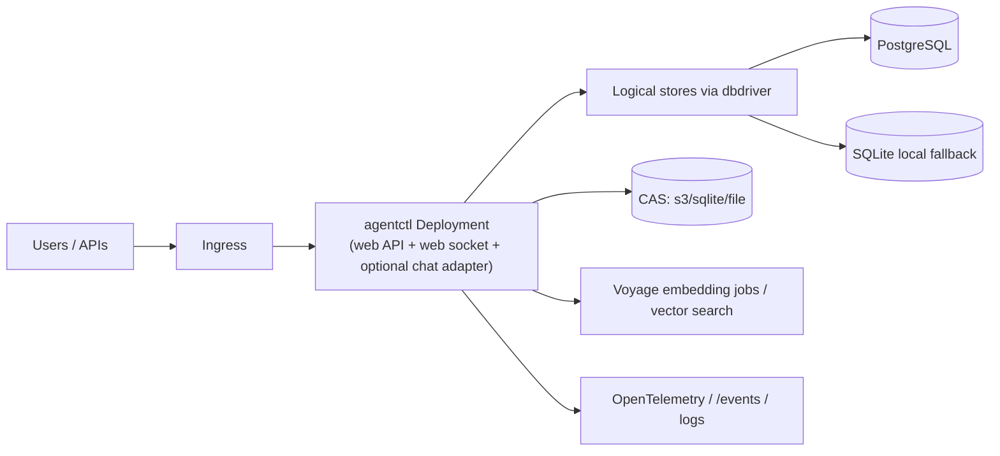

# Kubernetes Runtime Architecture (Current + In-Repo)

This page describes the *current deployed topology* represented by `deploy/kubernetes` and how it maps to runtime behavior in the code.

## High-level topology

## What is represented in-repo today

`deploy/kubernetes` currently contains three practical operational modes:

1. Base manifests (legacy defaults)
2. PostgreSQL overlay
3. Local overlay (k3s/dev variants)

## Base manifests (current snapshot, requires drift review)

`deploy/kubernetes/base/` is the base set used as the foundation:

- `deployment.yaml`: `agentctl` pod with web service and readiness/liveness probes using `agentctl health` exec checks.
- `configmap.yaml`: defaulting to `AGENTCTL_DB_DRIVER=turso` and old CAS key names (`AGENTCTL_CAS_BACKEND`/`AGENTCTL_CAS_BUCKET`).
- `workspace-deployment.yaml`: optional dedicated workspace pod with git-sync sidecar for mounted source.
- `cronjobs.yaml`: scheduled companion workloads (rerank, sqlite maintenance), still wired for the same env style as base.
- `embedding-worker.yaml`: separate worker deployment for background embedding pipeline.

This base is useful as a historical template but contains mixed configuration generations.

## PostgreSQL production overlay (implemented)

`deploy/kubernetes/overlays/postgres/` updates the base to the storage and runtime model currently reflected in code:

- `configmap-patch.yaml`
  - `AGENTCTL_DB_DRIVER: "postgres"`
  - `AGENTCTL_POSTGRES_MAX_CONNS`, `AGENTCTL_POSTGRES_REQUIRE_VECTOR`
  - `AGENTCTL_CAS_DRIVER: "s3"` and `AGENTCTL_CAS_S3_BUCKET`/region settings
- `deployment-patch.yaml`
  - Sets `AGENTCTL_POSTGRES_DSN` from Kubernetes secret
  - Replaces probe model to HTTP:
    - `GET /healthz` (liveness)
    - `GET /readyz` (readiness)

This overlay matches current server behavior where `web/` registers root-level health endpoints and `agentctl web` serves command endpoints under `/api`.

## Local overlay (dev)

`deploy/kubernetes/overlays/local/`:

- Runs a single pod and local state directories in `emptyDir`.
- Executes `agentctl web serve --port=8080` from container command.
- Includes local PostgreSQL + pgvector statefulset (`local-postgres.yaml`) when local multi-component testing is desired.

## Chat adapters in Kubernetes

Adapters are not selected in manifests. They are runtime CLI flags:

- `agentctl web serve --chat discord`
- `agentctl web serve --chat telegram`
- `agentctl web serve --chat teams`

Teams webhooks use `POST /api/teams/messages`; this endpoint must remain reachable in whichever ingress/network policies are in use.

## Deployment architecture notes for multi-pod operation

- Shared control-plane state is required for horizontal scaling:
  - PostgreSQL-backed sessions/sessions-like stores
  - CAS in external object storage
  - Shared locks (companion turn lock via PostgreSQL when available)
- Local-only SQLite mode can still run with replicas for dev and smaller deployments but does not give true shared state semantics.

## Environment keys to use when documenting runbooks

Prefer:

- `AGENTCTL_DB_DRIVER`
- `AGENTCTL_POSTGRES_DSN` / `DATABASE_URL`
- `AGENTCTL_POSTGRES_MAX_CONNS`
- `AGENTCTL_POSTGRES_REQUIRE_VECTOR`
- `AGENTCTL_CAS_DRIVER`
- `AGENTCTL_CAS_S3_*`
- `AGENTCTL_WORKSPACE`, `AGENTCTL_STORAGE_ROOT`

Legacy keys still seen in base artifacts:

- `AGENTCTL_CAS_BACKEND`
- `AGENTCTL_CAS_BUCKET`

## Related docs

- Current architecture notes:
  - [docs/architecture/chat-platform-adapter.md](chat-platform-adapter.md)
  - [docs/architecture/postgres-storage.md](postgres-storage.md)
- Historical plans:
  - [docs/plans/k8s-sql-storage.md](../plans/k8s-sql-storage.md)

