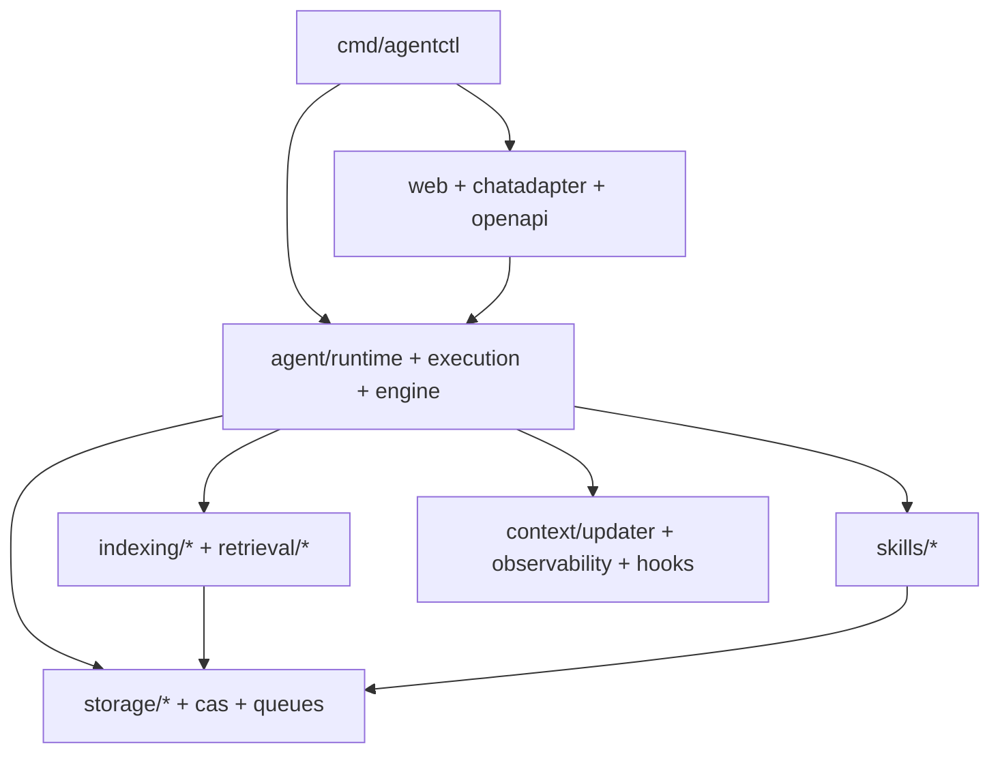

# System Architecture (Canonical)

This is the canonical architecture map for `agentctl`.

## Metadata

| Field | Value |
|------|-------|
| Status | Current |
| Canonical scope | Runtime/component architecture for `cmd/agentctl` + `internal/*` |
| Last reviewed | 2026-02-17 |

## Runtime Topology

## Core Package Groups

| Group | Key packages | Responsibility | Primary docs |
|------|--------------|----------------|--------------|
| Agent orchestration | `internal/agent`, `internal/daemon`, `internal/execution`, `internal/engine` | Agent lifecycle, tool-loop execution, daemon control plane | `docs/general/agent-daemon.md`, `docs/general/runtime-orchestration.md` |
| Session/runtime support | `internal/sessionkit`, `internal/skillrun`, `internal/runservice`, `internal/queue`, `internal/workflow` | Session parsing/archival, run invocation pipeline, queueing, DAG workflows | `docs/general/runtime-orchestration.md` |
| State and persistence | `internal/storage/*` | Durable stores (sessions, memory, tasks, mailbox, CAS integration) | `docs/general/storage.md` |
| Retrieval and indexing | `internal/indexing/*`, `internal/retrieval`, `internal/codecontext`, `internal/codemap` | Semantic/symbol/repo indexing and context extraction | `docs/general/search.md`, `docs/general/repoindex.md` |
| Interface layers | `internal/web`, `internal/chatadapter`, `internal/openapi`, `internal/lsp`, `internal/providers` | API/server surfaces and external platform integrations | `docs/general/api-server.md`, `docs/architecture/chat-platform-adapter.md`, `docs/start/openapi_and_plugins.md` |
| Context and observability | `internal/context/updater`, `internal/observability`, `internal/hooks` | Proactive context surfacing, trace/event propagation, hook execution | `docs/general/context-and-observability.md`, `docs/observability/README.md`, `docs/general/hooks.md` |
| Policy and prompting | `internal/agentpolicy`, `internal/agentprompt` | Capability profiles and role-specific system instructions | `docs/general/agent-policy-and-prompts.md` |
| Security/identity | `internal/auth`, `internal/authbroker`, `internal/verification`, `internal/domain/identity` | Auth flows, broker integration, verification paths | `docs/architecture/auth-identity.md` |
| Foundations | `internal/domain`, `internal/platform`, `internal/protocol`, `internal/tools`, `internal/tooling` | Core types, config/platform utilities, protocol helpers | `docs/general/architecture.md`, `docs/spec/README.md` |

## Architectural Invariants

| Invariant | Why it matters |
|----------|----------------|
| Envelope contract stability (`meta.*` and shape) | Prevents breakage across hooks/UI/golden tests |
| WASI isolation (`network:"none"`) | Security boundary for sandboxed skills |
| Workspace-constrained IO | Prevents path escapes and unsafe file access |
| CAS-backed large outputs | Avoids oversized envelopes and preserves replayability |
| Context propagation (`context.Context`) | Enables cancellation/timeouts across runtime stack |

## Related Architecture Docs

- `docs/architecture/chat-platform-adapter.md`
- `docs/architecture/kubernetes-runtime.md`
- `docs/architecture/postgres-storage.md`
- `docs/kubernetes.md`
