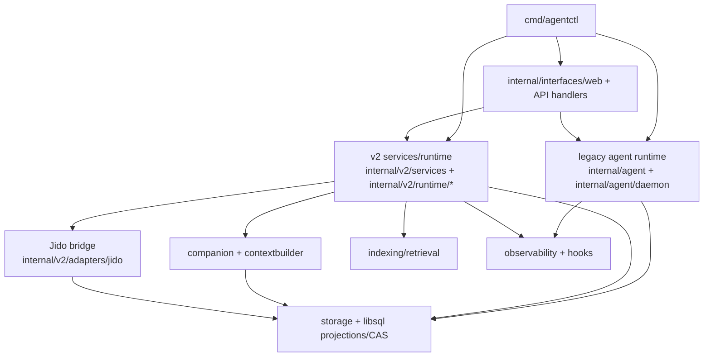

# System Architecture (Canonical)

This is the canonical current-state architecture map for `agentctl`.

## Metadata

| Field | Value |
|------|-------|
| Status | Current |
| Canonical scope | Runtime/component architecture for `cmd/agentctl` + `internal/*` |
| Last reviewed | 2026-03-06 |

## Runtime Topology

## Current State Notes

1. The repo is not a single-runtime system yet. Legacy mailbox-driven agent
   execution and newer v2/Jido-backed services both exist.
2. `internal/v2/*` should be read as the newer **agent/runtime/orchestration**
   lane, not as a generic replacement namespace for all of `internal/*`.
   See `docs/architecture/package-topology.md`.
3. The clearest v2 ownership today is ask/projection handling, orchestration
   scheduling/reconciliation, v2 event stores, context building, and companion
   integration points.
4. Some CLI agent management surfaces still route through legacy stores or
   `agentmanager` fallback paths.
5. Room runtime observability now includes a persisted `last_delivery_trace`
   on the room-loop row, and the API/status surfaces expose that trace as the
   canonical explanation for the latest room delivery decision.
6. `bash tests/regression/run.sh` is the canonical room-runtime regression
   entrypoint; targeted integration tests such as
   `TestIntegrationRelayRoomMessageTmuxConsumesInputRealTmux` are follow-on
   checks for symptoms that involve real pane submission behavior.

## Core Package Groups

| Group | Key packages | Responsibility | Primary docs |
|------|--------------|----------------|--------------|
| Legacy agent runtime | `internal/agent`, `internal/agent/daemon`, `internal/execution/agentmanager` | Mailbox-driven sessions, overseer hierarchy, legacy spawn/list/run/kill paths still used by some CLI flows | `docs/general/agent-daemon.md`, `docs/spec/agent_hierarchy.md` |
| V2 command and orchestration stack | `internal/v2/core/*`, `internal/v2/services`, `internal/v2/runtime/{runner,orchestration,supervisor,tools,snapshots,profiles}` | Typed v2 commands, event-sourced orchestration, staged turn execution, long-lived components | `docs/general/runtime-orchestration.md`, `docs/spec/v2_symphony_kanban_orchestration.md` |
| Jido execution bridge | `internal/v2/adapters/jido` | JSON-RPC client, child spawn bridge, ask/runtime adapter, orchestration reconciliation, companion provider | `docs/general/runtime-orchestration.md` |
| Companion and context assembly | `internal/context/companion`, `internal/v2/runtime/contextbuilder`, `internal/v2/runtime/enrichers` | Conversation memory, layered context assembly, async derived artifacts, companion bridge integration | `docs/general/companion-memory.md`, `docs/general/context-and-observability.md` |
| State and persistence | `internal/storage/*`, `internal/v2/adapters/libsql/*` | Durable stores, CAS, mailbox/task/session persistence, v2 events and projections | `docs/general/storage.md`, `docs/architecture/postgres-storage.md` |
| Retrieval and indexing | `internal/intelligence/indexing/*`, `internal/intelligence/retrieval`, `internal/intelligence/codecontext`, `internal/intelligence/codemap` | Semantic/symbol/repo indexing and context extraction | `docs/general/search.md`, `docs/general/repoindex.md` |
| Interface layers | `internal/interfaces/web`, `internal/interfaces/chatadapter`, `internal/interfaces/openapi`, `internal/providers` | API/server surfaces and external platform integrations | `docs/general/api-server.md`, `docs/architecture/chat-platform-adapter.md` |
| Observability and hooks | `internal/observability`, `internal/hooks`, `internal/context/updater` | Trace/event propagation, hook execution, proactive context surfacing | `docs/general/context-and-observability.md`, `docs/general/hooks.md` |
| Foundations | `internal/domain`, `internal/platform`, `internal/protocol`, `internal/tools`, `internal/tooling` | Core types, config/platform utilities, protocol helpers | `docs/general/architecture.md`, `docs/spec/README.md` |

For the canonical grouping target for `internal/*` and the explicit legacy-runtime
vs `v2` replacement map, see `docs/architecture/package-topology.md`.

## Architectural Invariants

| Invariant | Why it matters |
|----------|----------------|
| Envelope contract stability (`meta.*` and shape) | Prevents breakage across hooks/UI/golden tests |
| Append-first v2 events plus projection reads | Keeps orchestration and ask state replayable |
| Jido bridge remains adapter-scoped | Prevents runtime transport concerns from leaking into v2 core contracts |
| Workspace-constrained IO | Prevents path escapes and unsafe file access |
| CAS-backed large outputs | Avoids oversized envelopes and preserves replayability |
| Context propagation (`context.Context`) | Enables cancellation/timeouts across both legacy and v2 stacks |

## Related Architecture Docs

- `docs/general/runtime-orchestration.md`
- `docs/architecture/package-topology.md`
- `docs/architecture/jido-hybrid-runtime.md`
- `docs/general/agent-daemon.md`
- `docs/architecture/chat-platform-adapter.md`
- `docs/architecture/kubernetes-runtime.md`
- `docs/architecture/postgres-storage.md`
