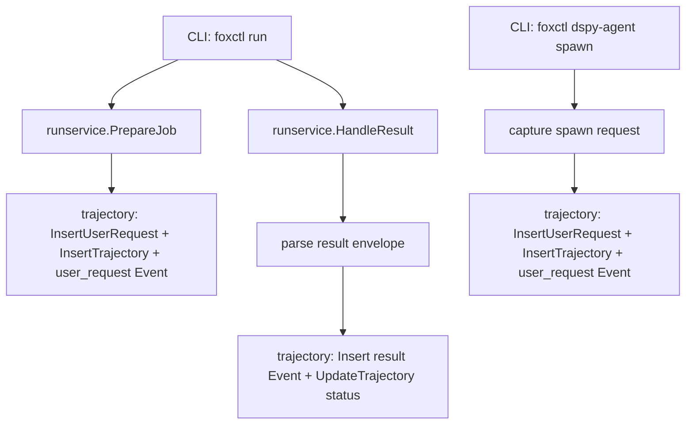

# Phase 7 PR2 – Capture Hooks: CLI, Jobs, and Agents → Trajectory Events

## Goal

Implement initial trajectory capture hooks per
`docs/spec/dspy_trajectory_capture.md` §4:

- Capture **CLI user requests** that trigger work (initially via `foxctl run`
  flows).
- Capture **job/skill results** as `trajectory.Event` records.
- Capture **agent-related CLI activity** for `foxctl dspy-agent spawn` as a
  minimal agent-run capture point.

All persisted records must be **redacted** (no secrets) and stored in the
internal SQLite trajectory store (`internal/storage/trajectory`).

## Non-goals

- No envelope schema changes (no new `meta.*` fields or shape changes).
- No exporter (`trajectory.export`) work.
- No deep dspy-go internal tracing (tool-call streaming) beyond the initial CLI
  capture point.

## Correlation Strategy (v1)

The trajectory schema references a `trace_id` conceptually; in this repo,
correlation is sourced from `meta.correlation_id` and stored as `trace_id`
internally.

For PR2 we map correlation as follows (no wire changes):

- **Trajectory trace_id**: use `meta.correlation_id` when available.
- If absent, generate a per-run correlation id in the CLI process and store it
  in `meta.correlation_id` (existing field).
- Always set `meta.job_id` on run results using the known job id.

## Capture Points (implemented in PR2)

### A) `foxctl run <skill>`

- On job creation:
  - Persist a `UserRequestCapture` (source `cli`).
  - Persist a `Trajectory` (status `partial`) linked to `job_id` and correlation
    id.
  - Persist a `Event(kind=user_request)`.

- On job completion:
  - Persist a `Event` derived from the validated result envelope:
    - `kind=tool_result` by default.
    - For `todo/manage` results, map certain operations to:
      - `task_transition` (task create/activate/complete)
      - `review_request` / `review_result` (review gate operations)
  - Update the trajectory `status` to `ok`/`error`.

### B) `foxctl dspy-agent spawn`

- Persist a `UserRequestCapture` and `Trajectory` at spawn time:
  - Use `--workspace`, `--task`, `--epic`, `--role` as correlation hints.
  - Store a `user_request` event.

## Redaction

Before any persistence:

- All user-provided text and JSON payloads must be redacted using
  `internal/platform/secrets`.
- Persisted `data_inline` must be small summaries (no full file contents).

## Design Diagram

## Rollout Plan

| Step | Action                                         | Validation                                                     |
| ---- | ---------------------------------------------- | -------------------------------------------------------------- |
| 1    | Add capture hooks for runservice job lifecycle | Unit tests for mapping + `go test ./...`                       |
| 2    | Add capture for dspy-agent spawn               | Unit test(s) or smoke test + `go test ./...`                   |
| 3    | Ensure redaction in all persisted fields       | Unit tests verifying redaction helper called / redacted output |

## Rollback Plan

- Revert the PR.
- Existing trajectory DB files are additive; leaving `trajectory.db` in storage
  is acceptable.

## Test Plan

- Add unit tests covering:
  - Creating a trajectory from a run invocation.
  - Updating trajectory status on success/error.
  - Extracting task_id/review fields from `todo/manage` inputs/outputs.
  - Ensuring empty/no-op when storage root is unset.

- Run:
  - `CGO_ENABLED=0 go test ./...`
  - `make lint`
