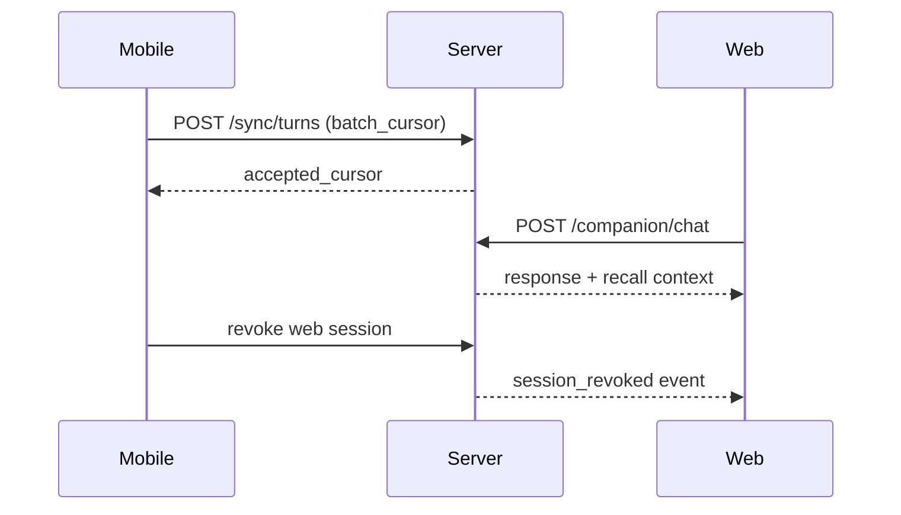
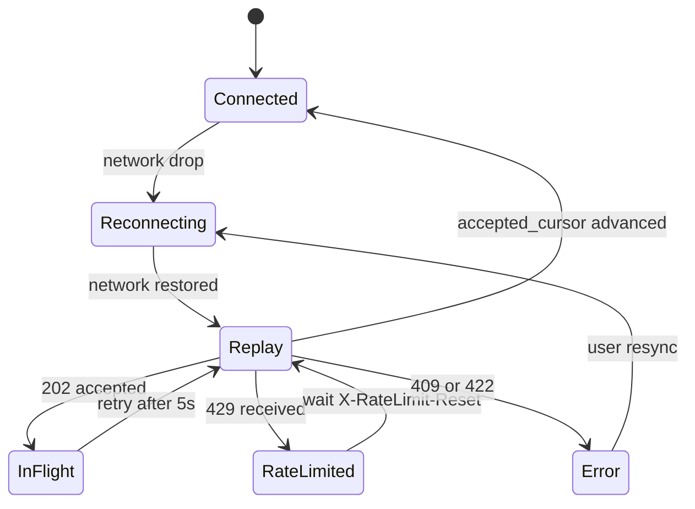

# Web Companion MVP (Phase 0)

> Design doc for a parallel web client to the mobile companion.

**Status**: Draft
**Author**: Design Session
**Date**: 2026-01-22

---

## Overview

The web app is a parallel companion surface focused on desktop usage, approvals,
and quick chat. It complements the on-device mobile experience and relies on
server-side retrieval over an opt-in cloud mirror.

---

## Goals

- Provide a full chat experience on desktop.
- Support multimodal messages (text + image + audio notes).
- Offer approvals, consent management, and memory review.
- Use server-side semantic recall from synced data.
- Share the same companion personality and context rules.

## Non-Goals

- Always-on background presence in the browser.
- Location tracking or sensor use.
- Offline-first operation.
- Local on-device embeddings in the browser (Phase 0).

---

## Architecture

```
Browser (Web UI)
  |
  | HTTPS/WS
  v
Companion API
  |
  | Opt-in sync store (turns, attachments, embeddings)
  v
Semantic Retrieval + LLM
```

- Chat LLM: hosted provider (Groq/Cerebras/agent-hosted).
- Vision: Gemini 3.0 Flash for image understanding.
- STT/TTS: Groq for audio notes and playback.

---

## Data and Sync Model

**Opt-in cloud mirror**
- Mobile device uploads turns, attachments, and derived captions/transcripts.
- Server stores data in a user-bound workspace for web recall.
- If embeddings are not synced, server re-embeds from text.

**Privacy modes**
- Sync disabled: web app is view-only or chat without memory recall.
- Sync enabled: full semantic recall and multimodal context.

---

## MVP Scope

- Chat + streaming responses.
- Image upload + vision caption -> embed -> recall.
- Audio note upload -> STT -> embed -> recall.
- Approvals queue (optional if not used).
- Settings: consents, model status, data export/reset.

---

## Multimodal Flow

1. User sends image or audio note.
2. Upload to server.
3. Vision/STT generates caption/transcript.
4. Caption/transcript is embedded and indexed.
5. Context builder uses semantic matches + recency + pins.

---

## Presence Model (Web)

- Presence is tied to an open tab and active session only.
- No background loops; proactive suggestions only while active.
- Respect DND and cooldown rules from the core policy layer.

---

## API Surface

- POST /companion/chat
- POST /companion/context
- POST /sync/turns
- POST /sync/attachments
- POST /vision/describe
- POST /speech/stt
- POST /speech/tts (optional)
- GET /consents, PATCH /consents/{id}

## API Payloads (Phase 0)

### POST /sync/turns

```json
{
  "conversation_id": "conv_123",
  "device_id": "ios_abc",
  "batch_cursor": 120,
  "turns": [
    {
      "id": "turn_001",
      "role": "user",
      "content": "Can you remind me about dinner?",
      "created_at": "2026-01-22T12:00:00Z",
      "embedding": {
        "model": "gemma-3-embed",
        "dimensions": 1024,
        "vector": "base64..."
      }
    }
  ]
}
```

```json
{
  "accepted": ["turn_001"],
  "skipped": [],
  "accepted_cursor": 121,
  "status": "ok"
}
```

**Headers**
- Idempotency-Key: <uuid>
- X-RateLimit-Remaining: <int>
- X-RateLimit-Reset: <unix_seconds>

**Retry guidance**
- 429: wait until X-RateLimit-Reset, then retry.
- 202: poll with same Idempotency-Key after 5s.

### POST /sync/attachments

```json
{
  "conversation_id": "conv_123",
  "turn_id": "turn_001",
  "attachment": {
    "id": "att_001",
    "mime_type": "image/jpeg",
    "content_base64": "...",
    "sha256": "...",
    "caption": "A ramen bowl"
  }
}
```

```json
{
  "attachment_id": "att_001",
  "status": "stored"
}
```

**Headers**
- Idempotency-Key: <uuid>
- X-RateLimit-Remaining: <int>
- X-RateLimit-Reset: <unix_seconds>

### POST /vision/describe

```json
{
  "image_base64": "...",
  "mime_type": "image/jpeg",
  "prompt": "optional guidance",
  "max_tokens": 256
}
```

```json
{
  "caption": "A bowl of ramen on a wooden table",
  "tags": ["food", "ramen"],
  "model": "gemini-3.0-flash",
  "latency_ms": 120
}
```

**Headers**
- X-RateLimit-Remaining: <int>
- X-RateLimit-Reset: <unix_seconds>

### POST /speech/stt

```json
{
  "audio_base64": "...",
  "mime_type": "audio/m4a",
  "language": "en",
  "punctuate": true
}
```

```json
{
  "transcript": "Can you remind me about the dinner plan?",
  "model": "groq-stt",
  "duration_ms": 5321
}
```

### POST /speech/tts

```json
{
  "text": "Your reminder is set.",
  "voice": "neutral",
  "format": "mp3",
  "speed": 1.0
}
```

```json
{
  "audio_base64": "...",
  "model": "groq-tts"
}
```

## Sync Policy

- Sync is opt-in with per-category toggles (turns, attachments, embeddings).
- Default retention: 90 days for mirrored turns and derived text.
- Raw attachments are stored short-term unless pinned.
- User deletion triggers immediate logical delete; full purge within 90 days.
- Web recall is disabled if sync is off.

## Embedding Strategy (Web)

- Default remote embedder: Voyage.
- Self-hosted mode: Gemma 3 embedder.
- Prefer synced embeddings from device with model id + dimensions + content hash.
- If missing or mismatched, recompute using the configured web embedder.
- Deduplicate by content hash; re-embed only when content changes.
- Store embedding metadata for audit and future migrations.

## Sync Endpoint Details

- Batch size: recommend <= 200 turns or <= 10 MB payload.
- Ordering: client sends `batch_cursor` (monotonic) to preserve turn order.
- Idempotency: `Idempotency-Key` header per batch; server replays the same result.
- Response includes `accepted_cursor` for next batch.

### Error Response (Example)

```json
{
  "status": "error",
  "error": {
    "code": "SYNC_CONFLICT",
    "message": "Turn already exists with different content.",
    "retryable": false
  }
}
```

**Response codes**
- 200: accepted
- 202: accepted (async processing)
- 409: conflict (content mismatch)
- 422: invalid payload
- 429: rate limited

**Rate-limit tiers (example)**
- Starter: 60 req/min
- Pro: 300 req/min
- Enterprise: 1200 req/min

### Sync + Revocation Sequence (Sketch)



## Reconnect + Replay Guidance

- Keep a local sync queue with stable IDs and payload hashes.
- On reconnect, fetch the last `accepted_cursor` and replay missing batches with the same Idempotency-Key.
- Treat 202 as in-flight; poll or retry after 5s without creating a new batch id.
- Back off on 429 using X-RateLimit-Reset; jitter retries.
- If 409 or 422, halt the batch, surface an error, and request a resync.
- For attachments, recheck server by `sha256` before re-uploading to avoid duplicates.

### Client State Diagram (Web)



## Retention Defaults

| Data Type | Default Retention | Notes |
|----------|-------------------|-------|
| Turns | 90 days | Mirrored text + metadata |
| Derived text | 90 days | Captions + transcripts |
| Attachments | 7 days | Longer if pinned |
| Embeddings | 90 days | Recompute if missing |

## Embedder Migration (Web)

- New embedder versions must include model id + dimensions in metadata.
- During migration, recompute embeddings lazily on read.
- Optionally run a background re-embed job for top-K recent items.
- Keep old embeddings until new version coverage is >= 95%.

## Auth Model (Web)

- Device-link flow to bind a browser session to a user account.
- Short-lived access tokens + refresh tokens for API calls.
- Optional SSO or passkeys for returning users.
- Session revocation propagates to active web clients.

### Device-Link Flow (Sketch)

```
Web login -> shows QR or 6-digit code
Mobile app scans/enters code -> confirms link
Server issues web session tokens -> web reloads
```

### Session Revocation + Unlink

- User can revoke a web session from mobile settings.
- Server invalidates refresh tokens and pushes a logout event to web.
- Unlinking removes the device-web association and stops future syncs.

**Logout event payload**

```json
{
  "type": "session_revoked",
  "session_id": "web_sess_123",
  "reason": "user_revoked"
}
```

**Device unlink event payload**

```json
{
  "type": "device_unlinked",
  "device_id": "ios_abc",
  "reason": "user_unlinked"
}
```

---

## Open Questions

- Should approvals be editable from web or view-only?
- Do we allow pinned attachments to bypass the 7-day retention rule?
- What is the desired rate-limit tier per user or device?
