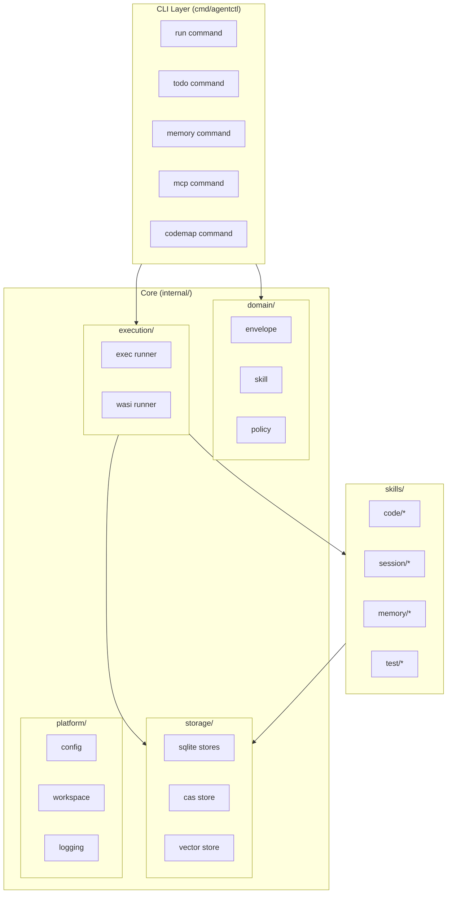
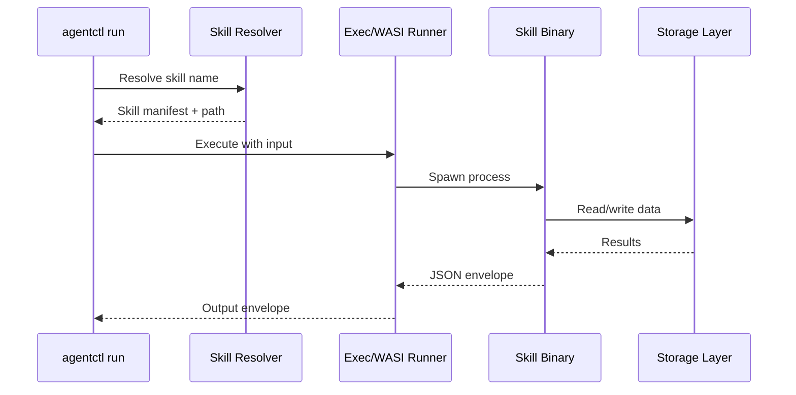
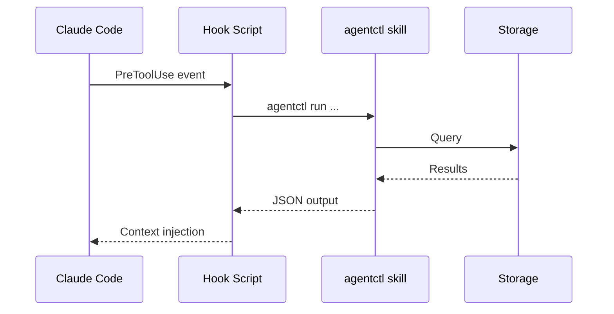

# Architecture

agentctl is a Go CLI providing infrastructure for AI coding assistants.

---

## System Overview

---

## Package Structure

### `cmd/agentctl/`
CLI entry point using Cobra. Each command in `cmd/` subdirectory.

| File | Purpose |
|------|---------|
| `main.go` | Entry point |
| `cmd/run.go` | Skill execution |
| `cmd/todo.go` | Task management |
| `cmd/memory.go` | Memory operations |
| `cmd/mcp.go` | MCP server |
| `cmd/codemap.go` | Codemap generation |

### `internal/domain/`
Pure business types with no external dependencies.

| Package | Purpose |
|---------|---------|
| `envelope` | JSON envelope types, validation |
| `skill` | Skill manifests, resolution |
| `policy` | Path validation, security policies |

### `internal/execution/`
Skill runners that execute skill binaries.

| Package | Purpose |
|---------|---------|
| `exec` | Native process executor with rlimits |
| `wasi` | WASM executor (wazero, pure Go) |

### `internal/storage/`
Persistence layer.

| Package | Purpose |
|---------|---------|
| `memory` | Named memories with vector search |
| `tasks` | Task management with dependencies |
| `sessions` | Session lifecycle and lineage |
| `cas` | Content-addressable storage (SHA-256) |
| `vector` | Vector embeddings (Voyage AI) |
| `jobs` | Async job execution |

### `internal/platform/`
Infrastructure utilities.

| Package | Purpose |
|---------|---------|
| `config` | Configuration loading (Viper) |
| `workspace` | Workspace detection |
| `logging` | Structured logging (zerolog) |
| `fsutil` | File system utilities |

### `internal/codemap/`
Codemap generation system using dspy-go.

| File | Purpose |
|------|---------|
| `agent.go` | ReAct agent definition |
| `types.go` | Codemap, Trace, Annotation types |
| `tools/` | Agent tools (search, read) |

### `internal/codecontext/`
Code snippet extraction and evidence collection.

| Package | Purpose |
|---------|---------|
| `files/` | File reading with limits |
| `expander/` | Block boundary detection |
| `lang/` | Language-specific utilities |

---

## Data Flow

### Skill Execution

### Hook Execution (Claude Code)

---

## Key Invariants

1. **Envelope Contract**: All skill I/O uses JSON envelopes (version: 1)
2. **WASI Isolation**: WASI skills have no network access
3. **Workspace Confinement**: Skills cannot access files outside workspace
4. **CAS Integrity**: SHA-256 verification on all CAS reads
5. **Session Lineage**: Sessions track parent_session_id for context chain

---

## Configuration

Default paths:

| Path | Purpose |
|------|---------|
| `~/.agentctl/` | Root directory |
| `~/.agentctl/storage/` | SQLite databases |
| `~/.agentctl/cas/` | Content-addressable storage |
| `~/.agentctl/skills/` | Installed skills |
| `~/.agentctl/.env` | Environment variables |

Key environment variables:

| Variable | Default | Purpose |
|----------|---------|---------|
| `AGENTCTL_HOME` | `~/.agentctl` | Root directory |
| `AGENTCTL_WORKSPACE` | cwd | Current workspace |
| `VOYAGE_API_KEY` | - | Vector embeddings |
| `ANTHROPIC_API_KEY` | - | LLM for codemaps |

See [.claude/CLAUDE.md](../../.claude/CLAUDE.md) for full environment reference.
