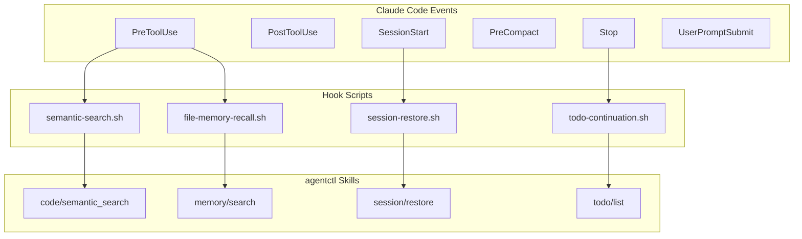

# Hooks

Hooks inject context into AI coding sessions at tool boundaries.

---

## Overview



---

## Hook Events

| Event | When Triggered | Use Case |
|-------|----------------|----------|
| `PreToolUse` | Before tool execution | Inject context, check conditions |
| `PostToolUse` | After tool execution | Suggest follow-ups, capture data |
| `SessionStart` | Session begins/resumes | Restore context |
| `PreCompact` | Before context compaction | Save state |
| `Stop` | User attempts to stop | Block if tasks remain |
| `UserPromptSubmit` | User sends message | Detect patterns, suggest skills |

---

## Active Hooks

### PreToolUse Hooks

| Hook | Triggers On | Purpose |
|------|-------------|---------|
| `semantic-search` | Grep, Glob | Vector search for relevant code |
| `file-memory-recall` | Edit, Write | Surface memories before editing |
| `overseer-inbox` | Read, Bash, Grep, Glob, Task | Human-in-the-loop messages |
| `task-guard` | Write, Edit | Ensure task exists for writes |

### PostToolUse Hooks

| Hook | Triggers On | Purpose |
|------|-------------|---------|
| `read-context-suggestions` | Read | Suggest context_ripgrep for symbols |
| `counsel-suggest` | Read (3+ files) | Suggest /counsel analysis |
| `lsp-diagnostics` | Edit, Write | Show LSP errors after editing |
| `memory-prompt` | TodoWrite | Prompt to save memories on completion |

### Session Hooks

| Hook | Event | Purpose |
|------|-------|---------|
| `session-restore` | SessionStart | Restore context on resume |
| `session-save` | PreCompact | Capture session state |
| `session-summarize` | PreCompact | Extract learnings via LLM |

### Control Hooks

| Hook | Event | Purpose |
|------|-------|---------|
| `todo-continuation` | Stop | Block stop if tasks remain |
| `plan-sync` | Stop | Sync plans to tasks |

### Detection Hooks

| Hook | Event | Purpose |
|------|-------|---------|
| `memory-detector` | UserPromptSubmit | Detect save/recall patterns |
| `skill-advisor` | UserPromptSubmit | Suggest skills based on prompt |
| `anchor-detect` | UserPromptSubmit | Set session goal via `/anchor` |
| `counsel-detect` | UserPromptSubmit | Run `/counsel` analysis |
| `context-detect` | UserPromptSubmit | Run `/context` gathering |

---

## Hook Configuration

Hooks are configured in `.claude/settings.json`:

```json
{
  "hooks": {
    "PreToolUse": [
      {
        "matcher": "Grep|Glob",
        "hooks": [
          {
            "type": "command",
            "command": "~/.agentctl/hooks/semantic-search.sh \"$TOOL_INPUT\""
          }
        ]
      }
    ],
    "PostToolUse": [
      {
        "matcher": "Read",
        "hooks": [
          {
            "type": "command",
            "command": "~/.agentctl/hooks/read-context-suggestions.sh \"$TOOL_INPUT\" \"$TOOL_OUTPUT\""
          }
        ]
      }
    ]
  }
}
```

---

## Hook Implementation

### Basic Hook Script

```bash
#!/bin/bash
# configs/hooks/my-hook.sh

TOOL_INPUT="$1"
TOOL_OUTPUT="${2:-}"

# Parse input
FILE_PATH=$(echo "$TOOL_INPUT" | jq -r '.file_path // empty')

# Run skill
RESULT=$(agentctl run my/skill --input "{\"path\": \"$FILE_PATH\"}" 2>/dev/null)

# Output context injection (if any)
if [ -n "$RESULT" ]; then
    echo "---"
    echo "**Context from my-hook:**"
    echo "$RESULT" | jq -r '.data.summary // empty'
fi
```

### Hook Output

Hooks can output text that gets injected into the AI's context:

- Return nothing for no injection
- Return text for context injection
- Use `---` separator for visual separation
- Format as markdown for readability

---

## Environment Variables

Hooks receive these environment variables:

| Variable | Description |
|----------|-------------|
| `TOOL_INPUT` | JSON input to the tool |
| `TOOL_OUTPUT` | JSON output from tool (PostToolUse only) |
| `TOOL_NAME` | Name of the tool being called |
| `AGENTCTL_WORKSPACE` | Current workspace path |
| `AGENTCTL_SESSION_ID` | Current session ID |

---

## Human-in-the-Loop: Overseer Inbox

Send messages to a running Claude session:

```bash
# Send a message
agentctl-mail "Priority change" "Focus on auth bug first"

# With priority
agentctl-mail -p 1 "STOP" "Pause and review this issue"

# Require acknowledgment
agentctl-mail --ack "Review needed" "Check the API changes"
```

The `overseer-inbox` hook checks for unread messages on every tool call
and injects them into Claude's context.

---

## Slash Commands

Hooks enable slash commands in Claude Code:

| Command | Hook | Purpose |
|---------|------|---------|
| `/anchor <goal>` | `anchor-detect` | Set session goal |
| `/todo` | - | Enable todo check-in mode |
| `/counsel <question>` | `counsel-detect` | Multi-perspective analysis |
| `/context <query>` | `context-detect` | Quick code context |

---

## Gotchas

### Hook Timeout
Hooks have a timeout (default 30s). Long-running operations should:
- Use background jobs
- Cache results
- Fail fast with partial results

### Hook Blocking
Hooks run synchronously. A slow hook blocks the AI:
- Keep hooks fast (<1s ideal)
- Use async patterns for heavy work
- Consider caching

### Context Size
Hook output adds to context window:
- Keep output concise
- Use summaries, not full content
- Truncate large results

See [gotchas.md](gotchas.md) for more common pitfalls.
