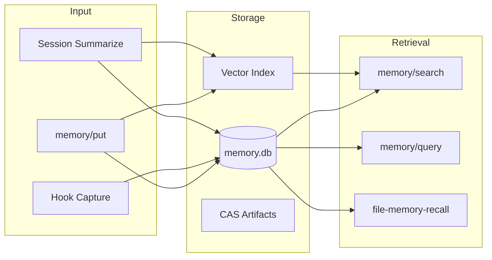
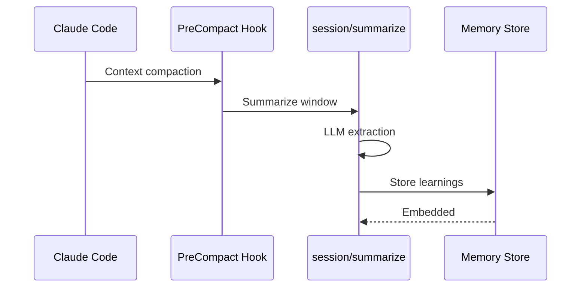

# Memory System

Persistent knowledge storage with vector search for AI assistants.

---

## Overview



---

## Memory Types

| Type | Purpose | Examples |
|------|---------|----------|
| `gotcha` | Pitfalls and warnings | "Skills must call config.LoadDotEnv()" |
| `decision` | Architectural choices | "Using Voyage AI for embeddings" |
| `pattern` | Code patterns | "TOCTOU-safe file reading pattern" |
| `learning` | Discovered knowledge | "Session lineage via parent_session_id" |
| `reference` | External references | "API docs at https://..." |
| `codemap` | Semantic code traces | Generated by codemap/generate |
| `symbol` | Code symbol embeddings | Extracted by code/symbols |

---

## Operations

### Store Memory

```bash
agentctl memory put \
  --name "gotcha-env-loading" \
  --type "gotcha" \
  --summary "Skills must call config.LoadDotEnv() before os.Getenv()"

# With full data
agentctl memory put \
  --name "decision-embedding-provider" \
  --type "decision" \
  --summary "Using Voyage AI for embeddings (1024 dims)" \
  --data '{"rationale": "Better benchmarks than OpenAI", "date": "2025-12"}'
```

### Search Memory

```bash
# Semantic search (vector-based)
agentctl memory search "environment variable loading"

# Query by type
agentctl memory query --type gotcha

# Query by workspace
agentctl memory query --workspace /path/to/project
```

### List Memories

```bash
agentctl memory list
agentctl memory list --type gotcha --limit 10
```

---

## Vector Search

Memories are embedded using Voyage AI for semantic search.

### Embedding Models

| Scope | Model | Dimensions | Rationale |
|-------|-------|------------|-----------|
| `symbols` | `voyage-code-3` | 1024 | Best for code |
| `memory` | `voyage-3-large` | 1024 | Best for text |
| `codemaps` | `voyage-3.5` | 1024 | Good balance |
| `sessions` | `voyage-3.5` | 1024 | Good balance |

### Configuration

```bash
# Required
export VOYAGE_API_KEY=...

# Optional: Rate limiting (0 = disabled for paid tier)
export AGENTCTL_EMBEDDING_RATE_LIMIT=3

# Optional: Enable reranking
export AGENTCTL_SEMANTIC_RERANK=1
```

---

## Automatic Capture

### Session Summarization
When sessions are compacted, `session/summarize` extracts learnings:



### File Memory Recall
Before editing files, the `file-memory-recall` hook surfaces relevant memories:

```bash
# Triggered automatically on Edit/Write
# Searches for memories related to the file being edited
```

---

## Memory Hooks

| Hook | Event | Purpose |
|------|-------|---------|
| `memory-detector` | UserPromptSubmit | Detect save/recall patterns |
| `memory-prompt` | PostToolUse (TodoWrite) | Prompt to save on task completion |
| `file-memory-recall` | PreToolUse (Edit/Write) | Surface memories before editing |

### Detection Patterns

The `memory-detector` hook recognizes:

**Save patterns:**
- "remember this", "the trick is", "TIL"
- "watch out for", "please don't", "don't forget"

**Recall patterns:**
- "how did we", "didn't we already", "last time we"

---

## Storage Schema

Memories are stored in `~/.agentctl/storage/memory.db`:

```sql
CREATE TABLE memories (
    id TEXT PRIMARY KEY,
    name TEXT UNIQUE NOT NULL,
    type TEXT NOT NULL,
    summary TEXT NOT NULL,
    data TEXT,  -- JSON blob
    workspace TEXT,
    created_at DATETIME,
    updated_at DATETIME
);

CREATE TABLE memory_embeddings (
    memory_id TEXT PRIMARY KEY,
    embedding BLOB NOT NULL,  -- 1024-dim float32
    model TEXT NOT NULL,
    FOREIGN KEY (memory_id) REFERENCES memories(id)
);
```

---

## Workspace Scoping

Memories are scoped by workspace path:

```bash
# Query from correct workspace
cd /path/to/project
agentctl memory search "authentication"

# Or specify explicitly
agentctl memory query --workspace /path/to/project
```

---

## Gotchas

### Workspace Scoping
Memory queries are scoped by workspace. Running from `/tmp` won't find
memories stored for `/Users/me/project`.

### Embedding Dimension Mismatch
All queries must use the same embedding model as stored memories.
Mixing Gemini (3072 dims) with Voyage (1024 dims) will fail.

### CAS Store Signature
When storing artifacts:
```go
obj, err := casStore.Put(ctx, bytes.NewReader(data), "application/json", []string{"tag"})
digest := obj.Digest  // "sha256:..."
```

See [gotchas.md](gotchas.md) for more common pitfalls.
