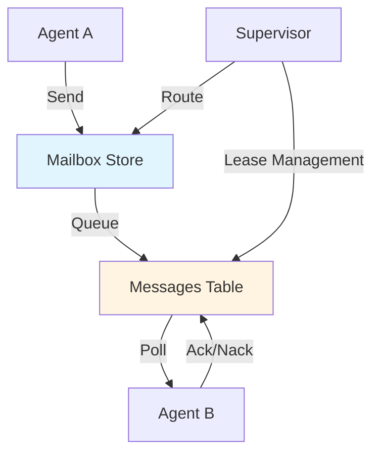

# Message Passing in agentctl

This guide explains how agents communicate through message passing in agentctl.

## Overview

agentctl uses a durable, lease-based messaging system built on SQLite. Messages are:
- **Persisted** to `~/.agentctl/mailbox.db`
- **Leased** during processing to prevent duplicate delivery
- **Routed** by namespace (actor mailbox)
- **Tracked** with session lineage and workspace context

## Architecture



### Key Components

| Component | Location | Purpose |
|-----------|----------|---------|
| `mailbox.Store` | `internal/storage/mailbox/store.go` | SQLite persistence |
| `MailboxAdapter` | `internal/actor/mailbox_adapter.go` | Storage → Actor bridge |
| `BaseActor` | `internal/actor/base_actor.go` | Message handling |
| `Supervisor` | `internal/actor/supervisor.go` | Lifecycle & routing |

## Message Types

### Core Messages

| Type | Subject | Pattern | Use Case |
|------|---------|---------|----------|
| Request | `agent.ask` | Request/Response | Ask a question, get answer |
| Response | `agent.reply` | Response to ask | Return result |
| Command | `agent.cmd` | Fire-and-forget | Trigger action |
| Event | `agent.event` | Notification | Publish status/event |

### Console Messages

| Type | Subject | Use Case |
|------|---------|----------|
| Input | `console.ask` | User input from TUI/API |
| Output | `console.reply` | Final response to user |
| Stream | `console.event` | Progress updates |
| Control | `console.cmd` | Cancel/pause/resume |

## Message Structure

```go
type Message struct {
    ID        string                 // Unique message ID (ULID)
    FromNS    string                 // Source namespace
    ToNS      string                 // Destination namespace
    Type      MessageType            // Message type
    TTLMS     int64                  // Time-to-live in milliseconds
    Headers   map[string]string      // Metadata
    Payload   json.RawMessage        // Envelope JSON (see below)
    VisibleAt int64                  // Unix timestamp when message becomes visible
    Attempt   int                    // Retry count
    Timestamp int64                  // Creation timestamp
    
    // Lineage context
    SessionID string                 // Originating session
    Workspace string                 // Workspace path
    AgentID   string                 // Sending agent's ID
}
```

### Payload Envelope

All payloads follow the standard envelope format:

```json
{
  "version": 1,
  "status": "ok",
  "command": "agent.ask",
  "data": {
    "ask_id": "...",
    "question": "...",
    "context": { ... }
  },
  "meta": {
    "ts": "2026-01-12T12:00:00Z"
  },
  "error": {}
}
```

## Usage Patterns

### 1. Sending Messages from an Actor

In your actor's handler, use `Reply()` to send back to the sender:

```go
func (a *MyActor) handleAsk(ctx context.Context, msg *Message) (*Message, error) {
    // Parse the incoming payload
    var env struct {
        Data agentdomain.AskData `json:"data"`
    }
    if err := json.Unmarshal(msg.Body, &env); err != nil {
        return nil, fmt.Errorf("unmarshal: %w", err)
    }
    
    // Process the request
    answer := processQuestion(env.Data.Question)
    
    // Build reply
    replyData := agentdomain.ReplyData{
        AskID:  env.Data.AskID,
        Answer: map[string]any{"result": answer},
    }
    replyEnv := envelope.OK("agent.reply", replyData)
    replyPayload, _ := json.Marshal(replyEnv)
    
    return &Message{
        ID:        ulid.Make().String(),
        Type:      agent.MessageTypeReply,
        Payload:   replyPayload,
        Timestamp: time.Now().Unix(),
    }, nil
}
```

### 2. Broadcasting to Multiple Agents

To send to multiple namespaces:

```go
func broadcastMessage(ctx context.Context, store mailbox.Store, msg Message, namespaces ...string) error {
    for _, ns := range namespaces {
        msg.ToNS = ns
        msg.ID = ulid.Make().String()
        msg.VisibleAt = time.Now().Unix()
        if err := store.Send(ctx, msg); err != nil {
            return err
        }
    }
    return nil
}
```

### 3. Request/Response Pattern

```go
// Agent A: Send request
func (a *AgentA) requestFromAgentB(ctx context.Context, question string) (*agentdomain.ReplyData, error) {
    askID := ulid.Make().String()
    
    askData := agentdomain.AskData{
        AskID:    askID,
        Question: question,
    }
    askEnv := envelope.OK("agent.ask", askData)
    askPayload, _ := json.Marshal(askEnv)
    
    msg := &Message{
        ID:        ulid.Make().String(),
        FromNS:    a.Namespace(),
        ToNS:      "agent:b",
        Type:      agent.MessageTypeAsk,
        Payload:   askPayload,
        Timestamp: time.Now().Unix(),
        TTLMS:     int64(5 * time.Minute / time.Millisecond), // 5 minute timeout
    }
    
    // Send through mailbox
    if err := a.mailbox.Send(ctx, msg); err != nil {
        return nil, err
    }
    
    // Wait for reply (requires correlation tracking)
    // See helpers.MessageSender for complete example
    return waitForReply(ctx, askID)
}
```

### 4. Fire-and-Forget Commands

```go
// Send a command without waiting for response
func (a *AgentA) triggerBuild(ctx context.Context) error {
    cmdData := agentdomain.CmdData{
        CmdID:  ulid.Make().String(),
        Action: "run_build",
        Args:   map[string]any{"target": "all"},
    }
    cmdEnv := envelope.OK("agent.cmd", cmdData)
    cmdPayload, _ := json.Marshal(cmdEnv)
    
    msg := &Message{
        ID:        ulid.Make().String(),
        FromNS:    a.Namespace(),
        ToNS:      "agent:builder",
        Type:      agent.MessageTypeCmd,
        Payload:   cmdPayload,
        Timestamp: time.Now().Unix(),
        TTLMS:     int64(30 * time.Minute / time.Millisecond),
    }
    
    return a.mailbox.Send(ctx, msg)
}
```

### 5. Event Publishing

```go
// Publish events for other agents to subscribe
func (a *AgentA) publishEvent(ctx context.Context, eventKind string, data map[string]any) error {
    eventData := agentdomain.EventData{
        EventID: ulid.Make().String(),
        Kind:    eventKind,
        Custom:  data,
    }
    eventEnv := envelope.OK("agent.event", eventData)
    eventPayload, _ := json.Marshal(eventEnv)
    
    msg := &Message{
        ID:        ulid.Make().String(),
        FromNS:    a.Namespace(),
        ToNS:      "broadcast", // Special namespace for events
        Type:      agent.MessageTypeEvent,
        Payload:   eventPayload,
        Timestamp: time.Now().Unix(),
        TTLMS:     int64(5 * time.Minute / time.Millisecond),
    }
    
    return a.mailbox.Send(ctx, msg)
}
```

## Session Lineage

Messages carry session context for debugging and tracing:

```go
// When creating a message in response, preserve context
reply := &Message{
    ID:        ulid.Make().String(),
    Type:      agent.MessageTypeReply,
    Payload:   replyPayload,
    Timestamp: time.Now().Unix(),
    SessionID: originalMsg.SessionID,  // Preserve session
    Workspace: originalMsg.Workspace,  // Preserve workspace
}
```

To query all messages in a session:

```go
messages, err := store.ListBySession(ctx, sessionID, 100)
```

## Error Handling and Retries

### Automatic Retries

Messages that return an error (not acked) become visible again after the lease timeout:

```go
func (a *MyActor) handleAsk(ctx context.Context, msg *Message) (*Message, error) {
    // If this returns an error, the message will be retried
    // up to msg.MaxRetries times
    
    if someCondition {
        return nil, fmt.Errorf("transient error: %w", err)
    }
    
    // Return reply to ack and remove the message
    return buildReply(...), nil
}
```

### Explicit Failure

For non-retryable errors, delete the message:

```go
func (a *MyActor) handleAsk(ctx context.Context, msg *Message) (*Message, error) {
    if isPermanentError(err) {
        // Ack to remove from queue (won't retry)
        _ = a.mailbox.Ack(ctx, msg.ID)
        return nil, nil // No reply, message consumed
    }
    
    // Normal path
    return buildReply(...), nil
}
```

### Message Dead Letter

Messages exceeding max retries remain in the queue. Clean them up:

```sql
-- Find stuck messages
SELECT * FROM mailbox 
WHERE attempt >= 3 
  AND visible_at <= strftime('%s', 'now', '-1 hour');

-- Delete stuck messages
DELETE FROM mailbox 
WHERE attempt >= 3 
  AND visible_at <= strftime('%s', 'now', '-1 hour');
```

## Best Practices

### DO

✅ Preserve session lineage when replying  
✅ Use ULIDs for message IDs  
✅ Set appropriate TTL (default 5 minutes)  
✅ Validate payloads with envelope format  
✅ Handle errors gracefully with retries  
✅ Use `Headers` for correlation data  

### DON'T

❌ Block indefinitely in message handlers  
❌ Ignore `ctx` cancellation  
❌ Send huge payloads in-message (use CAS instead)  
❌ Forget to Ack or reply (causes lease expiration)  
❌ Modify `meta` fields in envelopes

## Monitoring

### Check Message Queue Sizes

```go
func (a *MyActor) queueStats() error {
    messages, _ := a.store.List(ctx, a.Namespace(), 0)
    fmt.Printf("Queue depth: %d\n", len(messages))
    return nil
}
```

### Query from CLI

```bash
# Open mailbox database
sqlite3 ~/.agentctl/mailbox.db

# Count pending messages
SELECT to_ns, COUNT(*) FROM mailbox WHERE visible_at <= strftime('%s', 'now') GROUP BY to_ns;

# Find stale messages (older than 1 hour)
SELECT * FROM mailbox WHERE ts < strftime('%s', 'now', '-1 hour');

# Monitor lease expirations
SELECT to_ns, visible_at, attempt FROM mailbox ORDER BY visible_at ASC LIMIT 20;
```

## Troubleshooting

### Messages Not Delivered

1. **Check namespace**: Ensure `ToNS` matches receiving actor's namespace
2. **Check lease**: Messages with expired leases may be claimed by other processes
3. **Check visibility**: `visible_at` must be in the past to be polled
4. **Check actor state**: Actor must be running to poll messages

### Messages Stuck in Queue

1. **Check retries**: Exceeded MAX_RETRIES?
2. **Check errors**: Handler returning errors?
3. **Check locks**: Long-running handler holding lease?

### Duplicate Messages

1. **Check lease timeout**: Ensure it's longer than your handler's max duration
2. **Check parallelism**: Only one instance per namespace should be running

## See Also

- [Events System](./events.md) - Event bus for system-wide notifications
- [Actors](https://github.com/jkatigb/agentctl/tree/main/internal/actor) - Actor implementation
- [Mailbox Storage](https://github.com/jkatigb/agentctl/tree/main/internal/storage/mailbox) - Persistence layer
