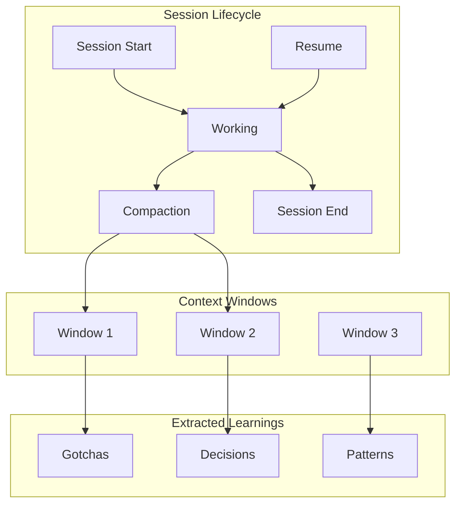
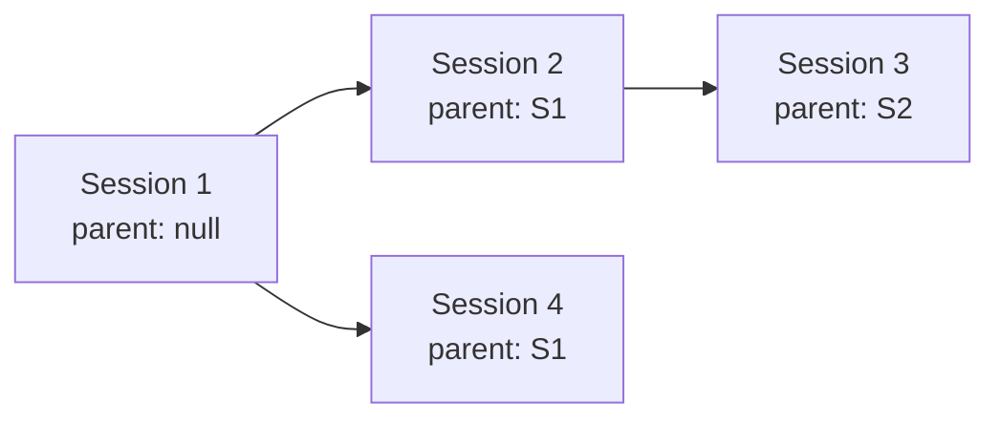
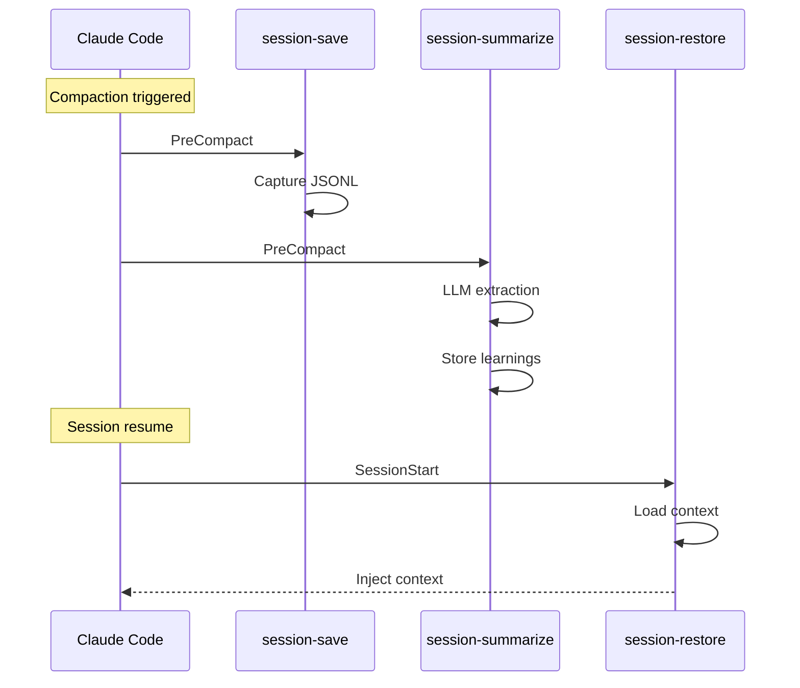

# Sessions

Session management for context preservation across compaction boundaries.

---

## Overview



---

## Session Lineage

Sessions track their ancestry for context chain:



```bash
# View session chain
agentctl sessions chain

# Output:
# Session 3 (current)
#   └── Session 2
#       └── Session 1 (root)
```

---

## Context Windows

Each compaction creates a new context window within a session:

| Field | Description |
|-------|-------------|
| `session_id` | Parent session |
| `window_number` | Sequential within session |
| `chunk_count` | Number of message chunks |
| `raw_jsonl_path` | Path to captured JSONL |
| `summary` | LLM-generated summary |

---

## Session Skills

### session/restore

Restore context when resuming or after compaction:

```bash
agentctl run session/restore --input '{"session_id": "..."}'
```

Returns:
- Recent session context
- Relevant past windows (via vector search)
- Active anchor goal
- Pending tasks

### session/summarize

Extract learnings from session windows:

```bash
agentctl run session/summarize --input '{"session_id": "..."}'
```

Extracts:
- Gotchas discovered
- Decisions made
- Patterns identified
- Technical learnings

### session/recall

Search past sessions:

```bash
agentctl run session/recall --input '{"query": "authentication bug"}'
```

---

## Session Hooks

| Hook | Event | Purpose |
|------|-------|---------|
| `session-restore` | SessionStart | Restore context on resume |
| `session-save` | PreCompact | Capture session state |
| `session-summarize` | PreCompact | Extract learnings via LLM |

### Hook Flow



---

## Identity Fallback

For hooks without environment access, a fallback file stores session identity:

```
~/.agentctl/sessions/active/<workspace_hash>.json
```

```json
{
  "session_id": "abc123",
  "agent_id": "claude",
  "parent_session_id": "xyz789",
  "workspace": "/path/to/project"
}
```

---

## Environment Variables

Skills receive session context via environment:

| Variable | Description |
|----------|-------------|
| `AGENTCTL_SESSION_ID` | Current session ID |
| `AGENTCTL_AGENT_ID` | Agent identifier |
| `CLAUDE_SESSION_ID` | Claude Code session ID |

Fallback chain:
1. `AGENTCTL_SESSION_ID`
2. `CLAUDE_SESSION_ID`
3. `OPENCODE_SESSION_ID`
4. `CURSOR_SESSION_ID`
5. `TERM_SESSION_ID`

---

## Anchor Goals

Sessions can have an anchor goal that persists across compaction:

```bash
# Set anchor (in Claude Code chat)
/anchor Fix the authentication timeout bug

# Anchor is restored on resume via session/restore
```

---

## Storage Schema

Sessions stored in `~/.agentctl/storage/sessions.db`:

```sql
CREATE TABLE sessions (
    id TEXT PRIMARY KEY,
    agent_id TEXT,
    workspace TEXT,
    parent_session_id TEXT,
    status TEXT,  -- running, ok, error, canceled
    started_at DATETIME,
    ended_at DATETIME,
    anchor TEXT,
    FOREIGN KEY (parent_session_id) REFERENCES sessions(id)
);

CREATE TABLE context_windows (
    id TEXT PRIMARY KEY,
    session_id TEXT NOT NULL,
    window_number INTEGER NOT NULL,
    chunk_count INTEGER,
    raw_jsonl_path TEXT,
    summary TEXT,
    created_at DATETIME,
    FOREIGN KEY (session_id) REFERENCES sessions(id)
);
```

---

## Gotchas

### Session Archives are Gzipped
Session JSONL files are archived as `.jsonl.gz`. Skills reading
`session.RawJSONLPath` must handle gzip:

```go
if strings.HasSuffix(path, ".gz") {
    gzReader, err := gzip.NewReader(file)
    // ...
}
```

### Session Learnings are Idempotent
`session/summarize` uses content-hash naming and checks for existing
embeddings before re-processing. Safe to run multiple times.

### Context Window vs Session Summaries
Summaries are at the **context window** level, not session level.
A session may have multiple windows, each with its own summary.

See [gotchas.md](gotchas.md) for more common pitfalls.
