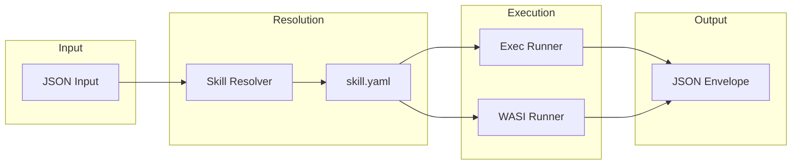

# Skills

Skills are discoverable tools that AI assistants can invoke through agentctl.

---

## Overview



---

## Skill Categories

### Code Analysis

| Skill | Description | Input |
|-------|-------------|-------|
| `code/symbols` | Extract functions, types, variables | `{"path": "file.go"}` |
| `code/complexity` | Cyclomatic complexity analysis | `{"path": "."}` |
| `code/imports` | Import/dependency analysis | `{"path": "file.go"}` |
| `code/security` | Security vulnerability scan | `{"path": "."}` |
| `code/git` | Git blame, hotspots | `{"path": "."}` |

### Code Search

| Skill | Description | Input |
|-------|-------------|-------|
| `code/semantic_search` | Vector-based code search | `{"query": "...", "limit": 10}` |
| `code/smart_search` | Auto-candidate generation + extraction | `{"query": "..."}` |
| `code/context_ripgrep` | Search with full function bodies | `{"pattern": "...", "path": "."}` |
| `code/snippet_extract` | Extract code snippets from candidates | `{"candidates": [...]}` |

### Code Editing

| Skill | Description | Input |
|-------|-------------|-------|
| `code/smart_write` | Symbol-based editing with dry-run | `{"path": "...", "edits": [...]}` |

### Testing

| Skill | Description | Input |
|-------|-------------|-------|
| `test/run` | Run tests with coverage | `{"path": ".", "pattern": "..."}` |

### LSP

| Skill | Description | Input |
|-------|-------------|-------|
| `lsp/gopls` | Go LSP operations | `{"operation": "definition", "path": "...", "line": 10}` |

### Mobile

| Skill | Description | Input |
|-------|-------------|-------|
| `mobile/ios` | iOS Simulator automation | `{"action": "tap", "x": 100, "y": 200}` |
| `mobile/android` | Android Emulator automation | `{"action": "screenshot"}` |

### Sessions

| Skill | Description | Input |
|-------|-------------|-------|
| `session/restore` | Restore context on resume | `{"session_id": "..."}` |
| `session/summarize` | Extract learnings from session | `{"session_id": "..."}` |
| `session/recall` | Search past sessions | `{"query": "..."}` |

### Memory

| Skill | Description | Input |
|-------|-------------|-------|
| `memory/put` | Store a memory | `{"name": "...", "type": "gotcha", "summary": "..."}` |
| `memory/search` | Search memories | `{"query": "..."}` |
| `memory/query` | Query by type/workspace | `{"type": "gotcha"}` |

### Codemaps

| Skill | Description | Input |
|-------|-------------|-------|
| `codemap/generate` | Generate semantic code trace | `{"query": "..."}` |
| `codemap/search` | Search existing codemaps | `{"query": "..."}` |

### CI/Git

| Skill | Description | Input |
|-------|-------------|-------|
| `ci/status` | CI status and PR info | `{"pr": 123}` |
| `ci/comments` | PR review comments | `{"pr": 123, "source": "coderabbit"}` |
| `git/status` | Git status | `{}` |

---

## Skill Manifest Format

Each skill has a `skill.yaml` manifest:

```yaml
name: code/symbols
version: 0.1.0
description: Extract symbols from source code
distribution: exec  # or "wasi"

input:
  type: object
  properties:
    path:
      type: string
      description: Path to file or directory
  required:
    - path

output:
  type: object
  properties:
    symbols:
      type: array
      items:
        type: object
```

---

## Runners

### Exec Runner
Native process execution with resource limits.

- Spawns skill binary as subprocess
- Sets `AGENTCTL_WORKSPACE` environment variable
- Enforces rlimits (memory, CPU time)
- Captures stdout as JSON envelope

### WASI Runner
WebAssembly execution via wazero (pure Go).

- No network access (Core v1 mandate)
- Sandboxed filesystem
- Used for portable, isolated skills

---

## Creating Skills

### Directory Structure

```
skills/
└── my_skill/
    ├── main.go       # Implementation
    ├── skill.yaml    # Manifest
    └── main_test.go  # Tests
```

### Implementation Pattern

```go
package main

import (
    "encoding/json"
    "os"

    "github.com/jkatigb/agentctl/internal/platform/config"
)

func main() {
    // Load .env for API keys
    config.LoadDotEnv()

    // Read input from stdin
    var input struct {
        Path string `json:"path"`
    }
    json.NewDecoder(os.Stdin).Decode(&input)

    // Do work...
    result := doWork(input.Path)

    // Output JSON envelope to stdout
    json.NewEncoder(os.Stdout).Encode(map[string]any{
        "version": 1,
        "status":  "ok",
        "command": "my/skill",
        "data":    result,
        "meta": map[string]any{
            "ts": time.Now().UTC().Format(time.RFC3339),
        },
    })
}
```

### Build and Install

```bash
# Build and install to ~/.agentctl/skills/
CGO_ENABLED=0 go build -o ~/.agentctl/skills/my/skill/bin ./skills/my_skill

# Or use make target (rebuilds all)
make skills-install
```

---

## Gotchas

### Skill Binary Naming
The loader looks for `bin` or `bin-cgo`, NOT custom names from `skill.yaml`.

```bash
# Correct
go build -o ~/.agentctl/skills/my/skill/bin ./skills/my_skill

# Wrong - loader won't find it
go build -o ~/.agentctl/skills/my/skill/my_skill ./skills/my_skill
```

### .env Loading
Skills must explicitly load `.env` files:

```go
import "github.com/jkatigb/agentctl/internal/platform/config"

func main() {
    config.LoadDotEnv() // Must call BEFORE os.Getenv()
    // ...
}
```

### Two-Stage Deploy
Changes require both build AND install:

```bash
# Build creates binary in wrong location
go build ./skills/my_skill  # Creates ./my_skill

# Must install to correct location
go build -o ~/.agentctl/skills/my/skill/bin ./skills/my_skill
```

See [gotchas.md](gotchas.md) for more common pitfalls.
