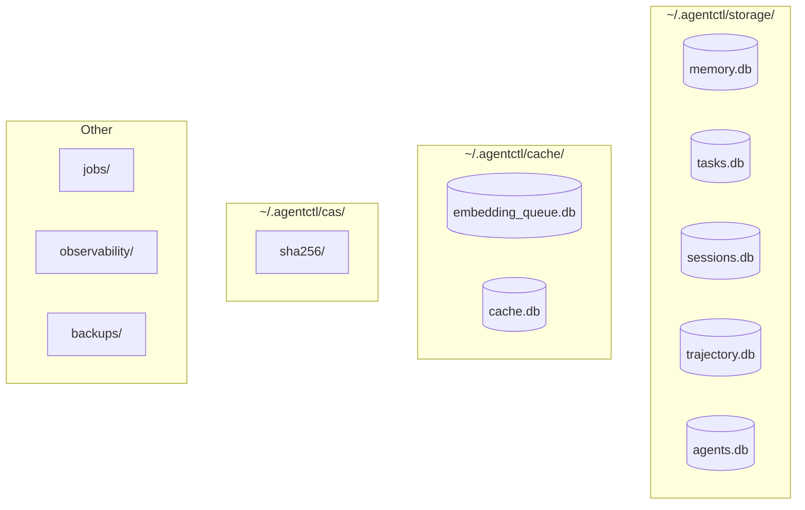

# Storage

agentctl uses SQLite databases and content-addressable storage.

---

## Overview



---

## Database Files

### Persistent Storage (`~/.agentctl/storage/`)

| Database | Purpose | Key Tables |
|----------|---------|------------|
| `memory.db` | Memories, codemaps, symbols | `memories`, `memory_embeddings` |
| `tasks.db` | Task management | `tasks`, `task_dependencies` |
| `sessions.db` | Session lineage | `sessions`, `context_windows` |
| `trajectory.db` | Agent audit trail | `trajectories`, `trajectory_events` |
| `agents.db` | Agent registry | `agents` |

### Cache (`~/.agentctl/cache/`)

| Database | Purpose | Notes |
|----------|---------|-------|
| `embedding_queue.db` | Symbol embedding jobs | Regenerable |
| `cache.db` | Skill result cache | TTL-based |

---

## Content-Addressable Storage

Large artifacts stored by SHA-256 digest:

```
~/.agentctl/cas/
└── sha256/
    ├── abc123...
    ├── def456...
    └── ...
```

### Operations

```bash
# Store content
DIGEST=$(agentctl cas put < large-file.json)

# Retrieve by digest
agentctl cas get $DIGEST

# Pin (prevent GC)
agentctl cas pin $DIGEST

# Garbage collect
agentctl cas gc --older-than=168h --dry-run
```

### Integrity
Every `get` recomputes the SHA-256 and fails with `EIO` on mismatch.

---

## Schema Details

### memory.db

```sql
CREATE TABLE memories (
    id TEXT PRIMARY KEY,
    name TEXT UNIQUE NOT NULL,
    type TEXT NOT NULL,  -- gotcha, decision, pattern, learning, reference
    summary TEXT NOT NULL,
    data TEXT,  -- JSON blob
    workspace TEXT,
    created_at DATETIME DEFAULT CURRENT_TIMESTAMP,
    updated_at DATETIME DEFAULT CURRENT_TIMESTAMP
);

CREATE TABLE memory_embeddings (
    memory_id TEXT PRIMARY KEY,
    embedding BLOB NOT NULL,  -- 1024-dim float32
    model TEXT NOT NULL,
    created_at DATETIME DEFAULT CURRENT_TIMESTAMP,
    FOREIGN KEY (memory_id) REFERENCES memories(id)
);

CREATE INDEX idx_memories_type ON memories(type);
CREATE INDEX idx_memories_workspace ON memories(workspace);
```

### tasks.db

```sql
CREATE TABLE tasks (
    id TEXT PRIMARY KEY,
    title TEXT NOT NULL,
    description TEXT,
    status TEXT DEFAULT 'pending',  -- pending, in_progress, completed, blocked
    priority INTEGER DEFAULT 0,
    workspace TEXT,
    created_at DATETIME DEFAULT CURRENT_TIMESTAMP,
    updated_at DATETIME DEFAULT CURRENT_TIMESTAMP,
    completed_at DATETIME
);

CREATE TABLE task_dependencies (
    task_id TEXT NOT NULL,
    depends_on TEXT NOT NULL,
    PRIMARY KEY (task_id, depends_on),
    FOREIGN KEY (task_id) REFERENCES tasks(id),
    FOREIGN KEY (depends_on) REFERENCES tasks(id)
);

CREATE INDEX idx_tasks_status ON tasks(status);
CREATE INDEX idx_tasks_workspace ON tasks(workspace);
```

### sessions.db

```sql
CREATE TABLE sessions (
    id TEXT PRIMARY KEY,
    agent_id TEXT,
    workspace TEXT,
    parent_session_id TEXT,
    status TEXT DEFAULT 'running',  -- running, ok, error, canceled
    anchor TEXT,
    started_at DATETIME DEFAULT CURRENT_TIMESTAMP,
    ended_at DATETIME,
    FOREIGN KEY (parent_session_id) REFERENCES sessions(id)
);

CREATE TABLE context_windows (
    id TEXT PRIMARY KEY,
    session_id TEXT NOT NULL,
    window_number INTEGER NOT NULL,
    chunk_count INTEGER DEFAULT 0,
    raw_jsonl_path TEXT,
    summary TEXT,
    created_at DATETIME DEFAULT CURRENT_TIMESTAMP,
    FOREIGN KEY (session_id) REFERENCES sessions(id)
);

CREATE INDEX idx_sessions_workspace ON sessions(workspace);
CREATE INDEX idx_sessions_status ON sessions(status);
CREATE INDEX idx_windows_session ON context_windows(session_id);
```

---

## Vector Storage

Embeddings stored as binary blobs (float32 arrays):

```go
// Store embedding
embedding := make([]float32, 1024)
// ... populate embedding
blob := float32ToBytes(embedding)
db.Exec("INSERT INTO memory_embeddings (memory_id, embedding, model) VALUES (?, ?, ?)",
    memoryID, blob, "voyage-3-large")

// Query with cosine similarity
// (Typically done in application code with vector library)
```

### Turso Sync (Optional)

For cross-workspace search, embeddings can sync to Turso:

```bash
export TURSO_DATABASE_URL=libsql://your-db.turso.io
export TURSO_AUTH_TOKEN=your-token

# Push local embeddings
agentctl index sync push --scope memory

# Query globally
agentctl index sync query --query "..." --global
```

Requires CGO build: `make build-cgo`

---

## Jobs Storage

Async job execution stored in `~/.agentctl/jobs/`:

```
jobs/
├── jobs.db           # Job state
└── <ulid>/
    ├── input.json    # Job input
    ├── output.json   # Job output
    └── logs/         # Execution logs
```

---

## Observability

Wide events stored in `~/.agentctl/observability/events/`:

```
observability/
└── events/
    ├── 2026-01-12.ndjson
    ├── 2026-01-11.ndjson
    └── ...
```

Enable with:
```bash
export AGENTCTL_OBS_DIR=$HOME/.agentctl/observability
```

---

## Backups

```bash
# Create backup
agentctl backup create

# List backups
agentctl backup list

# Restore
agentctl backup restore <backup-id>
```

Backups stored in `~/.agentctl/backups/`.

---

## Gotchas

### Memory Path
Memory is in `storage/memory.db`, NOT `cache/memory.db`:

```go
// Correct
store, err := memory.Open(ctx, cfg.Storage.Root, cfg.Paths.CAS)

// Wrong
store, err := memory.Open(ctx, cfg.Paths.Cache, cfg.Paths.CAS)
```

### CGO for Turso
Vector search with Turso requires CGO build:

```bash
# Wrong - causes duplicate SQLite symbols
CGO_ENABLED=1 go build ./...

# Correct
make build-cgo  # Uses -tags=libsqlite3
```

See [gotchas.md](gotchas.md) for more common pitfalls.
