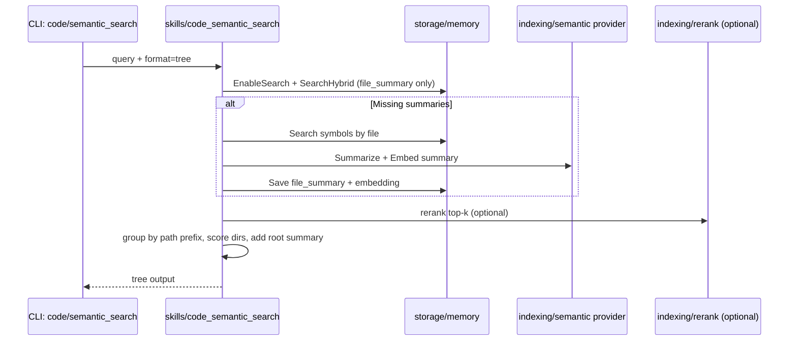

# Semantic Search Tree (Smart TOC) Spec

## Goal
- Provide a query-driven, first-contact "smart table of contents" over a repo index.
- Surface the most relevant paths quickly with short file summaries for early research.

## Decisions
- File summaries are generated lazily by default, but can be produced during an index run if one is already invoked.
- A repo-level root summary node is included in tree output for quick context.
- File summaries are stored as a new named memory type (`file_summary`), not `code_symbol`.
- Tree assembly logic lives in internal retrieval, and tree rendering uses `TreeText`.

## Non-Goals
- Queryless semantic clustering.
- Replacing snippet extraction or smart search.

## Data Model
- File summary entry stored alongside symbol entries.
- Summary is cached and keyed by a digest of deterministic inputs.

Example entry:
```json
{
  "name": "file://<workspace>/<path>",
  "type": "file_summary",
  "summary": "Implements the embedding queue store, including enqueueing jobs and persisting embeddings.",
  "result": {
    "file_path": "internal/intelligence/indexing/embedding/store.go",
    "package": "embedding",
    "symbols": ["Store", "OpenStore", "Enqueue", "ClaimNext", "Complete"],
    "digest": "sha256:<hash>"
  }
}
```

## Summary Generation
- Inputs: file path, package doc line, first comment block, top N exported symbol signatures.
- Prompt: deterministic, 1-2 sentences, <= 40 words, no speculation.
- Cache key: hash of inputs; regenerate only when digest changes.
- Fallback: deterministic summary from path + symbol list if LLM unavailable.

## Embeddings
- File-level embedding uses: summary + package + top comment + top N symbol names.
- Embeddings are separate from symbol vectors and updated only when digest changes.

## Search Behavior
- `semantic_search --tree` runs a file-level semantic search, then groups by path prefix.
- Tree depth and breadth are controlled by user flags.
- Root node summarizes the repo intent based on top-scoring paths.

## Touchpoints and Internal Packages
### Skills (entrypoints)
- `skills/code_semantic_search/main.go`: `Input.Format`, `Output.TreeText`, `run` (tree output), summarize path for root summary.
- `skills/code_smart_search/main.go`: `run`, `generateCandidates`, `invokeSnippetExtract`.
- `skills/code_snippet_extract/main.go`: `run`, `processFiles`, `extractSnippets`, `makeInlinePreviews`, `searchRelatedSessions`.
- `skills/code_context_ripgrep/main.go`: `run`, `rgutil.Normalize`, `ripgrep.SearchJSON`, `codeblocks.ExpandMatches`.
- `skills/code_incremental_index/main.go`: `extractSymbols`, `upsertSymbols`, `queueEmbeddings`, `ingestGraphEdges`.

### Retrieval and Tree Construction
- `internal/intelligence/retrieval/candidates.go`: `NewGenerator`, `WithSearchableStore`, `Generator.Generate`, `Candidate`, `GenerateResult`.
- `internal/intelligence/retrieval/semantic_search.go`: `searchSemanticIndex`, `semanticBM25Fallback`, `memoryResultsToCandidates`, `extractFilePath`.
- `internal/intelligence/retrieval/symbol_search.go`: `searchSymbolIndex`, `buildSearchTerms`, `tokenize`, `symbolHit`.
- `internal/intelligence/retrieval/merge.go`: `mergeCandidates`, `mergedCandidate.merge`, `mergedCandidate.finalize`, `MergeOptions`, `DefaultMergeOptions`.

### Indexing and Embeddings
- `internal/intelligence/indexing/symbol/indexer.go`: `Indexer`, `NewIndexer`, `Indexer.Index`, `indexFile`.
- `internal/intelligence/indexing/symbol/types.go`: `Symbol`, `SymbolType`, `KindFileSummary`, `ComputeDigest`.
- `internal/intelligence/indexing/semantic/indexer.go`: `Indexer`, `NewIndexer`, `Indexer.Index`, `indexFile`, `indexSingleFile`, `indexChunkedFile`.
- `internal/intelligence/indexing/semantic/jobs.go`: `JobArgs`, `JobFileInput`, `JobResult`, `JobSummary`, `JobFailure`.
- `internal/intelligence/indexing/embedding/store.go`: `OpenStore`, `OpenStoreFromConfig`, `Store.Enqueue`, `Store.ClaimNext`, `Store.Complete`, `Store.Fail`.
- `internal/intelligence/indexing/embedding/worker.go`: `Worker.Start`, `Worker.dispatchJobs`, `Worker.processJob`.

### Storage, Search, and Rerank
- `internal/storage/memory/store.go`: `Store.Save`, `Store.Get`, `Store.OpenFromConfig`, `NamedEntry`.
- `internal/storage/memory/search.go`: `Store.EnableSearch`, `SearchableStore.Search`, `searchBM25`, `searchVector`.
- `internal/storage/memory/vector.go`: `VectorStore.SaveWithEmbedding`, `SearchSimilar`, `GetWithEmbedding`.
- `internal/storage/vector/vector.go`: `vector.Store`, `SearchOptions` (vector-enabled builds).
- `internal/intelligence/indexing/rerank/provider.go`: `Provider.Rerank`, `Candidate`, `RankedResult`, `UsageTrackingProvider`.

## Implementation Sketch (Touchpoint-Focused)
1) Tree output in semantic search
- `skills/code_semantic_search/main.go`: branch in `run` when `Input.Format == "tree"` to skip RRF output and emit tree.
- Use existing `Output.TreeText` to return the rendered tree.
- Reuse `llmproviders` and `Input.Summarize` plumbing for root summary generation (LLM or deterministic fallback).

2) File-level candidate retrieval
- Open memory store via `memory.OpenWithConfig`, enable advanced search via `Store.EnableSearch` and `SearchableStore.Search` in `internal/storage/memory/search.go`.
- For file-level entries, filter results by entry `Type == "file_summary"` and/or `Entry.Name` prefix `file://` (compatible with `internal/intelligence/retrieval/extractFilePath`).
- Optionally rerank top-k using `internal/intelligence/indexing/rerank.Provider.Rerank` with content set to the file summary text.

3) Lazy summary generation (on-demand)
- When a file candidate lacks a cached summary, build one from symbol data:
  - Pull symbols by file path via memory store (existing `Store.Search` + `symbol.UnmarshalResult` in `internal/intelligence/indexing/symbol`).
  - Compute digest using `internal/intelligence/indexing/symbol.ComputeDigest` over the summary input payload.
  - Generate summary via LLM (same provider used in `skills/code_semantic_search/main.go`) or deterministic fallback.
  - Persist as `NamedEntry` via `Store.Save` in `internal/storage/memory/store.go`.

4) Embedding for file summaries
- Embed the summary text with `internal/intelligence/indexing/semantic.EmbeddingProvider` (already imported in `skills/code_semantic_search/main.go`).
- Store embedding alongside the summary entry using `VectorStore.SaveWithEmbedding` in `internal/storage/memory/vector.go`.
- If vector search is disabled, fall back to BM25 via `SearchableStore.searchBM25`.

5) Tree construction
- Group file results by path prefix (depth-limited) and aggregate scores (see Scoring).
- Root summary: use top-k child summaries as input; emit under `path: "."`.

## File Summary Entry Format and Flow
- Name: `file://<workspace>/<file_path>` (compatible with `internal/intelligence/retrieval.extractFilePath`).
- Type: `file_summary` (distinct from `code_symbol` entries).
- Summary: short, deterministic or LLM-generated text (<= 40 words).
- Result JSON (example payload):
  ```json
  {
    "file_path": "internal/intelligence/indexing/embedding/store.go",
    "package": "embedding",
    "symbols": ["Store", "OpenStore", "Enqueue", "ClaimNext", "Complete"],
    "digest": "sha256:<hash>"
  }
  ```
- Embedding: stored in `named_memory.embedding` via `VectorStore.SaveWithEmbedding`.
- Cache behavior: only recompute summary+embedding when `digest` changes.

## Sequence Diagram (Query to Tree)


## Minimal API Example
```json
{
  "query": "how does semantic search work",
  "scope": ["symbols"],
  "format": "tree",
  "depth": 2,
  "max_children": 10,
  "include_summaries": true,
  "max_missing_summaries": 20,
  "fallback": "symbol"
}
```

## Tree Output Schema
```json
{
  "nodes": [
    {
      "path": ".",
      "score": 0.82,
      "summary": "Core runtime, indexing, and storage subsystems with skills and tooling.",
      "children": [
        {
          "path": "internal/intelligence/indexing",
          "score": 0.78,
          "summary": null,
          "children": [
            {
              "path": "internal/intelligence/indexing/embedding",
              "score": 0.74,
              "summary": null,
              "children": [
                {
                  "path": "internal/intelligence/indexing/embedding/store.go",
                  "score": 0.71,
                  "summary": "Implements the embedding queue store, including enqueueing jobs and persisting embeddings.",
                  "children": []
                }
              ]
            }
          ]
        }
      ]
    }
  ]
}
```

## CLI / API Options
- `--tree` (bool): enable tree output.
- `--depth` (int): directory depth, default 2.
- `--max-children` (int): nodes per level, default 10.
- `--include-summaries` (bool): include file summaries, default true.
- `--max-missing-summaries` (int): cap lazy summary generation per request.
- `--fallback` (enum): `symbol|ripgrep|none`.

## Constraints and Guards
- Tree mode should filter to file-summary entries (e.g., `type == "file_summary"` or `name` prefix `file://`) to avoid mixing sessions/memories.
- Avoid naming collisions with existing `summarize` behavior in `code/semantic_search`; use `include-summaries` for tree rendering and reserve `summarize` for answer synthesis.
- Keep file-summary embeddings distinct from full-file semantic index entries to avoid cross-mode retrieval ambiguity.
- Root summary should always have deterministic fallback (top-k child summaries stitched) when LLM is disabled.

## Next Steps
1) Add internal tree builder (e.g., `internal/intelligence/retrieval/tree.go`) to group file results by path prefix, score nodes, and render `TreeText`.
2) Wire `skills/code_semantic_search/main.go` to call the tree builder when `format == "tree"`, and to lazily generate/store `file_summary` entries.
3) Restrict tree-mode search results to `file_summary` entries (type or name prefix).

## Scoring
- File score: normalized vector similarity (0-1).
- Directory score: sum of top-k child scores with size penalty.
  - `dir_score = sum(top_k(file_scores)) / (1 + log(1 + total_files))`

## Output Shape
```json
{
  "nodes": [
    {
      "path": ".",
      "score": 0.82,
      "summary": "Core runtime, indexing, and storage subsystems with skills and tooling.",
      "children": [
        {
          "path": "internal/intelligence/indexing",
          "score": 0.78,
          "children": [
            {
              "path": "internal/intelligence/indexing/embedding/store.go",
              "score": 0.71,
              "summary": "Implements the embedding queue store, including enqueueing jobs and persisting embeddings."
            }
          ]
        }
      ]
    }
  ]
}
```

## CLI / API Options
- `--tree` (bool): enable tree output.
- `--depth` (int): directory depth, default 2.
- `--max-children` (int): nodes per level, default 10.
- `--summary` (bool): include file summaries, default true.
- `--fallback` (enum): `symbol|ripgrep|none`.

## Failure Modes
- Embeddings unavailable: fall back to symbol index + text search, still tree-grouped.
- Summary missing: omit summary or use deterministic fallback text.

## Integration Notes
- This is a "smart TOC" layer that complements existing `code/smart_search`.
- Tree output is designed for early research, with deeper drill-down via existing tools.
