# Go-native runtime parity, optional Jido, and later Eino/backend pluggability

| Field | Value |
|-------|--------|
| Status | Active plan (dependency-ordered rollout) |
| Supersedes | Prior Eino-first sequencing in this doc |
| Canonical architecture | [docs/architecture/go-native-runtime-and-optional-jido.md](../../architecture/go-native-runtime-and-optional-jido.md) |

## Goals

1. **Go-native runtime parity first** — child spawn, lifecycle state, runtime trees, and
   orchestration reconcile no longer require Jido.
2. **Jido reduced to an optional runtime adapter** *(process/runtime substrate)* — useful
   for BEAM/OTP operators, but not required for core control-plane behavior.
3. **Stable backend seams** — runtime and engine adapters become explicit enough that
   future external runtimes or language backends can plug in behind Go-owned contracts.
4. **Eino later, not first** — Eino remains a candidate engine implementation after
   runtime ownership is settled.

## Non-goals (for the first milestones)

- Rewriting skills, repo graph, DAG grep, or tree-sitter pipelines in Eino.
- Replacing v2 event sourcing or envelope v1 contracts.
- Making Eino or any other engine library the new control-plane owner.
- Full feature parity with DeepAgent-style multi-agent behavior in the first runtime PRs.

## Core design rules

| Rule | Implication |
|------|-------------|
| **Control-plane truth lives in Go** | Parent/child links, worker state, runtime trees, and orchestration status come from Go-managed stores and services. |
| **Adapters execute work; they do not own semantics** | Jido, subprocess workers, or future external runtimes plug into contracts; they do not become the source of truth. |
| **Single tool authority stays intact** | Existing `engine.ToolExecutor` and v2 tool execution remain canonical. |
| **Runtime and engine are different migrations** | Runtime parity must ship before engine replacement becomes important. |
| **Shared core lives below the top-level interfaces** | `engine.AgentEngine` and v2 `runner.Model` should share adapter plumbing, not be forced into one identical implementation. |

## Why the sequencing changed

The original idea was directionally right, but it understated one dependency:

- classic runtime already has a rich `AgentEngine` contract
- v2 runner has a much thinner `Model` contract
- web/API runtime trees and orchestration reconcile still depend on Jido-oriented state

That means the highest-value work is not Eino first. The highest-value work is taking
runtime ownership back into Go so Jido becomes optional in fact, not just in docs.

## Current seams that are already usable

| Seam | Current state | Why it matters |
|------|---------------|----------------|
| `internal/v2/services.RuntimeSpawner` | Already an interface boundary | Correct starting point for Go-native child spawn |
| `internal/runtime/engine.AgentEngine` | Stable classic engine contract | Good place for later engine pluggability |
| `internal/v2/runtime/runner.Model` | Stable v2 model contract | Good place for a later v2 engine adapter |
| Tool execution | Already routed through Go executors | Prevents tool semantics from fragmenting across runtimes |

## Workstreams in dependency order

```mermaid
flowchart LR
  Registry[Design registry + worker state model]
  Spawn[Implement Go RuntimeSpawner + supervisor]
  Recon[Implement Go reconciler]
  API[Move web/API runtime trees to Go state]
  Optionalize[Make Jido optional adapter]
  Pluggable[Generalize runtime backend adapters]
  EngineFactory[Refactor engine creation to interface/factory]
  Eino[Optional Eino engine adapters]

  Registry --> Spawn
  Spawn --> Recon
  Recon --> API
  API --> Optionalize
  Optionalize --> Pluggable
  Pluggable --> EngineFactory
  EngineFactory --> Eino
```

## Phase plan

### Phase 1. Runtime registry and worker-state model

Define the Go-owned state model for runtime facts.

Deliverables:

- durable child/worker registry
- parent/child relationship model
- worker heartbeat / exit / failure state
- runtime tree read model requirements
- explicit reconcile inputs for v2 event emission

Files likely touched:

- `internal/v2/core/*` for typed contracts
- `internal/v2/services/spawn_service.go`
- `internal/v2/adapters/libsql/*` or equivalent storage packages
- docs for registry schema and lifecycle semantics, anchored by [docs/spec/runtime-backend-contracts.md](../../spec/runtime-backend-contracts.md)

Exit criteria:

- runtime facts can be represented without calling Jido APIs
- API consumers have a clear Go-owned state source to read from

### Phase 2. Default Go runtime adapter

Implement the first Go-owned worker backend using subprocesses.

Deliverables:

- Go `RuntimeSpawner` backed by subprocess workers
- bounded supervisor logic
- worker registration and status updates
- cancellation / exit handling
- deterministic tests around spawn and lifecycle state

Files likely touched:

- new `internal/v2/adapters/goruntime/` or similar
- `cmd/foxctl/cmd/overseer_v2_orchestration.go`
- runtime wiring for worker launch and shutdown

Exit criteria:

- v2 child spawn works without Jido
- parent-aware child lifecycle is visible in Go-owned state

### Phase 3. Go-native reconcile and runtime trees

Move orchestration and UI/runtime inspection onto Go-owned state.

Deliverables:

- reconciler reading worker registry/state instead of Jido runtime polling
- runtime tree loaders for orchestration cards and agents from projections/registry
- web/API handlers that no longer require optional Jido client for core views

Files likely touched:

- `internal/interfaces/web/api/orchestration.go`
- `internal/interfaces/web/api/agents.go`
- `internal/v2/runtime/orchestration/*`
- new Go reconciler adapter package

Exit criteria:

- orchestration refresh does not require `FOXCTL_JIDO_*`
- web/API runtime trees work from Go state

### Phase 4. Make Jido truly optional

After Go parity exists, demote Jido from architectural dependency to adapter.

Deliverables:

- Go runtime path becomes the documented default
- Jido wiring is only activated when explicitly configured
- CI and smoke coverage no longer assume Jido for default flows

Exit criteria:

- default docs and tests work with no Jido socket
- Jido remains supported as an external adapter, not required infra

### Phase 5. Generalize backend pluggability

Once Go owns runtime truth, make the adapter seams friendly to other implementations.

Deliverables:

- explicit adapter contracts for spawn, state read, reconcile input, and lifecycle hooks
- one optional external-runtime adapter beyond the local subprocess path if useful
- documentation that distinguishes Go-owned semantics from backend implementations

Examples of future backends:

- Jido / Elixir runtime adapter
- another external language worker supervisor
- remote worker pool with the same lifecycle contract

Exit criteria:

- adding a new runtime backend does not require reworking orchestration semantics
- backend differences stay below the contract layer

### Phase 6. Engine abstraction cleanup

Only after runtime parity, clean up engine construction for pluggability.

Deliverables:

- engine creation returns interface-driven abstractions instead of a concrete engine type
- shared adapter layer for provider config, tool wiring, and turn accounting
- classic and v2 wrappers can reuse lower-level engine plumbing without forcing one top-level implementation

Exit criteria:

- current engine still works unchanged through the new factory/adapter seam
- later engine swaps are low-risk

### Phase 7. Optional Eino engine work

Eino becomes one candidate engine backend after the above is stable.

Deliverables:

- optional classic `AgentEngine` backed by Eino
- optional v2 `runner.Model` backed by the same lower-level Eino adapter layer
- parity tests for token accounting, tool-loop behavior, and stop-reason mapping

Important constraint:

- do **not** force one identical top-level implementation across classic and v2
- share the chat/tool adapter layer below those interfaces instead

Exit criteria:

- Eino can be enabled behind config without changing runtime ownership
- removal or rollback is straightforward

## Decisions

| Topic | Decision |
|-------|----------|
| **Primary focus** | Go-native runtime parity before engine replacement |
| **Child isolation** | Subprocess workers for the default Go adapter |
| **Jido role** | Optional runtime adapter only, not control-plane owner |
| **Pluggability target** | Stable Go-owned contracts first, then multiple backend implementations |
| **Eino timing** | After runtime parity and engine-factory cleanup |
| **Classic vs v2 engine integration** | Shared lower-level adapter layer, separate top-level wrappers |

## Testing strategy

| Layer | Tests |
|-------|-------|
| Registry/state model | Table-driven storage and projection tests |
| Go runtime adapter | Integration tests for spawn, heartbeat, exit, cancel, and idempotency |
| Reconciler | Deterministic tests that append canonical v2 events from Go-owned worker state |
| Web/API runtime views | Handler tests that prove tree/status loading works without Jido |
| Optional Jido adapter | Compatibility tests proving explicit Jido config still works |
| Engine pluggability later | Unit/golden tests for classic `AgentEngine` and v2 `runner.Model` wrappers |

## Risks to manage explicitly

| Risk | Mitigation |
|------|------------|
| Recreating Jido behavior implicitly in multiple places | Centralize runtime facts in a single Go registry/state model |
| Mixing runtime migration with engine migration | Keep runtime parity and engine replacement as separate phases |
| Breaking current CLI/web surfaces while optionalizing Jido | Land API/tree consumers on Go state before changing defaults |
| Overfitting contracts to Jido terminology | Name contracts around lifecycle/state semantics, not adapter-specific transport names |
| Forcing classic and v2 into one engine abstraction too early | Share lower-level adapters instead of collapsing the interfaces |

## Related documents

- [go-native-runtime-and-optional-jido.md](../../architecture/go-native-runtime-and-optional-jido.md)
- [runtime-backend-contracts.md](../../spec/runtime-backend-contracts.md)
- [runtime-orchestration.md](../../general/runtime-orchestration.md)
- [agent_hierarchy.md](../../spec/agent_hierarchy.md)
- [jido-hybrid-runtime.md](../../architecture/jido-hybrid-runtime.md)
