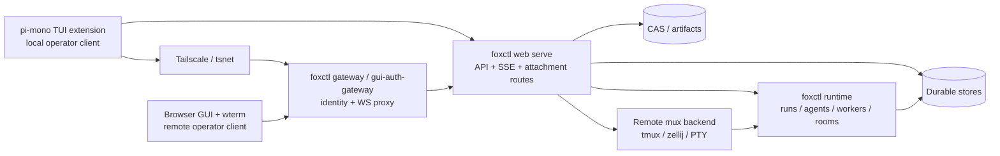

# Remote Workbench Session Handoff

Status: Ready for PR-A/PR-B; later slices proposed
Owner: Solo maintainer  
Last Updated: 2026-05-07

## Goal

Build a remote workbench model where a local operator can start in the
pi-mono-inspired TUI, move the active workbench to a Tailscale-reachable remote
environment, and continue from a browser without losing runtime identity,
room/task context, memory continuity, or terminal continuity.

The important split is:

- the **operator client** can be local TUI, browser GUI, browser terminal, or SSH
- the **workbench session** is an operator continuity object
- the **runtime authority** remains `foxctl`
- the **terminal attachment** is one attachable view, not the source of truth

This plan turns the current gateway, webterm, sshterm, TUI, and GUI pieces into
a deliberate session handoff architecture for remote agent work and eventual
multi-tenant browser access.

## Existing Direction

The repo already has most of the low-level ingredients:

- browser terminal access exists under `internal/interfaces/gateway/webterm`
  and uses a WebSocket-to-PTY bridge.
- SSH terminal access exists under `internal/interfaces/gateway/sshterm` and
  authenticates through Tailscale WhoIs.
- `gateway.Server` registers browser and SSH terminal access from one terminal
  room service.
- room participants already carry transport and delivery binding metadata.
- `identity.Principal` carries tenant, user, actor, workspace, and session
  context.
- `gui-auth-gateway` can keep `foxctl web serve` private and proxy
  authenticated `/api/*` and `/ws/*` traffic.
- the TUI direction says pi-mono is an interaction reference while `foxctl`
  remains the runtime authority.

The current weak spots are authority leaks through terminal-facing paths:

- browser terminal authority is still shaped like `room_id -> tmux_session`
- GUI terminal preview still deals in mux and pane-ish identifiers
- gateway room registration exposes room and tmux session coupling
- Better Auth proxying authenticates at the edge, but the Go web server needs a
  durable request principal
- current WebSocket text-frame handling can swallow JSON-looking terminal input

## Current Hardening Decision

This plan is implementation-ready only through PR-A and PR-B. Those two slices
remove the immediate terminal protocol ambiguity and establish the request
identity bridge needed by every later workbench route.

Do next:

- PR-A: harden the existing `webterm` WebSocket protocol.
- PR-B: bridge authenticated requests into `identity.Principal` and forward
  explicit identity through the auth proxy.

Do not start yet:

- durable `WorkbenchSession` storage
- public `/ws/workbench-terminal/{attachment_id}` routes
- WebSocket tickets
- write leases
- remote host handoff orchestration
- pi-mono adapter implementation

Those later pieces depend on PR-A/PR-B evidence. A hidden browser terminal
experiment can follow only as PR-C dogfooding against compatibility endpoints;
it must not become the production authority model.

Canonical references:

- [Package topology](../../architecture/package-topology.md)
- [Kubernetes runtime architecture](../../architecture/kubernetes-runtime.md)
- [Tmux collaboration](../../general/tmux-collaboration.md)
- [Agent mux + room hierarchy](agent-mux-room-hierarchy.md)
- [OpenTUI agent terminal facades](opentui-agent-terminal-facades.md)
- [TUI agent control plane](../tui-agent-control-plane.md)
- [Principal and tenant isolation](../k8s/01-principal-and-tenant-isolation.md)

## Non-Goals

- Do not make pi-mono or the pi-mono-based extension own agent lifecycle,
  session storage, tool execution, room semantics, or memory.
- Do not make terminal scrollback the canonical runtime history.
- Do not expose raw tmux session names, zellij pane IDs, pane IDs, backend refs,
  or filesystem paths as browser attachment authority.
- Do not require Kubernetes for the first useful slice. A manually configured
  Tailscale-connected host is enough for the first remote handoff.
- Do not solve full VM/container sandboxing in this plan. Remote workbench
  isolation can later compose with smolvm, Kubernetes, or opensandbox plans.
- Do not implement automatic remote host provisioning until local/tailnet
  browser attachment is proven.

## Hard Invariants

Reviewers should reject implementation patches that violate these invariants:

1. `foxctl` runtime stores, room timeline, events, memory, runs, and tasks remain
   the source of truth.
2. Terminal scrollback is never parsed into canonical runtime state.
3. Browser terminal URLs contain only opaque attachment IDs and short-lived
   tickets.
4. Raw tmux, zellij, pane, session, backend, and filesystem identifiers are
   never browser attachment authority.
5. Every workbench, attachment, token, and lease decision is made from
   `identity.Principal`.
6. Every new durable workbench table has `tenant_id`.
7. Write input requires an unexpired write lease with a fencing token or lease
   epoch.
8. Public browser terminal routes require both authenticated session identity
   and attachment authorization.
9. Existing `/terminal/{room-id}` and `/ws/terminal/{room-id}` routes are
   compatibility, development, or tailnet surfaces, not the durable production
   workbench attachment route.
10. `internal/v2` is not the package target for workbench, terminal transport,
    or web API glue.

## Terminology

### Workbench Session

A durable operator workbench record. It binds the current workspace, room,
foreground assistant/run, selected terminal binding, remote host, and attachable
views.

This is the thing the user thinks of as "my current foxctl session".

### Runtime Session

The existing `foxctl` runtime state: run, agent, worker, room, mailbox, memory,
event stream, CAS artifacts, tasks, and orchestration state.

This is the system of record and must survive client detach. "RuntimeSession" in
this plan is a conceptual reference to existing runtime state, not a new storage
owner unless a separate runtime need appears.

### Terminal Binding

A durable, server-side reference to the terminal target associated with an
authorized room participant or runtime actor. The browser must never choose raw
mux coordinates directly.

### Terminal Attachment

One active view into a workbench terminal, such as:

- local terminal TUI
- browser terminal rendered with wterm
- SSH session over the tailnet

Attachments can come and go. The workbench session stays.

### Remote Workbench Host

A machine or pod reachable over Tailscale/tsnet that can run:

- `foxctl web serve`
- `foxctl gateway --with-web` or an equivalent embedded gateway
- a mux backend such as tmux or zellij
- optional agent workers

### WebSocket Ticket

A short-lived opaque ticket that lets an already authenticated principal attach
to one terminal attachment endpoint. It is additional capability, not a
replacement for session authentication.

### Write Lease

An explicit lease that allows keyboard input into the remote terminal. Browser
terminal attachments are read-only unless they hold a valid, unexpired write
lease for the current attachment generation.

## Product Workflows

### Workflow 1: Local TUI to Browser

1. Operator starts the pi-mono-based TUI extension locally.
2. TUI creates or resumes a `WorkbenchSession`.
3. Operator chooses `Move to Remote`.
4. `foxctl` selects an already configured Tailscale-reachable remote workbench
   host for the first implementation.
5. Remote host creates or reattaches the mux terminal binding for the workbench.
6. `foxctl` returns a browser URL and short-lived WebSocket ticket.
7. Browser loads the GUI and wterm terminal from the remote endpoint.
8. Browser reattaches to the same room/run/session context.

### Workflow 2: Browser Back to Local TUI

1. Operator opens the same workbench locally.
2. Local TUI fetches the durable `WorkbenchSession`.
3. Local TUI replays runtime events and restores selected view state.
4. If needed, local TUI requests a new terminal attachment to the remote mux.

The browser does not "own" the session after handoff. It is just another
attachment.

### Workflow 3: Remote Host Restart

1. Remote host restarts.
2. `foxctl web serve` reattaches durable runtime workers where supported.
3. Workbench session reports terminal attachment state as stale or restoring.
4. Runtime event history remains available from durable stores.
5. User can either reconnect to a restored mux session or create a replacement
   terminal attachment.

The first remote slice only needs stale/restoring reporting. Full restart
recovery can wait until the workbench API contract is stable.

### Workflow 4: Multi-Tenant Browser Access

1. User authenticates through Tailscale identity headers or Better Auth.
2. Server maps request identity into `identity.Principal`.
3. Attach request is authorized against tenant, workspace, room membership,
   actor/participant binding, attachment generation, and requested mode.
4. Terminal attachment events are audited with principal subject and node/user
   identity.

## Pi/TUI Dogfood Lane

Pi and the TUI are client surfaces for this architecture, not runtime owners.
They are useful because they can exercise the same handoff contract a browser
will eventually use, but they should consume existing typed foxctl APIs rather
than bypass them.

Allowed before durable workbench storage:

- read room, task, run, event, memory, and semantic-search state through typed
  APIs
- use semantic anchors and repoindex output as retrieval evidence
- display durable execution state from runtime, jobs, trajectory, room, and
  mailbox stores
- use hardened compatibility terminal endpoints for local or tailnet dogfood
  only

Not allowed before PR-D/PR-E:

- treat Pi session IDs as durable workbench IDs
- pass tmux, zellij, pane, filesystem, or backend refs through Pi as browser
  authority
- restore runtime meaning by parsing terminal scrollback
- make the pi-mono extension own memory, session storage, agent lifecycle, or
  remote handoff decisions

After PR-A and PR-B land, the first Pi/TUI validation should prove that the
client can show typed runtime continuity while terminal attachment remains a
replaceable view. It does not need remote host movement yet.

## Target Architecture



## Core Contracts

### 1. Principal Bridge Contract

New workbench and terminal attachment routes use `identity.Principal`, not
`internal/interfaces/web/api.Identity`, as the authorization model.

The bridge should be explicit and live near web auth or middleware:

```go
func PrincipalFromRequest(r *http.Request) (identity.Principal, error)
```

Rules:

- Tailscale-derived identity maps to a consistent platform such as
  `"tailscale"` or `"web/tailscale"`.
- Better Auth headers map to a `"web"` platform principal.
- The Better Auth proxy must forward explicit identity headers for both HTTP
  and WebSocket proxy paths.
- Tenant ID is filled from a configured single-tenant default, Better Auth org
  metadata, or a future explicit tenant header trusted only at the proxy
  boundary.
- Workspace ID is not accepted blindly from the client for privileged
  operations. It is checked against session/workbench ownership.
- Actor ID is derived from route/body only after authorization. It is not
  treated as request identity.
- Conflicting identity headers are rejected or resolved by explicit source
  priority, not by ad hoc heuristics.

Required tests:

- Better Auth identity headers
- Tailscale identity headers
- anonymous request
- conflicting headers
- missing tenant behavior
- workspace mismatch behavior

### 2. Workbench Session Contract

The workbench session is the durable handoff anchor.

Suggested storage fields:

```go
type WorkbenchSession struct {
    ID                 string
    TenantID           string
    WorkspaceID        string
    WorkspaceRoot      string // server-only; never browser authority
    RoomID             string
    ForegroundRunID    string
    ForegroundAgentID  string
    ActorID            string
    OwnerSubject       string
    RemoteHostID       string
    TerminalAttachmentID string
    Status             string // local, moving, remote_ready, stale, closed
    ViewState          json.RawMessage
    CreatedAt          time.Time
    UpdatedAt          time.Time
}
```

Rules:

- `TenantID`, `WorkspaceID`, and `OwnerSubject` are authorization inputs.
- `WorkspaceRoot` is server-only. API DTOs and audit payloads use
  `WorkspaceID` and redact filesystem paths unless local developer mode
  explicitly exposes them.
- `ViewState` is client state only: selected pane, scroll position, active tab,
  draft text, filters, and layout hints.
- Runtime state stays in runtime, event, and room stores, not in `ViewState`.
- Closing a workbench session does not delete runtime history.

### 3. Terminal Attachment Contract

Terminal attachments hide backend details behind an opaque attach ID and resolve
internally to an already authorized terminal binding.

Suggested storage fields:

```go
type TerminalAttachment struct {
    ID                 string
    WorkbenchSessionID string
    TenantID           string
    WorkspaceID        string
    RoomID             string
    ActorID            string
    ParticipantID      string
    TerminalBindingID  string
    Backend            string // server-side diagnostic, not authority
    BackendRef         string // encrypted/server-only, never API-visible
    Mode               string // read, write
    Status             string // active, stale, closed
    Generation         int64
    CreatedBySubject   string
    CreatedAt          time.Time
    ExpiresAt          time.Time
}
```

Rules:

- Browser URLs use `TerminalAttachment.ID`, never mux-native identifiers.
- `TerminalBindingID` is the server-side bridge to the participant/runtime
  terminal target.
- `Backend` is diagnostic and not an authorization input from the browser.
- `BackendRef` is encrypted or server-only and never returned through API DTOs.
- Write access requires a valid fenced lease, even if the attachment exists.
- Multiple read-only attachments can coexist.
- Write leases are single-writer by default.
- Attachment generation increments when the backend target is replaced or
  invalidated. Tickets and leases are bound to the generation.

### 4. WebSocket Ticket Contract

Browser WebSocket clients cannot set arbitrary headers reliably, so the first
implementation uses a short-lived query ticket plus normal authenticated
session identity.

Transport:

1. Browser calls `POST /api/workbench/attachments/{id}/token`.
2. Server returns `ws_ticket`.
3. Browser connects to `/ws/workbench-terminal/{id}?ticket=...`.
4. Server redacts `ticket` from logs and verifies that the authenticated
   session/cookie maps to the same principal subject as the ticket.

Suggested storage fields:

```go
type AttachTicket struct {
    TokenHash            string
    TerminalAttachmentID string
    WorkbenchSessionID   string
    TenantID             string
    WorkspaceID          string
    PrincipalSubject     string
    Mode                 string
    AttachmentGeneration int64
    CreatedAt            time.Time
    ExpiresAt            time.Time
    UsedAt               *time.Time
    RevokedAt            *time.Time
}
```

Rules:

- Store only token hashes.
- Token plaintext is never logged, audited, or persisted.
- Ticket is bound to principal subject, tenant, workspace, workbench session,
  terminal attachment, attachment generation, and requested mode.
- A valid authenticated session is still required when a ticket is presented.
- Write tickets are single-use.
- Read-only tickets can be short-lived multi-use only if reconnect requires it.
- Token issue/redeem routes require origin checks and CSRF protection for
  browser clients.

### 5. Write Lease Contract

Write leases need fencing, not only "single writer".

Suggested storage fields:

```go
type WriteLease struct {
    ID                   string
    TerminalAttachmentID string
    AttachmentGeneration int64
    HolderSubject        string
    Mode                 string
    IssuedAt             time.Time
    ExpiresAt            time.Time
    RenewedAt            time.Time
    LeaseEpoch           int64
    ReleasedAt           *time.Time
    RevokedAt            *time.Time
    RevocationReason     string
}
```

Rules:

- Every input frame is accepted only if the connection currently owns a valid
  lease epoch for the current attachment generation.
- Renewals return the current lease epoch.
- Stale clients cannot continue writing after expiry, revocation, reconnect
  races, or attachment generation changes.
- Only the write lease holder should resize the backing PTY in the first
  implementation. Read-only clients resize their local viewport only.
- Shared multi-writer terminal collaboration is out of scope.

### 6. Authorization Decision Contract

Policy code should receive a structured decision input:

```go
type TerminalAttachDecisionInput struct {
    TenantID             string
    WorkspaceID          string
    WorkbenchSessionID   string
    TerminalAttachmentID string
    RoomID               string
    ActorID              string
    ParticipantID        string
    PrincipalSubject     string
    PrincipalRoles       []string
    AuthSource           string
    RequestedMode        string
    AttachmentGeneration int64
    RemoteHostID         string
}
```

The policy must check tenant, workspace, room membership, actor/participant
binding, attachment generation, requested mode, principal roles, and remote host
trust before issuing tickets or leases.

### 7. API DTO Redaction Contract

Storage models and API response DTOs must be separate.

Response DTOs and audit event payloads redact:

- `WorkspaceRoot`
- `BackendRef`
- raw tmux session names
- raw zellij session or pane IDs
- filesystem paths
- token hashes
- ticket plaintext
- lease internals not needed by the client

## Terminal WebSocket Protocol

The first hardening slice should make the existing webterm protocol strict.

Client to server:

- binary: raw terminal input bytes
- JSON text: control messages only

Server to client:

- binary: raw terminal output bytes
- JSON text: status/control messages only

Required control messages:

```json
{"type":"hello","attachment_id":"...","mode":"read","generation":1}
{"type":"resize","cols":120,"rows":40}
{"type":"lease_requested","mode":"write"}
{"type":"lease_granted","lease_id":"...","lease_epoch":7,"expires_at":"..."}
{"type":"lease_denied","reason":"..."}
{"type":"status","state":"reattaching"}
{"type":"error","code":"EAUTH","message":"..."}
```

Rules:

- Unknown text control messages return a control error. They are not silently
  dropped.
- Invalid JSON text returns a control error.
- JSON-looking shell input must be sent as binary terminal input.
- If a client sends terminal text as text, it must use an explicit wrapper such
  as `{"type":"input","data_b64":"..."}` or be rejected.
- Resize validation rejects zero and huge dimensions.
- Workbench terminal input requires a current write lease epoch.
- Compatibility room terminal endpoints may keep a transitional mode only for
  dev/tailnet use, but production workbench endpoints use this strict protocol.

Required tests:

- binary input
- JSON-looking terminal input
- unknown JSON control
- invalid JSON text
- resize validation
- close and disconnect cleanup
- input rejected without write lease on workbench endpoints

## Browser Renderer Contract

wterm should be treated as the browser renderer, not the workbench authority.

The browser terminal component should:

- connect to `/ws/workbench-terminal/{attachment_id}?ticket=...`
- send raw input as binary frames
- send resize as JSON control
- request a write lease before allowing keyboard input
- show read-only, reattaching, stale, denied, and lease-owner states
- never choose `backend`, `tmux_session`, `zellij_session`, or `pane_id`
- never parse room/task/runtime meaning from terminal output

The GUI should also load typed room/run/session state through normal HTTP and
SSE APIs so the browser remains useful if the terminal attachment is stale.

Existing `RoomTerminalView.tsx`-style polling previews can remain diagnostic and
read-only, but they must not become the public attachment authority model.

## API Surface

Initial production-shaped routes:

| Method | Route | Purpose |
|------|-------|---------|
| `POST` | `/api/workbench/sessions` | Create or resume a workbench session |
| `GET` | `/api/workbench/sessions/{id}` | Inspect redacted session, remote state, and attach options |
| `POST` | `/api/workbench/sessions/{id}/handoff` | Prepare the workbench on a remote host |
| `POST` | `/api/workbench/sessions/{id}/attachments` | Create a terminal attachment |
| `POST` | `/api/workbench/attachments/{id}/token` | Mint a short-lived WebSocket ticket |
| `POST` | `/api/workbench/attachments/{id}/lease` | Request, renew, or release write lease |
| `GET` | `/ws/workbench-terminal/{id}` | WebSocket terminal attachment |
| `DELETE` | `/api/workbench/sessions/{id}` | Close the workbench session |

Compatibility routes:

| Route | Status |
|------|--------|
| `/terminal/{room-id}` | compatibility, development, or tailnet only |
| `/ws/terminal/{room-id}` | compatibility, development, or tailnet only |

## Audit Events

Audit events should include decision metadata, not terminal content.

Include:

- principal subject
- auth source
- tenant ID
- workspace ID
- workbench session ID
- terminal attachment ID
- room ID
- actor ID and participant ID
- requested mode
- decision: allowed or denied
- reason or policy rule
- remote address or Tailscale node where available
- user agent
- lease ID and lease epoch for write events
- timestamp
- coarse byte counts only if needed

Never log terminal input/output bytes, ticket plaintext, token hashes, or backend
refs.

Event topics:

- `workbench.session.created`
- `workbench.session.handoff_started`
- `workbench.session.remote_ready`
- `workbench.session.stale`
- `workbench.attachment.created`
- `workbench.attachment.closed`
- `workbench.attach.allowed`
- `workbench.attach.denied`
- `workbench.lease.granted`
- `workbench.lease.renewed`
- `workbench.lease.released`
- `workbench.lease.revoked`
- `workbench.lease.denied`

## Package Placement

Follow the package topology boundary:

| Concern | Target package family |
|------|------------------------|
| Workbench domain types and pure validation | `internal/domain/workbench` |
| Workbench durable stores | `internal/storage/workbench` |
| Terminal lifecycle and mux-neutral attach contract | `internal/runtime/terminal` |
| Remote host lifecycle and handoff orchestration | `internal/runtime` |
| HTTP APIs | `internal/interfaces/web` |
| Gateway browser/SSH terminal transports | `internal/interfaces/gateway` |
| Browser GUI and wterm renderer | `packages/gui-agent` |
| Better Auth proxy identity forwarding | `packages/gui-auth-gateway` |
| pi-mono TUI extension adapter | TUI package/client layer, not runtime |

Do not put workbench storage or browser terminal transport in `internal/v2`.
`internal/v2` remains the newer agent/runtime/orchestration lane.

## Origin and Edge Auth Policy

Production browser terminal routes require explicit origin configuration:

- exact Better Auth public origin
- exact tailnet DNS suffix or configured gateway origin
- no broad wildcard like `*.tail*`
- trim and validate env-provided origins
- reject missing origin for browser routes unless explicitly in dev mode
- log the origin decision without logging tickets

Mutating routes that issue tickets or leases also require CSRF/origin checks for
browser clients.

## Threat Model

The first implementation contract should cover:

- cross-tenant attach
- stolen ticket
- stale write lease
- CSRF against ticket/lease routes
- origin spoofing or broad wildcard origin acceptance
- room ID guessing
- raw backend ID leakage
- remote host restart
- log leakage of tickets or backend refs
- browser client attempting to choose backend, session, or pane identifiers

## Authorization Matrix

| Scenario | Expected decision |
|------|-------------------|
| Owner requests read ticket for active attachment | allow |
| Owner requests write lease and no active writer exists | allow |
| Owner requests write lease with stale attachment generation | deny |
| Room member requests read ticket where policy allows member read | allow |
| Room member requests write lease without operator role | deny |
| Coordinator/operator requests write lease | allow if tenant/workspace/room match |
| User from unrelated tenant requests any attach | deny |
| Authenticated user presents ticket for different subject | deny |
| Authenticated user presents expired ticket | deny |
| Authenticated user presents ticket for wrong workspace | deny |
| Client presents revoked lease epoch | deny input |
| Browser attempts workbench terminal without session auth | deny |
| Browser attempts workbench terminal with room ID only | deny |

## Implementation Sequence

The implementation sequence is gated. PR-A and PR-B are the next executable
work; PR-C is optional dogfooding; PR-D and later remain proposed until the
protocol and identity evidence exists.

### PR-A: Terminal Protocol Hardening Only

Goal: remove the immediate WebSocket correctness bug without introducing durable
workbench storage.

Tasks:

- update `internal/interfaces/gateway/webterm/client.go`
- reserve text frames for explicit control
- treat binary frames as terminal input
- return errors for unknown control messages
- reject invalid text controls
- validate resize dimensions
- add tests for binary input, JSON-looking terminal input, unknown control,
  invalid control, resize, and disconnect cleanup

Acceptance criteria:

- binary frames are the only implicit terminal input path
- text frames are parsed as explicit control messages or rejected with a control
  error
- JSON-looking shell input is covered by a binary-frame test
- unknown control messages and invalid JSON text do not disappear silently
- resize controls reject zero, negative, and excessive dimensions
- disconnect cleanup is deterministic
- `go test ./internal/interfaces/gateway/webterm` passes

No durable workbench types, tickets, leases, browser auth changes, or Pi adapter
work in this PR.

### PR-B: Identity Bridge and Proxy Forwarding

Goal: make request identity durable enough for terminal policy decisions.

Tasks:

- add `PrincipalFromRequest` near web auth or middleware
- bridge existing web API identity into `identity.Principal`
- update Better Auth gateway proxying to forward explicit identity headers for
  `/api` and `/ws`
- test Tailscale and Better Auth identity paths separately
- document which headers are trusted and only from which proxy boundary
- add log redaction for future `ticket` query params

Acceptance criteria:

- `PrincipalFromRequest` has explicit tests for Better Auth, Tailscale,
  anonymous requests, conflicting headers, missing tenant behavior, and
  workspace mismatch behavior
- trusted identity headers are accepted only from the configured proxy boundary
- `/api` and `/ws` proxy paths preserve the same principal inputs
- future `ticket` query parameters are redacted from request logs
- `go test ./internal/interfaces/gateway/...` and the relevant web auth tests
  pass

This lands before any public browser workbench terminal route.

### PR-C: Experimental Browser Terminal, Compatibility Endpoint Only

Goal: validate wterm/browser ergonomics without claiming production attachment
semantics.

Gate: PR-C can start only after PR-A and PR-B have landed.

Tasks:

- add a hidden client dogfood surface using the hardened protocol; the first
  path should be `foxctl-pi` registering/showing local or tailnet room-terminal
  links, not a public workbench route
- connect only to existing room terminal endpoints, with any browser client
  pointed at the terminal gateway host rather than the plain web API host
- mark the feature experimental and dev/tailnet only
- keep room-ID terminal endpoints out of public workbench handoff flows
- add one identity-forwarding smoke test if the experiment runs through
  `gui-auth-gateway`

No durable `WorkbenchSession` yet.

This PR is a dogfood surface only. It must not introduce public production
attachment routes, opaque attachment IDs, tickets, leases, or remote host
handoff.

### PR-D: Workbench Domain and Storage Skeleton

Goal: create the durable handoff anchor without remote provisioning or terminal
write input.

Tasks:

- add `internal/domain/workbench`
- add storage interfaces and sqlite tests
- include `tenant_id` on every durable table
- define storage models separately from API DTOs
- redact `WorkspaceRoot`, `BackendRef`, raw mux IDs, and token internals from
  DTOs
- add create/get/close HTTP routes

No WebSocket workbench terminal route yet.

### PR-E: Opaque Terminal Attachments and Read-Only WebSocket

Goal: create the first production-shaped browser continuation path.

Tasks:

- create `TerminalAttachment`
- target a durable terminal binding or participant binding
- add `/ws/workbench-terminal/{attachment_id}`
- require authenticated principal
- require short-lived WebSocket ticket
- support read-only terminal output first
- audit attach allowed/denied
- reject browser-provided backend, session, and pane identifiers

No write input yet.

### PR-F: Write Lease Support

Goal: make browser terminal input safe enough for public workbench endpoints.

Tasks:

- add lease store
- add lease grant/renew/release API
- add lease epoch or fencing token
- accept input only from the current lease holder
- bind input acceptance to attachment generation
- audit grant, renew, release, deny, revoke, and stale input decisions
- add stale lease and reconnect race tests

Only after this PR should public browser workbench terminal attachments become
interactive.

### PR-G: Manual Tailnet Remote Handoff

Goal: implement the smallest real "move to remote and continue in browser"
workflow.

Tasks:

- support a manually configured remote host
- run `foxctl gateway --with-web`
- use authenticated browser access over tailnet
- create attachment against an already running room terminal
- return browser URL plus short-lived WebSocket ticket
- document the local tailnet smoke run

No automatic provisioning, Kubernetes scheduling, remote worker migration, or
pi-mono adapter implementation in this slice.

## Deferred Work

Defer until after PR-G:

- automatic remote host provisioning
- Kubernetes or pod-based remote handoff
- full multi-pod terminal attachment routing
- pi-mono adapter implementation
- browser-to-local-TUI resume workflow
- remote host restart recovery beyond stale/restoring status
- shared multi-writer terminal collaboration
- public UI attachment management
- Postgres-backed workbench storage unless multi-tenant public deployment is the
  immediate target

Remove or reject:

- wording that implies browser terminal attachment can use room ID as production
  authority
- API responses that include `WorkspaceRoot`, `BackendRef`, tmux session,
  zellij pane, or filesystem paths
- implementations that parse terminal scrollback to restore runtime history

## Verification Matrix

| Area | Required checks |
|------|-----------------|
| Docs | `make check-doc-links` |
| Web terminal protocol | `go test ./internal/interfaces/gateway/webterm` |
| Gateway identity | `go test ./internal/interfaces/gateway/...` |
| Web API routes | `go test ./internal/interfaces/web/...` |
| Principal bridge | Better Auth, Tailscale, anonymous, conflicting headers, tenant/workspace mismatch |
| Workbench storage | sqlite and postgres-compatible store tests when implemented |
| GUI terminal | package build/typecheck plus browser smoke test |
| TUI handoff | local TUI creates handoff, browser reattaches, TUI resumes |
| Multi-tenant | tenant A cannot attach to tenant B workbench |

## Reject Criteria

A patch should be rejected if it:

- uses tmux or zellij IDs as browser authority
- accepts terminal input without a write lease on workbench endpoints
- logs attach tickets, token plaintext, or token hashes
- adds workbench code under `internal/v2`
- parses terminal output into room/runtime state
- creates a durable workbench store without `tenant_id`
- trusts client-provided workspace, actor, backend, session, or pane IDs without
  policy checks
- exposes `WorkspaceRoot`, `BackendRef`, raw mux IDs, or filesystem paths in
  public API DTOs
- lets a ticket replace authenticated session identity

## Risks

### Risk: Terminal Attachment Becomes Runtime Authority

Mitigation: terminal output is never parsed as room, run, task, or memory truth.
All semantic state comes from typed APIs and event stores.

### Risk: Browser URL Leaks Backend Identity

Mitigation: use opaque attachment IDs and short-lived tickets. Do not put mux
session names, room IDs, or workspace paths into attach authority.

### Risk: Identity Boundary Stays Split

Mitigation: implement the `PrincipalFromRequest` bridge and Better Auth/Tailscale
tests before public workbench attachment routes.

### Risk: Write Lease Race Allows Stale Input

Mitigation: bind every input frame to the connection's current lease epoch and
attachment generation.

### Risk: In-Process State Blocks Multi-Pod Operation

Mitigation: workbench sessions, attachments, leases, and runtime events must be
stored durably before horizontal scaling. Until then, public GUI can remain
single-core-replica as documented.

### Risk: pi-mono Runtime Semantics Leak Into foxctl

Mitigation: keep the pi-mono extension as an operator client and interaction
reference. `foxctl` remains the owner of lifecycle, orchestration, identity,
rooms, memory, and persistence.

## Open Questions

1. Should read-only browser terminal access be allowed for all room members, or
   only coordinator/operator roles?
2. What is the minimum durable `ViewState` needed for a useful first handoff?
3. Should terminal attachment protocol types live in `internal/runtime/terminal`
   immediately, or stay private to gateway/webterm until PR-E?
4. Which source should provide tenant ID first for Better Auth users:
   configured single-tenant default, org metadata, or an explicit trusted
   header?
5. How should remote host trust be represented before automatic provisioning
   exists?

## Recommended First Slice

Start with PR-A, then PR-B, then only the hidden part of PR-C:

1. harden the WebSocket terminal protocol
2. add tests for JSON-looking terminal input
3. make Better Auth/Tailscale identity available as `identity.Principal`
4. add a hidden/experimental browser terminal component using wterm against the
   existing room terminal endpoint
5. keep room IDs for the prototype only

That validates whether wterm is good enough for browser continuation before new
stores are introduced. Durable production handoff starts only after
`PrincipalFromRequest`, opaque terminal attachments, redacted DTOs, WebSocket
tickets, and fenced write leases are specified and tested.
