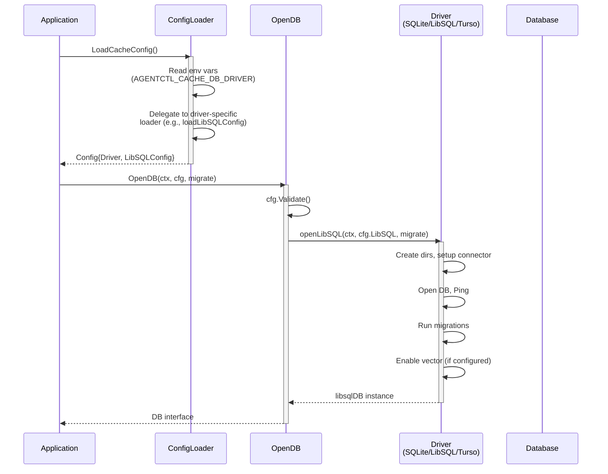
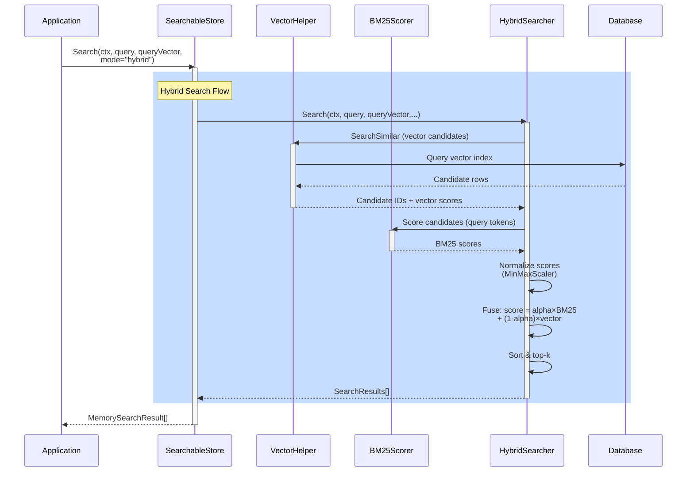

# Tasks for PR #66: Enable hot replacement from SQLite to Turso

**Repository:** jkatigb/agentctl
**URL:** https://github.com/jkatigb/agentctl/pull/66

## 📝 Review Comments to Address (18)

### Task 1: coderabbitai[bot]'s feedback

> [!WARNING]
> ## Rate limit exceeded
>
> @jkatigb has exceeded the limit for the number of commits or files that can be reviewed per hour. Please wait **4 minutes and 10 seconds** before requesting another review.
>
> <details>
> <summary>⌛ How to resolve this issue?</summary>
>
> After the wait time has elapsed, a review can be triggered using the `@coderabbitai review` command as a PR comment. Alternatively, push new commits to this PR.
>
> We recommend that you space out your commits to avoid hitting the rate limit.
>
> </details>
>
>
> <details>
> <summary>🚦 How do rate limits work?</summary>
>
> CodeRabbit enforces hourly rate limits for each developer per organization.
>
> Our paid plans have higher rate limits than the trial, open-source and free plans. In all cases, we re-allow further reviews after a brief timeout.
>
> Please see our [FAQ](https://docs.coderabbit.ai/faq) for further information.
>
> </details>
>
> <details>
> <summary>📥 Commits</summary>
>
> Reviewing files that changed from the base of the PR and between f82e14c53c78ab36522e416494bad481a03a916e and 3d478c18540b17c99e05958ff2aea6f2a68977f4.
>
> </details>
>
> <details>
> <summary>📒 Files selected for processing (10)</summary>
>
> * `.github/workflows/ci.yml` (3 hunks)
> * `Makefile` (5 hunks)
> * `cmd/agentctl/cmd/run_test.go` (2 hunks)
> * `examples/search_example.go` (1 hunks)
> * `internal/storage/dbdriver/migrate.go` (1 hunks)
> * `internal/storage/dbdriver/search.go` (1 hunks)
> * `internal/storage/dbdriver/sqlite.go` (1 hunks)
> * `internal/storage/dbdriver/turso.go` (1 hunks)
> * `internal/storage/memory/search.go` (1 hunks)
> * `internal/storage/memory/vector.go` (1 hunks)
>
> </details>
## Walkthrough
This PR introduces a comprehensive database driver abstraction layer enabling hot-swapping between SQLite, LibSQL, and Turso backends. It adds configuration management, vector search support, data migration utilities, and advanced search capabilities (BM25, vector, hybrid search). Includes documentation, example code, and environment templates for local and cloud-based testing.
## Changes
| Cohort / File(s) | Summary |
|---|---|
| **Configuration & Environment** <br> `\.env\.libsql\.test\.example`, `\.env\.turso\.example`, `\.gitignore` | New environment configuration templates for LibSQL and Turso with setup instructions, security guidance, and feature comparisons; expanded `.gitignore` for environment secrets. |
| **Database Driver Abstraction** <br> `internal/storage/dbdriver/driver.go`, `internal/storage/dbdriver/config.go`, `internal/storage/dbdriver/config_loader.go` | New DB interface for multi-backend support; DriverType enum and per-driver config structs (SQLite, LibSQL, Turso) with validation; ConfigLoader for environment-based driver selection and configuration. |
| **Driver Implementations** <br> `internal/storage/dbdriver/sqlite.go`, `internal/storage/dbdriver/libsql.go`, `internal/storage/dbdriver/turso.go` | Backend-specific driver wrappers implementing DB interface; openSQLite/openLibSQL/openTurso initialization with migrations, connection pooling, and driver metadata. |
| **Vector & Search Infrastructure** <br> `internal/storage/dbdriver/vector.go`, `internal/storage/dbdriver/search.go` | VectorHelper for embedding management and similarity search; comprehensive search subsystem with BM25 scoring, vector/hybrid search orchestration, term frequency analytics, and FTS5 utilities. |
| **Backward Compatibility & Migration** <br> `internal/storage/dbdriver/compat.go`, `internal/storage/dbdriver/migrate.go` | ToSQLDB/WrapSQLDB/OpenDBCompat for sql.DB interoperability; Migrator for SQLite-to-SQL data migration with batch processing, stats tracking, and export-to-SQL functionality. |
| **Driver & README** <br> `internal/storage/dbdriver/README.md` | Comprehensive documentation for DB driver abstraction, architecture, configuration, vector operations, migration workflows, and FAQ. |
| **Memory Store Search & Vector** <br> `internal/storage/memory/search.go`, `internal/storage/memory/vector.go` | SearchableStore and MemorySearchResult types enabling BM25/vector/hybrid search on memory store; VectorStore and VectorEntry for embedding persistence and similarity search. |
| **Storage Integration** <br> `internal/storage/sqliteutil/sqliteutil.go` | New OpenDBWithDriver and OpenDBWithAutoConfig helpers for driver-based database opening via abstraction layer. |
| **Documentation** <br> `docs/local-testing.md`, `docs/search-guide.md`, `docs/turso-migration.md` | Comprehensive guides covering local testing setup, advanced search capabilities (BM25/vector/hybrid), and Turso migration with examples, troubleshooting, and best practices. |
| **Examples & Build** <br> `examples/search_example.go`, `go.mod`, `Makefile` | New search example demonstrating BM25/vector/hybrid search with deterministic mock embeddings; updated Go version to 1.23, added libsql dependency, enabled CGO for lint. |
## Sequence Diagram(s)


## Estimated code review effort
🎯 4 (Complex) | ⏱️ ~60 minutes
**Areas requiring extra attention:**
- **`internal/storage/dbdriver/search.go`**: Dense BM25 scoring logic, tokenization, score normalization (MinMaxScaler), and hybrid search orchestration with multiple data flows require careful validation of algorithms and edge cases.
- **`internal/storage/dbdriver/migrate.go`**: Data migration logic with batch processing, transaction handling, error accumulation, and optional progress callbacks; SQL schema detection and table introspection require thorough testing.
- **`internal/storage/dbdriver/config_loader.go`**: Environment variable parsing across three driver types with fallbacks (e.g., per-database tokens plus global Turso token); ensure fallback precedence is correct and documented.
- **`internal/storage/dbdriver/vector.go`**: Vector representation (JSON encoding/decoding, SQL formatting), dimension validation, and integration with both libSQL and Turso via type assertions; ensure dimension consistency across driver types.
- **`internal/storage/memory/search.go` & `internal/storage/memory/vector.go`**: Integration of new search/vector subsystems with existing memory store; corpus statistics refresh and hybrid searcher lifecycle need validation.
- **`internal/storage/dbdriver/libsql.go` & `internal/storage/dbdriver/turso.go`**: Driver-specific initialization (vector support detection for Turso, embeded connector setup for LibSQL) and teardown; ensure resource cleanup on error paths.
## Possibly related PRs
- **jkatigb/agentctl#18**: Modifies storage abstraction layer and ports stores/CLI to shared internal/storage interfaces, complementing this PR's database driver abstraction additions.
## Suggested labels
`ai-generated`
## Poem
> 🐰 *Hops through backends with glee,*
> *SQLite, LibSQL, Turso—pick any three!*
> *Vectors dance, BM25 scores align,*
> *Hybrid searches fuse and shine.*
> *Hot-swap drivers, migrations run smooth,*
> *This database layer's got all the moves!* 🚀
## Pre-merge checks and finishing touches
<details>
<summary>❌ Failed checks (1 warning)</summary>
|     Check name    | Status     | Explanation                                                                                                                                                                                                                               | Resolution                                                                                                                                                                                |
| :---------------: | :--------- | :---------------------------------------------------------------------------------------------------------------------------------------------------------------------------------------------------------------------------------------- | :---------------------------------------------------------------------------------------------------------------------------------------------------------------------------------------- |
| Description check | ⚠️ Warning | The pull request description is incomplete. The Summary section is empty (contains only a dash), and the Notes section is minimal (single hyphen). While the testing checklist is present, critical context about the changes is missing. | Fill the Summary section with a clear explanation of what changes were made, why they were made, and how they achieve hot replacement capability. Provide meaningful notes if applicable. |
</details>
<details>
<summary>✅ Passed checks (2 passed)</summary>
|     Check name     | Status   | Explanation                                                                                                                                                                                                                                                    |
| :----------------: | :------- | :------------------------------------------------------------------------------------------------------------------------------------------------------------------------------------------------------------------------------------------------------------- |
|     Title check    | ✅ Passed | The title 'Enable hot replacement from SQLite to Turso' accurately and clearly summarizes the main objective of the pull request, aligning with the extensive changes introducing database driver abstraction, multi-backend support, and migration utilities. |
| Docstring Coverage | ✅ Passed | Docstring coverage is 100.00% which is sufficient. The required threshold is 80.00%.                                                                                                                                                                           |
</details>
---
<sub>Comment `@coderabbitai help` to get the list of available commands and usage tips.</sub>

---

### Task 2: coderabbitai[bot]'s feedback

**File:** `docs/search-guide.md:594`

**Fix incorrect `SearchableStore` method signatures in API reference**
The method signatures in this snippet are not valid Go and don’t match the actual usage (e.g., `ctx` typed as `string`, malformed `SearchHybrid` params). This will confuse users trying to copy/paste.
Consider updating them along these lines:
```go
// Enable search on a store
func (s *Store) EnableSearch(db DB, workspace string) (*SearchableStore, error)
// Generic search
func (ss *SearchableStore) Search(
    ctx context.Context,
    query string,
    queryVector Vector, // or dbdriver.Vector, depending on the actual type alias
    workspace string,
    mode SearchMode,
    limit int,
) ([]MemorySearchResult, error)
// Convenience methods
func (ss *SearchableStore) SearchBM25(ctx context.Context, query, workspace string, limit int) ([]MemorySearchResult, error)
func (ss *SearchableStore) SearchVector(ctx context.Context, queryVector Vector, workspace string, limit int) ([]MemorySearchResult, error)
func (ss *SearchableStore) SearchHybrid(ctx context.Context, query string, queryVector Vector, workspace string, limit int) ([]MemorySearchResult, error)
// Maintenance
func (ss *SearchableStore) RefreshCorpusStats(ctx context.Context, workspace string) error
```
(Adjust `Vector` to the actual exported type you want to expose, e.g., `dbdriver.Vector`, to keep docs consistent with the code.)
<details>
<summary>🤖 Prompt for AI Agents</summary>
```
In docs/search-guide.md around lines 573 to 594, the Go method signatures for
SearchableStore are syntactically invalid and inconsistent with real usage
(e.g., ctx typed as string, malformed SearchHybrid params); update each
signature to use correct Go types and parameter ordering: ctx should be
context.Context, query string, queryVector should use the actual exported Vector
type (or dbdriver.Vector), workspace string, mode SearchMode where applicable,
and limit int; fix the convenience methods to have proper param lists and types
(SearchBM25(ctx context.Context, query, workspace string, limit int),
SearchVector(ctx context.Context, queryVector Vector, workspace string, limit
int), SearchHybrid(ctx context.Context, query string, queryVector Vector,
workspace string, limit int)), and ensure RefreshCorpusStats uses ctx
context.Context.
```
</details>

---

### Task 3: coderabbitai[bot]'s feedback

**File:** `examples/search_example.go:341`

<details>
<summary>🧩 Analysis chain</summary>
**Fix incorrect “L2 normalize” implementation in `generateMockEmbedding`**
The current normalization scales by `1 / sum(val^2)` instead of `1 / sqrt(sum(val^2))`, so the resulting vector does not have unit L2 norm as advertised.
You can fix this by computing the L2 norm properly and normalizing:
```diff
-import (
-	"context"
-	"fmt"
-	"math/rand"
-
-	"github.com/jkatigb/agentctl/internal/storage/dbdriver"
-	"github.com/jkatigb/agentctl/internal/storage/memory"
-)
+import (
+	"context"
+	"fmt"
+	"math"
+	"math/rand"
+
+	"github.com/jkatigb/agentctl/internal/storage/dbdriver"
+	"github.com/jkatigb/agentctl/internal/storage/memory"
+)
@@
-	// L2 normalize
-	var norm float32
-	for _, val := range embedding {
-		norm += val * val
-	}
-	norm = float32(1.0 / float64(norm))
-
-	for i := range embedding {
-		embedding[i] *= norm
-	}
+	// L2 normalize
+	var norm float64
+	for _, val := range embedding {
+		norm += float64(val * val)
+	}
+	if norm > 0 {
+		norm = math.Sqrt(norm)
+		inv := 1.0 / norm
+		for i := range embedding {
+			embedding[i] = float32(float64(embedding[i]) * inv)
+		}
+	}
```
This keeps the example deterministic while producing genuinely unit‑norm vectors.
---
🏁 Script executed:
```shell
#!/bin/bash
# Search for the file and examine the generateMockEmbedding function
fd -t f "search_example.go" -x cat {} | head -350
```
Length of output: 9092
---
🏁 Script executed:
```shell
#!/bin/bash
# Extract imports and the generateMockEmbedding function specifically
fd -t f "search_example.go" -x grep -A 30 "func generateMockEmbedding" {}
```
Length of output: 678
---
🏁 Script executed:
```shell
#!/bin/bash
# Check current imports in the file
fd -t f "search_example.go" -x sed -n '1,20p' {}
```
Length of output: 415
---
</details>
**Fix incorrect L2 normalization in `generateMockEmbedding`**
The current implementation computes `1 / sum(val²)` instead of `1 / sqrt(sum(val²))`, so the resulting vector does not actually have unit L2 norm as advertised.
Add the `math` import and apply this fix:
```diff
 import (
 	"context"
 	"fmt"
+	"math"
 	"math/rand"
 	"github.com/jkatigb/agentctl/internal/storage/dbdriver"
 	"github.com/jkatigb/agentctl/internal/storage/memory"
 )
```
```diff
 	// L2 normalize
-	var norm float32
+	var norm float64
 	for _, val := range embedding {
-		norm += val * val
+		norm += float64(val * val)
 	}
-	norm = float32(1.0 / float64(norm))
-
-	for i := range embedding {
-		embedding[i] *= norm
+	if norm > 0 {
+		norm = math.Sqrt(norm)
+		inv := 1.0 / norm
+		for i := range embedding {
+			embedding[i] = float32(float64(embedding[i]) * inv)
+		}
 	}
```
<details>
<summary>🤖 Prompt for AI Agents</summary>
```
In examples/search_example.go around lines 315 to 341, the L2 normalization
computes 1/sum(val*val) instead of 1/sqrt(sum(val*val)); update the
normalization to compute norm = sqrt(sumSq) (add the math import) and scale by
1.0/ norm. Also guard against zero norm (e.g., if norm == 0 set norm = 1) before
dividing to avoid panic/NaN.
```
</details>

---

### Task 4: coderabbitai[bot]'s feedback

**File:** `internal/storage/dbdriver/compat.go:31`

<details>
<summary>🧩 Analysis chain</summary>
**Make `ToSQLDB` failure explicit and clarify `WrapSQLDB` semantics**
Two points here:
1. `ToSQLDB` currently returns `(nil, nil)` when `GetUnderlyingDB` reports no underlying `*sql.DB`. That makes it easy for callers to accidentally dereference a nil `*sql.DB` without any error signal.
   Consider returning an explicit error instead:
   ```diff
  -import (
-	"context"
-	"database/sql"
-)
+import (
+	"context"
+	"database/sql"
+	"fmt"
+)
@@
 func ToSQLDB(db DB) (*sql.DB, error) {
-	if sqlDB, ok := db.GetUnderlyingDB(); ok {
-		return sqlDB, nil
-	}
-	return nil, nil // Should never happen with our implementations
+	if sqlDB, ok := db.GetUnderlyingDB(); ok && sqlDB != nil {
+		return sqlDB, nil
+	}
+	return nil, fmt.Errorf("db does not expose an underlying *sql.DB")
   }
   ```
   This keeps current behavior for existing drivers (which do expose `*sql.DB`) while failing loudly if a future driver does not.
2. `WrapSQLDB` ignores the `driverType` parameter and always returns a `*sqliteDB`. If this helper is intended to be sqlite‑only, consider either:
   - Dropping `driverType` from the signature, or
   - Documenting that only `DriverSQLite` is supported today (and perhaps adding a `switch` with a default panic/log for other types).
This will make the compatibility helpers safer and their behavior more obvious to callers.
---
🏁 Script executed:
```shell
#!/bin/bash
# List usages of the compat helpers to confirm impact of tightening ToSQLDB’s behavior.
rg -n 'ToSQLDB\(' .
rg -n 'WrapSQLDB\(' .
```
Length of output: 315
---
🏁 Script executed:
```shell
#!/bin/bash
# Inspect the README.md usage to understand how ToSQLDB is expected to be used
sed -n '250,270p' ./internal/storage/dbdriver/README.md
```
Length of output: 371
---
🏁 Script executed:
```shell
#!/bin/bash
# Check GetUnderlyingDB implementations to understand current behavior
rg -nA5 'func.*GetUnderlyingDB' .
```
Length of output: 1342
---
🏁 Script executed:
```shell
#!/bin/bash
# Verify WrapSQLDB implementation and confirm driverType isn't used
sed -n '19,22p' ./internal/storage/dbdriver/compat.go
```
Length of output: 89
---
🏁 Script executed:
```shell
#!/bin/bash
# Check the sqliteDB struct to see if it has any relationship to driverType
rg -nB2 'type sqliteDB' .
```
Length of output: 249
---
🏁 Script executed:
```shell
#!/bin/bash
# Search for all callers of WrapSQLDB to understand usage context
rg -nB3 -A3 'WrapSQLDB' . --type go
```
Length of output: 651
---
</details>
**Make `ToSQLDB` failure explicit and clarify `WrapSQLDB` semantics**
Two valid points here:
1. `ToSQLDB` currently returns `(nil, nil)` when `GetUnderlyingDB` reports false. While all current implementations (sqlite, libsql, turso) return true, this defensive pattern is better handled with an explicit error:
   ```diff
  -import (
-	"context"
-	"database/sql"
-)
+import (
+	"context"
+	"database/sql"
+	"fmt"
+)
@@
 func ToSQLDB(db DB) (*sql.DB, error) {
-	if sqlDB, ok := db.GetUnderlyingDB(); ok {
-		return sqlDB, nil
-	}
-	return nil, nil // Should never happen with our implementations
+	if sqlDB, ok := db.GetUnderlyingDB(); ok && sqlDB != nil {
+		return sqlDB, nil
+	}
+	return nil, fmt.Errorf("db does not expose an underlying *sql.DB")
   }
   ```
2. `WrapSQLDB` accepts `driverType` but always returns `&sqliteDB`, ignoring the parameter entirely. Since this helper currently has no callers in the codebase, consider:
   - Removing the unused `driverType` parameter, or
   - Documenting that only `DriverSQLite` is supported and enforcing via validation.
Note: README.md at line 258 shows outdated API usage (`ok` pattern instead of error return); update documentation to match actual signature.
> Committable suggestion skipped: line range outside the PR's diff.
<details>
<summary>🤖 Prompt for AI Agents</summary>
```
internal/storage/dbdriver/compat.go lines 8-31: To fix two issues, change
ToSQLDB to return a clear error when db.GetUnderlyingDB() returns false instead
of (nil, nil) — return nil and a descriptive error (e.g., "underlying *sql.DB
not available for this driver") so callers can handle the failure; for WrapSQLDB
either remove the unused driverType parameter or validate it and return an error
for unsupported types — implement logic to accept only DriverSQLite (or switch
on driverType to construct the correct DB wrapper) and return an error if
another DriverType is passed; finally update README.md at the referenced line to
reflect the new ToSQLDB signature that returns (*sql.DB, error).
```
</details>

---

### Task 5: coderabbitai[bot]'s feedback

**File:** `internal/storage/dbdriver/driver.go:87`

**Avoid returning `(nil, nil)` for unknown driver types.**
The default branch returns a nil `DB` with no error. If `cfg.Validate()` ever regresses or new drivers are added without updating this switch, callers could dereference a nil `DB` with no prior error signal. Prefer returning an explicit error here (e.g., `fmt.Errorf("unsupported driver %q", cfg.Driver)`), even if today this path is “unreachable”.
<details>
<summary>🤖 Prompt for AI Agents</summary>
```
In internal/storage/dbdriver/driver.go around lines 72 to 87, the switch's
default branch returns (nil, nil) which can lead to a nil DB without an error if
cfg.Validate() regresses or new drivers are added; change the default branch to
return a non-nil error such as fmt.Errorf("unsupported driver %q", cfg.Driver)
so callers always receive an error for unknown drivers and import fmt if needed.
```
</details>

---

### Task 6: coderabbitai[bot]'s feedback

**File:** `internal/storage/dbdriver/migrate.go:62`

**Guard against non-positive `BatchSize` values.**
`NewMigrator` only normalizes `BatchSize` when it is exactly zero. If a negative value is provided, it flows through to `make([][]interface{}, 0, m.options.BatchSize)` in `migrateTableData`, which will panic. Treat all non-positive values the same:
```diff
- if options.BatchSize == 0 {
+ if options.BatchSize <= 0 {
    options.BatchSize = 100
 }
```
<details>
<summary>📝 Committable suggestion</summary>
> ‼️ **IMPORTANT**
> Carefully review the code before committing. Ensure that it accurately replaces the highlighted code, contains no missing lines, and has no issues with indentation. Thoroughly test & benchmark the code to ensure it meets the requirements.
```suggestion
// NewMigrator creates a new database migrator
func NewMigrator(source, target DB, options MigrationOptions) *Migrator {
	if options.BatchSize <= 0 {
		options.BatchSize = 100
	}
	return &Migrator{
		source:  source,
		target:  target,
		options: options,
	}
}
```
</details>
<details>
<summary>🤖 Prompt for AI Agents</summary>
```
In internal/storage/dbdriver/migrate.go around lines 52 to 62, NewMigrator only
normalizes BatchSize when it is exactly zero, allowing negative values to reach
migrateTableData and cause a panic; change the guard to treat all non-positive
BatchSize the same (e.g., if options.BatchSize <= 0 { options.BatchSize = 100
}), so any zero or negative input is replaced with the default batch size before
returning the Migrator.
```
</details>

---

### Task 7: coderabbitai[bot]'s feedback

**File:** `internal/storage/dbdriver/search.go:149`

_🛠️ Refactor suggestion_ | _🟠 Major_
**Consider guarding BM25 against zero-document corpora**
`BM25Scorer.Score` assumes `AvgDocLength > 0`. While `BuildCorpusStats` returns early when `TotalDocs == 0`, `BM25Scorer` is independently reusable and could be called with an empty corpus, which would make `avgdl` 0 and cause a divide-by-zero in the normalization term.
A small defensive check would make it safer:
```diff
func (b *BM25Scorer) Score(queryTerms []string, docStats DocumentStats) float64 {
-    score := 0.0
+    if b.corpusStats.TotalDocs == 0 || b.corpusStats.AvgDocLength == 0 {
+        return 0.0
+    }
+    score := 0.0
    ...
```
<details>
<summary>🤖 Prompt for AI Agents</summary>
```
internal/storage/dbdriver/search.go around lines 97 to 149: The BM25 scoring
code can divide by zero when the corpus or avg document length is zero; add a
defensive guard before using avgdl—if b.corpusStats.TotalDocs == 0 or computed
avgdl == 0, set avgdl to 1.0 (or return 0.0 early) so the normalization term
cannot divide by zero, and ensure downstream math uses that non-zero avgdl.
```
</details>

---

### Task 8: coderabbitai[bot]'s feedback

**File:** `internal/storage/dbdriver/search.go:351`

**Bug: scanning `rowid` into `string` plus some minor cleanups in `HybridSearcher.Search`**
Inside the candidate loop:
```go
var docID string
...
SELECT
    t.rowid as id,
    t.%s as text,
    %s as vector_sim
...
if err := rows.Scan(&docID, &text, &vectorSim); err != nil {
```
Most SQLite/libSQL drivers provide `rowid` as an integer type (e.g., `int64`), which cannot be scanned directly into `string`. This will typically yield an “unsupported Scan” error.
One simple fix is to cast `rowid` to text in SQL so it matches the destination type:
```diff
-        SELECT
-            t.rowid as id,
+        SELECT
+            CAST(t.rowid AS TEXT) as id,
             t.%s as text,
             %s as vector_sim
```
Or, change `docID` to `int64` and convert to string in Go before storing into `SearchResult.DocumentID`.
Additionally:
- `vectorScores` slice is populated but never used; it can be removed to avoid dead code.
- You are computing tokens twice per document (`ComputeTermFrequency(text)` and `len(Tokenize(text))`). If this becomes hot, consider having `ComputeTermFrequency` also return the length so you only tokenize once.
<details>
<summary>🤖 Prompt for AI Agents</summary>
```
internal/storage/dbdriver/search.go around lines 261 to 353: the query scans
rowid into a string which fails because rowid is an integer; change docID to
int64 and scan rowid into that, then convert to string (strconv.FormatInt) when
populating SearchResult.DocumentID; remove the unused vectorScores slice and its
append; and avoid double tokenization by either changing ComputeTermFrequency to
return both the term frequency map and document length (so you call tokenization
once) or by calling Tokenize(text) once, passing the tokens to
ComputeTermFrequency, and using the token length for DocumentStats.Length.
```
</details>

---

### Task 9: coderabbitai[bot]'s feedback

**File:** `internal/storage/dbdriver/vector.go:158`

**Bug: `SearchSimilar` constructs invalid SQL in the index path**
In the indexed path, the `FROM` clause is:
```go
query = fmt.Sprintf(`
    SELECT t.*
    FROM %s(%s, %d) vt
    JOIN %s t ON t.rowid = vt.id
`, vh.VectorTopK(indexName, queryVector, limit), indexName, limit, tableName)
```
But `VectorTopK(indexName, queryVector, limit)` already returns a full `vector_top_k('index', 'vector', k)` table-valued function call. The extra `(%s, %d)` makes the SQL invalid and duplicates the index/limit arguments.
You likely want to treat `VectorTopK(...)` as the entire source expression:
```diff
-        query = fmt.Sprintf(`
-            SELECT t.*
-            FROM %s(%s, %d) vt
-            JOIN %s t ON t.rowid = vt.id
-        `, vh.VectorTopK(indexName, queryVector, limit), indexName, limit, tableName)
+        query = fmt.Sprintf(`
+            SELECT t.*
+            FROM %s vt
+            JOIN %s t ON t.rowid = vt.id
+        `, vh.VectorTopK(indexName, queryVector, limit), tableName)
```
This aligns with how you already use `VectorTopK` in `HybridSearcher.Search`.
<details>
<summary>🤖 Prompt for AI Agents</summary>
```
internal/storage/dbdriver/vector.go around lines 115 to 158: the indexed branch
builds invalid SQL by embedding an extra "(%s, %d)" after the result of
vh.VectorTopK(...) which already returns the full table-valued function call;
remove the extra "(%s, %d)" and change the fmt.Sprintf format to use the
VectorTopK(...) result as the complete source expression (e.g. "FROM %s vt JOIN
%s t ON t.rowid = vt.id") and update the fmt.Sprintf arguments to pass
vh.VectorTopK(indexName, queryVector, limit) and tableName (so you no longer
duplicate index/limit arguments).
```
</details>

---

### Task 10: coderabbitai[bot]'s feedback

**File:** `internal/storage/dbdriver/vector.go:171`

_🛠️ Refactor suggestion_ | _🟠 Major_
**Consider using `ValidateVector` inside `SearchSimilar`**
`ValidateVector` is currently unused in this file. It would be a good safety net to call it at the beginning of `SearchSimilar` (and anywhere else vectors are accepted) so dimension mismatches fail fast in Go rather than surfacing as SQL/runtime errors from the DB.
<details>
<summary>🤖 Prompt for AI Agents</summary>
```
internal/storage/dbdriver/vector.go around lines 160-171: ValidateVector is
implemented but unused; call vh.ValidateVector(...) at the start of
SearchSimilar (and any other public method that accepts a Vector) to fail fast
on dimension mismatches. Specifically, at the top of SearchSimilar validate the
input vector, return the error if non-nil (or wrap it with context), and avoid
proceeding to SQL/DB calls when dimensions are wrong.
```
</details>

---

### Task 11: coderabbitai[bot]'s feedback

**File:** `internal/storage/memory/search.go:127`

**Avoid TEMP VIEW with pooled connections and reuse corpus builder.**
`EnableSearch` creates a `CREATE TEMP VIEW` on `s.db` and then queries that view to build corpus stats. With `database/sql` connection pooling, the `ExecContext` and subsequent `QueryContext` may run on different connections, so the temp view might not exist for the query, leading to “no such table/view” errors at runtime. The manual corpus loop here is also very similar to `buildCorpusStatsForWorkspace`, and you mix `s.db` (for view/stat queries) with the `db` parameter (for vector features).
Consider:
- Dropping the TEMP VIEW and calling `buildCorpusStatsForWorkspace(ctx, db, workspace)` directly, and
- Using the same `db` value consistently throughout `EnableSearch` (and ideally accepting a `ctx` instead of hard-coding `context.Background()`).
This removes a fragile TEMP VIEW dependency, de-duplicates logic, and keeps the DB handle consistent.
<details>
<summary>🤖 Prompt for AI Agents</summary>
```
internal/storage/memory/search.go lines 29-127: The function creates a TEMP VIEW
on s.db and manually builds corpus stats using context.Background(), which is
brittle with database/sql pooling and duplicates buildCorpusStatsForWorkspace;
replace the temp view and manual loop by calling
buildCorpusStatsForWorkspace(ctx, db, workspace) (or refactor that helper to
return CorpusStats), use the passed-in db for all DB operations instead of s.db,
change the signature to accept a ctx context.Context (remove
context.Background()), and ensure the same db handle is used when creating the
hybrid searcher so no temp view or duplicated logic remains.
```
</details>

---

### Task 12: coderabbitai[bot]'s feedback

**File:** `internal/storage/memory/search.go:300`

<details>
<summary>🧩 Analysis chain</summary>
**Review dynamic SQL construction for vector search and result shaping.**
`searchVector` builds the query via `fmt.Sprintf`, inlining both the `CosineSimilarity` SQL fragment and `queryVector.String()` into the statement. That makes correctness and safety depend on those helpers always emitting well-escaped fragments, and it bypasses `sortAndLimit`, so `Rank` is never populated for vector-only results.
If feasible, prefer having `VectorHelper` return a parameterized query (or query fragment plus args) instead of embedding `queryVector.String()` directly, and consider normalizing ranking/limit behavior with the BM25 path so all modes populate `Score`/`Rank` consistently.
---
🏁 Script executed:
```shell
#!/bin/bash
# Inspect how vectors are formatted/escaped before being interpolated into SQL.
# Expectation: Vector.String and VectorHelper.* only emit safe, non-user-controlled literals.
echo "=== Vector type and String/SQL helpers ==="
rg -n "type Vector" internal/storage/dbdriver/vector.go -n -C5 || true
rg -n "func (v Vector) String" internal/storage/dbdriver/vector.go -n -C5 || true
rg -n "CosineSimilarity" internal/storage/dbdriver/vector.go -n -C5 || true
rg -n "VectorExpression" internal/storage/dbdriver/vector.go -n -C5 || true
```
Length of output: 1979
---
I need to see the complete implementation of `Vector.String()` to assess the SQL injection risk properly.Let me use a different approach with a direct script to extract the complete function body:
---
🏁 Script executed:
```shell
#!/bin/bash
# Extract the complete Vector.String() implementation
cat internal/storage/dbdriver/vector.go | sed -n '39,50p'
```
Length of output: 67
---
```
---
🏁 Script executed:
```shell
#!/bin/bash
# Find vector.go file in repository
fd -t f "vector\.go" .
# Also search for Vector type definition across all Go files
rg -n "type Vector" --type go -A 2
```
Length of output: 864
---
```
---
🏁 Script executed:
```shell
#!/bin/bash
# Extract complete Vector.String() method
sed -n '39,60p' ./internal/storage/dbdriver/vector.go
```
Length of output: 532
---
```
---
🏁 Script executed:
```shell
#!/bin/bash
# Check for Vector validation and edge case handling
echo "=== Vector validation ==="
rg -n "ValidateVector" ./internal/storage/dbdriver/vector.go -A 10
# Check sortAndLimit to see if it populates Rank
echo "=== sortAndLimit function ==="
rg -n "sortAndLimit" ./internal/storage/memory/ -A 15
# Check searchVector caller to see how queryVector is created
echo "=== searchVector callers ==="
rg -n "searchVector" ./internal/storage/memory/search.go -B 5
```
Length of output: 3005
---
</details>
**Populate Rank in vector search results and consider NaN/Infinity validation.**
The `searchVector` function returns results directly without calling `sortAndLimit`, leaving `Rank` unpopulated (0). This creates inconsistency: `searchBM25` results get ranks via `sortAndLimit` (line 222), but vector results don't. The SQL inlining of `queryVector.String()` is safe in practice—`Vector.String()` outputs only numeric values like `[0.5,0.2,...]`—but the approach remains non-parameterized.
Additionally, `ValidateVector` only checks dimensions; it doesn't guard against NaN or Infinity values in the float32 slice, which could cause unexpected SQL behavior.
- Call `sortAndLimit` on vector results to populate `Rank` consistently with BM25 path.
- Consider adding NaN/Infinity validation to `ValidateVector`.
<details>
<summary>🤖 Prompt for AI Agents</summary>
```
internal/storage/memory/search.go around lines 225-300: the vector search path
builds results but never invokes sortAndLimit so Rank is left zero and behavior
differs from searchBM25; also ValidateVector currently only checks dimensions
and should reject NaN/Infinity values. Fix by passing the results through the
same sortAndLimit path used by BM25 (call ss.sortAndLimit with the results and
original limit/workspace so Rank and limits are populated consistently) and
update dbdriver.NewVectorHelper().ValidateVector to iterate the float slice and
return an error if any element is NaN or ±Inf (ensuring the searchVector path
validates and rejects such vectors before SQL execution).
```
</details>
✅ Addressed in commits e1d8ffb to daf4625

---

### Task 13: coderabbitai[bot]'s feedback

**File:** `internal/storage/memory/vector.go`

**`isColumnExistsError` can hide real schema migration failures.**
The helper returns true for both `"duplicate column name: embedding"` and `"table named_memory has no column named embedding"`. The latter message indicates the column is missing, not duplicated; in `migrateVectorSchema` this would cause a failure to add the `embedding` column to be silently ignored, leaving the schema incomplete.
Recommend:
- Treat only the genuine “duplicate column” condition as ignorable (e.g., via a substring match), and
- Remove the `"no column named embedding"` case so a missing column surfaces as an error.
<details>
<summary>🤖 Prompt for AI Agents</summary>
```
internal/storage/memory/vector.go around lines 73 to 82: the helper currently
treats both "duplicate column name: embedding" and "table named_memory has no
column named embedding" as ignorable, which can hide real migration failures;
change the logic to only detect the genuine duplicate-column condition (e.g.,
check for the substring "duplicate column name" or the exact duplicate message)
and remove the branch that treats the "no column named embedding" message as a
duplicate so that a missing column surfaces as an error during
migrateVectorSchema.
```
</details>

---

### Task 14: coderabbitai[bot]'s feedback

**File:** `internal/storage/sqliteutil/sqliteutil.go:80`

**The `defaultPath` parameter appears unused.**
The function signature includes a `defaultPath` parameter, but it's not used in the implementation. The `ConfigLoader` methods (`LoadCacheConfig`, `LoadJobsConfig`, `LoadMemoryConfig`) appear to handle default paths internally without needing this parameter.
Consider either using the parameter or removing it from the signature if it's not needed.
If the parameter should be used, you might need to pass it to the config loader or use it as a fallback. Otherwise, apply this diff to remove it:
```diff
-func OpenDBWithAutoConfig(ctx context.Context, rootDir string, dbType string, defaultPath string, migrate func(context.Context, *sql.DB) error) (*sql.DB, error) {
+func OpenDBWithAutoConfig(ctx context.Context, rootDir string, dbType string, migrate func(context.Context, *sql.DB) error) (*sql.DB, error) {
 	loader := dbdriver.NewConfigLoader(rootDir)
 	var cfg dbdriver.Config
 	switch dbType {
 	case "cache":
 		cfg = loader.LoadCacheConfig()
 	case "jobs":
 		cfg = loader.LoadJobsConfig()
 	case "memory":
 		cfg = loader.LoadMemoryConfig()
 	default:
 		return nil, fmt.Errorf("sqliteutil: unknown database type: %s", dbType)
 	}
 	return OpenDBWithDriver(ctx, cfg, migrate)
 }
```
<details>
<summary>🤖 Prompt for AI Agents</summary>
```
In internal/storage/sqliteutil/sqliteutil.go around lines 60 to 80, the function
OpenDBWithAutoConfig declares a defaultPath parameter that is unused; remove
defaultPath from the function signature and its documentation, update the
function comment to reflect the new parameter list, and update all call sites
(and tests) to stop passing the defaultPath argument so the ConfigLoader
internal defaults are used; ensure the function still returns
OpenDBWithDriver(ctx, cfg, migrate) unchanged and run go build/tests to fix any
remaining references.
```
</details>

---

### Task 15: coderabbitai[bot]'s feedback

**File:** `internal/storage/dbdriver/libsql.go:11`

<details>
<summary>🧩 Analysis chain</summary>
**Critical: Build failure due to missing dependency.**
The import `github.com/tursodatabase/go-libsql` is causing typecheck failures throughout the file. The dependency appears to be missing from `go.mod` or not properly installed.
Run the following script to verify the dependency status and suggest fixes:
---
🏁 Script executed:
```shell
#!/bin/bash
# Check if the dependency is in go.mod and suggest resolution
echo "=== Checking go.mod for go-libsql dependency ==="
if grep -q "github.com/tursodatabase/go-libsql" go.mod; then
    echo "✓ Dependency exists in go.mod"
    grep "github.com/tursodatabase/go-libsql" go.mod
else
    echo "✗ Dependency NOT found in go.mod"
    echo ""
    echo "To fix, run:"
    echo "  go get github.com/tursodatabase/go-libsql"
    echo "  go mod tidy"
fi
echo ""
echo "=== Checking if module can be fetched ==="
go list -m github.com/tursodatabase/go-libsql 2>&1 || echo "Module not available in current module cache"
```
Length of output: 460
---
The script reveals a different issue than initially assessed. The dependency is in `go.mod`, but with an invalid version reference. Let me investigate the actual code and available versions:
```
```
---
🏁 Script executed:
```shell
#!/bin/bash
# View the actual code to see the import and usage context
echo "=== Lines 1-50 of libsql.go ==="
head -50 internal/storage/dbdriver/libsql.go
echo ""
echo "=== Checking the current go.mod version format ==="
grep "go-libsql" go.mod
```
Length of output: 1485
---
🌐 Web query:
```web
go-libsql github.com/tursodatabase latest release version
```
💡 Result:
There are no releases published for tursodatabase/go-libsql on GitHub (as of November 17, 2025). [1]
Sources
[1] GitHub — tursodatabase/go-libsql (Releases section: "No releases published").
---
</details>
**Critical: Invalid dependency version in go.mod blocks build.**
The import statement is correct, but the version constraint in `go.mod` contains an invalid commit hash that cannot be resolved. The pseudo-version `v0.0.0-20240322134723-0e4adf9d01d8` points to a non-existent revision. Since there are no releases published for go-libsql, you must update `go.mod` to reference a valid commit hash from the repository.
Update the go-libsql dependency to use a valid commit, or remove it if no longer needed.
<details>
<summary>🤖 Prompt for AI Agents</summary>
```
In internal/storage/dbdriver/libsql.go around line 11, the import is correct but
the go.mod dependency uses an invalid pseudo-version
(v0.0.0-20240322134723-0e4adf9d01d8) that breaks builds; fix by updating go.mod
to point to a real commit or tag from the github.com/tursodatabase/go-libsql
repo (or remove the dependency if unused). To fix: find a valid commit hash on
the upstream repo (or the latest commit), run `go get
github.com/tursodatabase/go-libsql@<valid-commit>` (or edit go.mod to that
commit or a released tag), run `go mod tidy` and verify `go build` succeeds;
alternatively remove the import and related code if the package is no longer
required.
```
</details>
✅ Addressed in commit 4ce7400

---

### Task 16: coderabbitai[bot]'s feedback

**File:** `internal/storage/dbdriver/turso.go:36`

<details>
<summary>🧩 Analysis chain</summary>
**Verify NewEmbeddedReplicaConnector usage for Turso.**
The call to `libsql.NewEmbeddedReplicaConnector("", cfg.URL, libsql.WithAuthToken(cfg.AuthToken))` uses an empty string for the local path to indicate remote-only mode. Please verify this is the correct API usage for Turso remote databases.
Query the web to confirm the correct API usage:
---
🌐 Web query:
```web
How to use go-libsql NewEmbeddedReplicaConnector for Turso remote database
```
💡 Result:
Use the go-libsql embedded‑replica connector to create a local SQLite file that syncs from a Turso remote DB (reads come from local file, writes are delegated to the remote). Example steps and minimal code:
1. Install and prerequisites
- go get github.com/tursodatabase/go-libsql
- Build with CGO_ENABLED=1 (go-libsql uses CGO). [1][2]
2. Get Turso credentials
- From Turso CLI / dashboard obtain the database URL (libsql://...) and an auth token. [3][4]
3. Create the embedded replica connector (manual or auto sync)
- Manual sync example (call connector.Sync() when you want to fetch updates):
  import "github.com/tursodatabase/go-libsql"
  ...
  dbPath := "/path/to/local.db"
  primaryUrl := "libsql://<your-db>.turso.io"
  authToken := "<TURSO_AUTH_TOKEN>"
  connector, err := libsql.NewEmbeddedReplicaConnector(dbPath, primaryUrl,
      libsql.WithAuthToken(authToken),
  )
  if err != nil { ... }
  defer connector.Close()
  db := sql.OpenDB(connector)
  defer db.Close()
  // manually fetch updates
  if err := connector.Sync(); err != nil { ... }
- Auto sync: use NewEmbeddedReplicaConnectorWithAutoSync or pass WithSyncInterval to NewEmbeddedReplicaConnector to sync periodically. [1][2]
4. Optional settings
- WithReadYourWrites(true/false) to control immediate read-after-write visibility.
- WithEncryption(encryptionKey) to enable file encryption (encrypted DBs require libsql client to read). [1][2]
Important notes
- Embedded replicas require filesystem access (not suitable for serverless environments without persistent disk). [1][3]
- Do not open the local DB while a sync is running to avoid corruption; prefer coordinating syncs or using auto sync. [3]
Sources
[1] go-libsql README / pkg docs (examples, options, CGO requirement).
[2] go-libsql GitHub repository (examples and connector details).
[3] Turso docs — Embedded Replicas (usage, sync, best practices).
---
</details>
**Fix NewEmbeddedReplicaConnector usage—empty string for local path is not documented.**
The standard usage of `libsql.NewEmbeddedReplicaConnector()` requires a filesystem path for the local database (e.g., `/path/to/local.db`), not an empty string. Embedded replicas create a local SQLite file that syncs from the Turso remote DB and require filesystem access.
Passing an empty string as the first parameter does not appear in the documented API usage and contradicts the filesystem requirement. Either provide a valid local database path, or if remote-only access is needed, verify this is the correct API for that use case.
<details>
<summary>🤖 Prompt for AI Agents</summary>
```
In internal/storage/dbdriver/turso.go around lines 29 to 36, the call to
libsql.NewEmbeddedReplicaConnector incorrectly passes an empty string for the
local DB path; change this to a valid filesystem path (e.g., a configured path
or a temp file under the app data directory) and ensure the directory exists
with correct permissions before calling NewEmbeddedReplicaConnector, or if you
truly need remote-only access, replace this API with the appropriate remote-only
connector creation (verify libsql docs) and adjust error handling accordingly.
```
</details>

---

### Task 17: coderabbitai[bot]'s feedback

**File:** `internal/storage/dbdriver/libsql.go:77`

<details>
<summary>🧩 Analysis chain</summary>
**Close the libsql connector as well on early failures in `openLibSQL`**
After `libsql.NewEmbeddedReplicaConnector` and `sql.OpenDB(connector)`, the early error paths (Ping/migrations/vector setup) only call `db.Close()` and never close the `connector`. This can leak underlying resources (file descriptors, background threads) in error scenarios.
Centralize cleanup so both are closed on failure, e.g.:
```diff
 func openLibSQL(ctx context.Context, cfg LibSQLConfig, migrate MigrationFunc) (DB, error) {
@@
-	// Create libSQL connector for local file database
-	// For local files, just pass the path directly
-	connector, err := libsql.NewEmbeddedReplicaConnector(cfg.Path, "")
+	// Create libSQL connector for local file database
+	// For local files, just pass the path directly
+	connector, err := libsql.NewEmbeddedReplicaConnector(cfg.Path, "")
 	if err != nil {
 		return nil, fmt.Errorf("failed to create libsql connector: %w", err)
 	}
 	// Open database connection
-	db := sql.OpenDB(connector)
+	db := sql.OpenDB(connector)
+
+	cleanup := func() {
+		if db != nil {
+			_ = db.Close()
+		}
+		if connector != nil {
+			_ = connector.Close()
+		}
+	}
@@
 	// Test the connection
 	if err := db.PingContext(ctx); err != nil {
-		_ = db.Close() //nolint:errcheck
+		cleanup()
 		return nil, fmt.Errorf("failed to connect to libsql database: %w", err)
 	}
@@
 	if migrate != nil {
 		if err := migrate(ctx, db); err != nil {
-			_ = db.Close() //nolint:errcheck
+			cleanup()
 			return nil, fmt.Errorf("failed to run migrations: %w", err)
 		}
 	}
@@
 	if cfg.EnableVectorSearch {
 		if err := ensureVectorSupport(ctx, db, vectorDims); err != nil {
-			_ = db.Close() //nolint:errcheck
+			cleanup()
 			return nil, fmt.Errorf("failed to enable vector search: %w", err)
 		}
 	}
```
This keeps resource handling consistent with `libsqlDB.Close`.
---
```
---
🏁 Script executed:
```shell
#!/bin/bash
# Locate and examine the libsql.go file
find . -name "libsql.go" -type f 2>/dev/null | head -20
```
Length of output: 37
---
🏁 Script executed:
```shell
#!/bin/bash
# View the openLibSQL function in detail
fd -e go -p "libsql.go" | xargs cat 2>/dev/null | head -150
```
Length of output: 4373
---
🏁 Script executed:
```shell
#!/bin/bash
# Search for libsqlDB.Close() implementation to understand cleanup pattern
rg -n "libsqlDB|Close\(\)" --type go -A 5 -B 2
```
Length of output: 80005
---
🏁 Script executed:
```shell
#!/bin/bash
# Check libsql package imports and usage to understand connector type
rg -n "libsql\." --type go -B 2 -A 2 | head -100
```
Length of output: 1593
---
</details>
**Close the libsql connector on early failures in `openLibSQL`**
The resource leak claim is confirmed. The `libsql.Connector` type has an explicit `Close()` method (as shown in the `libsqlDB.Close()` implementation at lines 80-90), and it is not being closed on error paths in `openLibSQL`.
Current error paths (lines 50, 57, 65) only call `db.Close()` but never `connector.Close()`. The struct stores both as separate resources requiring independent cleanup. When initialization fails at Ping/migrations/vector-setup stages, the connector leaks.
The suggested fix using a centralized cleanup function is appropriate and necessary to prevent resource exhaustion.
<details>
<summary>🤖 Prompt for AI Agents</summary>
```
In internal/storage/dbdriver/libsql.go around lines 24 to 77, the
libsql.Connector created with libsql.NewEmbeddedReplicaConnector is not closed
on the early error paths (Ping, migrate, ensureVectorSupport), leaking the
connector; after creating the connector you should immediately register a
cleanup that will close the connector (and db if opened) on error — e.g. declare
a local deferred cleanup function right after connector creation that closes
connector (and db if non-nil) and set it to nil/disable it just before the
successful return, or explicitly call connector.Close() on every early return
(matching your current db.Close() calls); ensure errors from Close are
handled/ignored consistently (nolint if necessary).
```
</details>

---

### Task 18: coderabbitai[bot]'s feedback

**File:** `internal/storage/dbdriver/migrate.go:361`

**Fix `rows.Close` errcheck issues and ensure rows errors are handled in `ExportToSQL`**
`ExportToSQL` currently calls `rows.Close()` explicitly in several places and ignores its error, which is flagged by `errcheck`. You can follow the pattern used elsewhere in this file (deferred close with nolint) and also check `rows.Err()` once at the end:
```diff
@@ func (m *Migrator) ExportToSQL(ctx context.Context, writer io.Writer) error {
-		query := fmt.Sprintf("SELECT %s FROM %s", strings.Join(columns, ", "), table)
-		rows, err := m.source.QueryContext(ctx, query)
-		if err != nil {
-			return err
-		}
-
-		for rows.Next() {
+		query := fmt.Sprintf("SELECT %s FROM %s", strings.Join(columns, ", "), table)
+		rows, err := m.source.QueryContext(ctx, query)
+		if err != nil {
+			return err
+		}
+		defer func() { _ = rows.Close() }() //nolint:errcheck
+
+		for rows.Next() {
@@
-			if err := rows.Scan(valuePtrs...); err != nil {
-				_ = rows.Close()
-				return err
-			}
+			if err := rows.Scan(valuePtrs...); err != nil {
+				return err
+			}
@@
-			if _, err := fmt.Fprintf(writer, "INSERT INTO %s (%s) VALUES (%s);\n",
-				table, strings.Join(columns, ", "), strings.Join(valueStrs, ", ")); err != nil {
-				_ = rows.Close()
-				return err
-			}
+			if _, err := fmt.Fprintf(writer, "INSERT INTO %s (%s) VALUES (%s);\n",
+				table, strings.Join(columns, ", "), strings.Join(valueStrs, ", ")); err != nil {
+				return err
+			}
 		}
-		_ = rows.Close()
+
+		if err := rows.Err(); err != nil {
+			return err
+		}
@@
-		if _, err := fmt.Fprintf(writer, "\n"); err != nil {
-			return err
-		}
+		if _, err := fmt.Fprintf(writer, "\n"); err != nil {
+			return err
+		}
```
This should resolve the lint failures and also surfaces any iteration errors from the rows.
<details>
<summary>📝 Committable suggestion</summary>
> ‼️ **IMPORTANT**
> Carefully review the code before committing. Ensure that it accurately replaces the highlighted code, contains no missing lines, and has no issues with indentation. Thoroughly test & benchmark the code to ensure it meets the requirements.
```suggestion
func (m *Migrator) ExportToSQL(ctx context.Context, writer io.Writer) error {
	tables, err := m.getTablesToMigrate(ctx)
	if err != nil {
		return err
	}
	for _, table := range tables {
		// Write CREATE TABLE statement
		schema, err := m.getTableSchema(ctx, table)
		if err != nil {
			return err
		}
		if _, err := fmt.Fprintf(writer, "%s;\n\n", schema); err != nil {
			return err
		}
		// Write INSERT statements
		columns, err := m.getTableColumns(ctx, table)
		if err != nil {
			return err
		}
		query := fmt.Sprintf("SELECT %s FROM %s", strings.Join(columns, ", "), table)
		rows, err := m.source.QueryContext(ctx, query)
		if err != nil {
			return err
		}
		defer func() { _ = rows.Close() }() //nolint:errcheck
		for rows.Next() {
			values := make([]interface{}, len(columns))
			valuePtrs := make([]interface{}, len(columns))
			for i := range values {
				valuePtrs[i] = &values[i]
			}
			if err := rows.Scan(valuePtrs...); err != nil {
				return err
			}
			// Format values
			valueStrs := make([]string, len(values))
			for i, v := range values {
				switch val := v.(type) {
				case nil:
					valueStrs[i] = "NULL"
				case string:
					valueStrs[i] = fmt.Sprintf("'%s'", strings.ReplaceAll(val, "'", "''"))
				case []byte:
					valueStrs[i] = fmt.Sprintf("'%s'", strings.ReplaceAll(string(val), "'", "''"))
				default:
					valueStrs[i] = fmt.Sprintf("%v", val)
				}
			}
			if _, err := fmt.Fprintf(writer, "INSERT INTO %s (%s) VALUES (%s);\n",
				table, strings.Join(columns, ", "), strings.Join(valueStrs, ", ")); err != nil {
				return err
			}
		}
		if err := rows.Err(); err != nil {
			return err
		}
		if _, err := fmt.Fprintf(writer, "\n"); err != nil {
			return err
		}
	}
	return nil
}
```
</details>
<details>
<summary>🧰 Tools</summary>
<details>
<summary>🪛 GitHub Actions: CI</summary>
[error] 328-328: golangci-lint: Error return value of `rows.Close` is not checked (errcheck).
</details>
<details>
<summary>🪛 GitHub Check: Go 1.24.x • ubuntu-latest</summary>
[failure] 353-353:
Error return value of `rows.Close` is not checked (errcheck)
---
[failure] 349-349:
Error return value of `rows.Close` is not checked (errcheck)
---
[failure] 328-328:
Error return value of `rows.Close` is not checked (errcheck)
</details>
</details>
<details>
<summary>🤖 Prompt for AI Agents</summary>
```
In internal/storage/dbdriver/migrate.go around lines 292 to 361 the function
ExportToSQL calls rows.Close() explicitly in multiple places and ignores its
error, causing errcheck failures and missing iteration errors; change to defer
rows.Close() immediately after successful QueryContext (use defer rows.Close()
//nolint:errcheck), remove the explicit close calls inside the loop, and after
iterating check if err := rows.Err(); err != nil { return err } so any iteration
errors are surfaced. Ensure any early returns after Scan or fmt.Fprintf close
are removed because defer handles it.
```
</details>

---

## Summary

**Total tasks:** 18
- 📝 Review comments: 18
