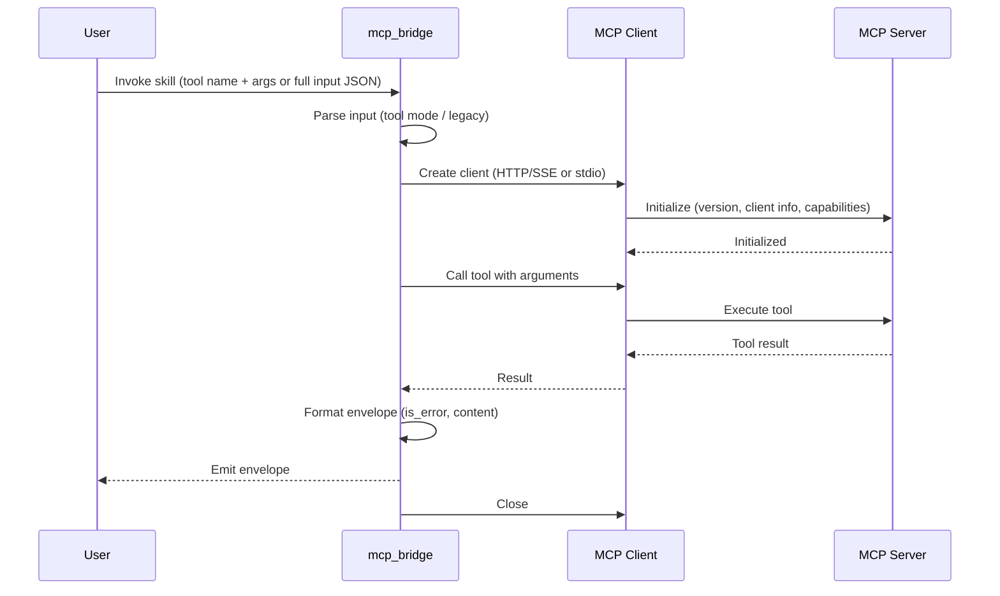
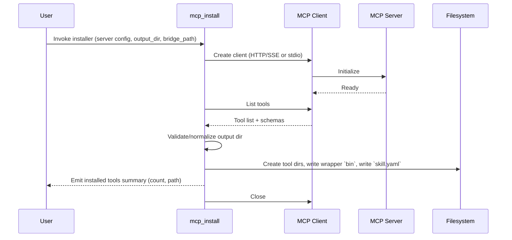

# Tasks for PR #77: feat(skills): Add MCP Tool Adapter

**Repository:** jkatigb/agentctl
**URL:** https://github.com/jkatigb/agentctl/pull/77

## 📝 Review Comments to Address (8)

### Task 1: coderabbitai[bot]'s feedback

## Walkthrough
Adds two new MCP-related skills: `mcp_bridge` (bridges tool calls to MCP servers via HTTP/SSE or stdio) and `mcp_install` (discovers MCP tools and generates per-tool skill wrappers/manifests). Also adds GEMINI.md, updates go.mod dependencies, extends .gitignore, and adds PR review notes.
## Changes
| Cohort / File(s) | Summary |
|---|---|
| **Ignore configuration** <br> `\.gitignore` | Added `mcp_bridge` and `mcp_install` to Dev binaries ignore section. |
| **Documentation** <br> `GEMINI.md` | New comprehensive guide describing Gemini agent context, MCP Tool Adapter, bridge and installer skills, usage examples, manifests, components, and troubleshooting. |
| **Dependency management** <br> `go.mod` | Added direct deps `github.com/mark3labs/mcp-go v0.43.0`, `github.com/mattn/go-sqlite3 v1.14.32`; upgraded `github.com/spf13/cast` to v1.7.1; added several indirect deps (jsonparser, jsonschema, ordered-map, uritemplate, generic-list). |
| **MCP Bridge skill** <br> **`skills/mcp_bridge`** <br> `skills/mcp_bridge/main.go`, `skills/mcp_bridge/skill.yaml` | New bridge executable and skill manifest implementing transport selection (HTTP/SSE or stdio), input parsing (tool mode and legacy), MCP client lifecycle and init, tool invocation, structured output envelopes, error handling, and skill signature/params. |
| **MCP Install skill** <br> **`skills/mcp_install`** <br> `skills/mcp_install/main.go`, `skills/mcp_install/skill.yaml` | New installer executable and manifest that creates an MCP client, lists tools, validates/normalizes output directory, generates per-tool skill directories with wrapper `bin` scripts and `skill.yaml` manifests by mapping tool schemas, and emits installation results. |
| **PR review notes** <br> `pr77_comments.md` | New review document with actionable comments: network capability vs runtime, tool-name sanitization, bridge-path validation suggestion, and style/format nitpicks. |
## Sequence Diagram(s)


## Estimated code review effort
🎯 4 (Complex) | ⏱️ ~60 minutes
- Pay special attention to:
  - `skills/mcp_bridge/main.go` — transport branching (HTTP vs stdio), input-mode parsing, initialization/close lifecycle, and structured error-envelope behavior.
  - `skills/mcp_install/main.go` — schema-to-manifest mapping, filesystem path construction/sanitization, wrapper script generation, and output-dir validation.
  - `go.mod` — added/updated dependencies for compatibility and build reproducibility.
## Poem
> 🐇
> I hopped a bridge and fetched the tools,
> Wrote little bins and careful rules,
> Manifests tucked neat in tree,
> Install, invoke — all safe for me,
> A tiny hop for devs and ghouls.
## Pre-merge checks and finishing touches
<details>
<summary>❌ Failed checks (1 warning, 1 inconclusive)</summary>
|     Check name     | Status         | Explanation                                                                                                                                           | Resolution                                                                                                                                                         |
| :----------------: | :------------- | :---------------------------------------------------------------------------------------------------------------------------------------------------- | :----------------------------------------------------------------------------------------------------------------------------------------------------------------- |
| Docstring Coverage | ⚠️ Warning     | Docstring coverage is 0.00% which is insufficient. The required threshold is 80.00%.                                                                  | You can run `@coderabbitai generate docstrings` to improve docstring coverage.                                                                                     |
|  Description check | ❓ Inconclusive | The PR description covers the main feature additions and changes, but the testing checklist template is not completed with any checkmarks or results. | Complete the testing checklist by verifying and marking the status of each test command (fmt, lint, vet, test, test-race, cover, skills-build, and policy checks). |
</details>
<details>
<summary>✅ Passed checks (1 passed)</summary>
|  Check name | Status   | Explanation                                                                                                                                                                                       |
| :---------: | :------- | :------------------------------------------------------------------------------------------------------------------------------------------------------------------------------------------------ |
| Title check | ✅ Passed | The title 'feat(skills): Add MCP Tool Adapter' accurately and concisely describes the main change—introducing MCP Tool Adapter functionality through two new skills (mcp/bridge and mcp/install). |
</details>
<details>
<summary>✨ Finishing touches</summary>
<details>
<summary>🧪 Generate unit tests (beta)</summary>
- [ ]    Create PR with unit tests
- [ ]    Post copyable unit tests in a comment
- [ ]    Commit unit tests in branch `feat/mcp-adapter`
</details>
</details>
---
<details>
<summary>📜 Recent review details</summary>
**Configuration used**: CodeRabbit UI
**Review profile**: CHILL
**Plan**: Pro
<details>
<summary>📥 Commits</summary>
Reviewing files that changed from the base of the PR and between f3122254bef818657da6e3005e841d03c3b1c709 and a91d25aed965c4cb5fc88be3a5ecdeef06b40b72.
</details>
<details>
<summary>📒 Files selected for processing (2)</summary>
* `skills/mcp_bridge/skill.yaml` (1 hunks)
* `skills/mcp_install/skill.yaml` (1 hunks)
</details>
<details>
<summary>🚧 Files skipped from review as they are similar to previous changes (2)</summary>
* skills/mcp_install/skill.yaml
* skills/mcp_bridge/skill.yaml
</details>
<details>
<summary>⏰ Context from checks skipped due to timeout of 90000ms. You can increase the timeout in your CodeRabbit configuration to a maximum of 15 minutes (900000ms). (1)</summary>
* GitHub Check: Go 1.24.x • ubuntu-latest
</details>
</details>
---
<sub>Comment `@coderabbitai help` to get the list of available commands and usage tips.</sub>

_Posted: 2025-11-20 13:21:36_

---

### Task 2: coderabbitai[bot]'s feedback

**File:** `skills/mcp_bridge/main.go:169`

**Propagate MCP tool failures as agentctl errors.** `toolResult.IsError` means the MCP server reported failure, yet we still emit a success envelope. Upstream logic (see `internal/protocol/protocol.go`) keys off `envelope.Status`, so these failures currently masquerade as successes. Bubble the condition as an error so the existing `fail` path emits an error envelope. Based on internal/protocol/protocol.go.
```diff
@@
-	// Format Output
-	data := map[string]any{
-		"is_error": toolResult.IsError,
-		"content":  toolResult.Content,
-	}
-
-	return rc.Emit("mcp/bridge", data, "application/json", envelope.Meta{
-		Source: "run",
-		Runner: "exec",
-	})
+	// Format Output
+	if toolResult.IsError {
+		payload, err := json.Marshal(toolResult.Content)
+		if err != nil {
+			return fmt.Errorf("tool %q returned MCP error (marshal content): %w", in.ToolName, err)
+		}
+		return fmt.Errorf("tool %q returned MCP error: %s", in.ToolName, payload)
+	}
+
+	data := map[string]any{
+		"is_error": false,
+		"content":  toolResult.Content,
+	}
+
+	return rc.Emit("mcp/bridge", data, "application/json", envelope.Meta{
+		Source: "run",
+		Runner: "exec",
+	})
```
<details>
<summary>🤖 Prompt for AI Agents</summary>
```
In skills/mcp_bridge/main.go around lines 144 to 163, the code ignores
toolResult.IsError and always emits a success envelope; change the flow so
MCP-reported failures return an error instead of emitting success. After the
CallTool success check, inspect toolResult.IsError and if true return a
formatted error (including toolResult.Content or other diagnostic fields) so the
caller's fail path will emit an error envelope; only call rc.Emit for non-error
toolResult cases.
```
</details>

_Posted: 2025-11-20 13:40:02_

---

### Task 3: coderabbitai[bot]'s feedback

**File:** `skills/mcp_install/main.go`

_🛠️ Refactor suggestion_ | _🟠 Major_
**Clean up inconsistent indentation and excessive blank lines.**
The indentation in this section is highly inconsistent with unnecessary blank lines, making the code difficult to read and maintain. Both the HTTP and stdio transport branches should follow consistent indentation patterns.
Apply this diff to improve readability:
```diff
-	var mcpClient *client.Client
-	var err error
-
-
-
-		if in.ServerURL != "" {
-
-
-
-			// SSE/HTTP Transport
-
-
-
-			mcpClient, err = client.NewStreamableHttpClient(in.ServerURL, transport.WithHTTPHeaders(in.ServerHeaders))
-
-
-
-			if err != nil {
-
-
-
-				return fmt.Errorf("failed to create HTTP client: %w", err)
-
-
-
-			}
-
-
-
-			if err := mcpClient.Start(ctx); err != nil {
-
-
-
-				return fmt.Errorf("failed to start transport: %w", err)
-
-
-
-			}
-
-
-
-		} else if in.ServerCmd != "" {
-		// Stdio Transport
-		env := os.Environ()
-		for k, v := range in.ServerEnv {
-			env = append(env, fmt.Sprintf("%s=%s", k, v))
-		}
-		mcpClient, err = client.NewStdioMCPClient(in.ServerCmd, env, in.ServerArgs...)
-		if err != nil {
-			return fmt.Errorf("failed to create stdio client: %w", err)
-		}
-	} else {
-		return fmt.Errorf("either server_cmd or server_url is required")
-	}
+	var mcpClient *client.Client
+	var err error
+
+	if in.ServerURL != "" {
+		// SSE/HTTP Transport
+		mcpClient, err = client.NewStreamableHttpClient(in.ServerURL, transport.WithHTTPHeaders(in.ServerHeaders))
+		if err != nil {
+			return fmt.Errorf("failed to create HTTP client: %w", err)
+		}
+		if err := mcpClient.Start(ctx); err != nil {
+			return fmt.Errorf("failed to start transport: %w", err)
+		}
+	} else if in.ServerCmd != "" {
+		// Stdio Transport
+		env := os.Environ()
+		for k, v := range in.ServerEnv {
+			env = append(env, fmt.Sprintf("%s=%s", k, v))
+		}
+		mcpClient, err = client.NewStdioMCPClient(in.ServerCmd, env, in.ServerArgs...)
+		if err != nil {
+			return fmt.Errorf("failed to create stdio client: %w", err)
+		}
+	} else {
+		return fmt.Errorf("either server_cmd or server_url is required")
+	}
```
<details>
<summary>📝 Committable suggestion</summary>
> ‼️ **IMPORTANT**
> Carefully review the code before committing. Ensure that it accurately replaces the highlighted code, contains no missing lines, and has no issues with indentation. Thoroughly test & benchmark the code to ensure it meets the requirements.
```suggestion
	var mcpClient *client.Client
	var err error
	if in.ServerURL != "" {
		// SSE/HTTP Transport
		mcpClient, err = client.NewStreamableHttpClient(in.ServerURL, transport.WithHTTPHeaders(in.ServerHeaders))
		if err != nil {
			return fmt.Errorf("failed to create HTTP client: %w", err)
		}
		if err := mcpClient.Start(ctx); err != nil {
			return fmt.Errorf("failed to start transport: %w", err)
		}
	} else if in.ServerCmd != "" {
		// Stdio Transport
		env := os.Environ()
		for k, v := range in.ServerEnv {
			env = append(env, fmt.Sprintf("%s=%s", k, v))
		}
		mcpClient, err = client.NewStdioMCPClient(in.ServerCmd, env, in.ServerArgs...)
		if err != nil {
			return fmt.Errorf("failed to create stdio client: %w", err)
		}
	} else {
		return fmt.Errorf("either server_cmd or server_url is required")
	}
```
</details>
<details>
<summary>🤖 Prompt for AI Agents</summary>
```
In skills/mcp_install/main.go around lines 97 to 157, the block that chooses
between HTTP (ServerURL) and stdio (ServerCmd) transports contains inconsistent
indentation and many unnecessary blank lines; normalize indentation to match
surrounding Go style (tabs for block indentation), remove extra blank lines,
align braces and if/else blocks consistently, and ensure error handling and
returns remain unchanged while collapsing spacing so each logical statement
occupies a single line or a compact block for readability.
```
</details>
✅ Addressed in commit 0dd33a2

_Posted: 2025-11-20 13:40:02_

---

### Task 4: coderabbitai[bot]'s feedback

**File:** `skills/mcp_install/main.go`

**Sanitize tool name before using in filesystem paths.**
The tool name from the MCP server is used directly in `filepath.Join` without validation or sanitization. A malicious or misconfigured MCP server could provide tool names containing path traversal sequences (e.g., `../../../etc/passwd`) or other filesystem-unsafe characters, potentially writing skills outside the intended directory.
Consider adding validation before line 285:
```go
// Sanitize tool name to prevent path traversal
sanitized := filepath.Base(tool.Name)
if sanitized != tool.Name || sanitized == "." || sanitized == ".." {
	return fmt.Errorf("invalid tool name: %s", tool.Name)
}
skillDir := filepath.Join(baseDir, sanitized)
```
<details>
<summary>🤖 Prompt for AI Agents</summary>
```
In skills/mcp_install/main.go around line 285, the code uses tool.Name directly
in filepath.Join which allows path traversal or unsafe filenames; validate and
sanitize tool.Name before use by extracting a safe base name and rejecting names
that differ from the original or equal "."/".." (returning an error), then use
the sanitized name to build skillDir so skills cannot be written outside
baseDir.
```
</details>
✅ Addressed in commit 0dd33a2

_Posted: 2025-11-20 13:40:02_

---

### Task 5: coderabbitai[bot]'s feedback

**File:** `skills/mcp_install/main.go`

**Network capability "none" contradicts MCP bridge requirements.**
The generated skill manifest sets `network: "none"`, but the skill's wrapper script invokes `mcp_bridge` which requires network access to communicate with MCP servers (especially for HTTP/SSE transport). This will cause runtime failures when the skill is executed under agentctl's policy enforcement.
Consider changing the network capability to allow egress:
```diff
 	"capabilities": map[string]any{
-		"network": "none",
+		"network": "egress",
+		"egressAllow": []string{"*"}, // Or restrict to specific MCP server domains if known
 		"filesystem": []map[string]string{
 			{"type": "workdir"},
 		},
 	},
```
<details>
<summary>📝 Committable suggestion</summary>
> ‼️ **IMPORTANT**
> Carefully review the code before committing. Ensure that it accurately replaces the highlighted code, contains no missing lines, and has no issues with indentation. Thoroughly test & benchmark the code to ensure it meets the requirements.
```suggestion
			"network": "egress",
			"egressAllow": []string{"*"}, // Or restrict to specific MCP server domains if known
			"filesystem": []map[string]string{
				{"type": "workdir"},
			},
```
</details>
<details>
<summary>🤖 Prompt for AI Agents</summary>
```
In skills/mcp_install/main.go around lines 460 to 468, the manifest sets
network: "none" but the wrapper invokes mcp_bridge which needs outbound network
access; change the manifest network capability from "none" to allow egress (for
example set network to "egress" or remove the "none" restriction so outbound
connections are permitted), keep filesystem as-is, and if possible narrow
allowed egress to only the MCP server hosts/ports to follow least privilege.
```
</details>
✅ Addressed in commit 0dd33a2

_Posted: 2025-11-20 13:40:03_

---

### Task 6: coderabbitai[bot]'s feedback

**File:** `skills/mcp_install/main.go:143`

**Sanitize `tool.Name` before joining paths to avoid path traversal**
`OutputDir` is validated via `PathValidator`, but individual skill directories are created with:
```go
skillDir := filepath.Join(baseDir, tool.Name)
if err := os.MkdirAll(skillDir, 0755); err != nil {
    return err
}
```
Because `tool.Name` is controlled by the MCP server, a malicious or buggy server could use names like `"../outside"` or include path separators to escape `baseDir` and write files outside the intended workspace. This is a path traversal vulnerability and should be fixed.
A minimal hardening is to sanitize the tool name before using it in any filesystem path, e.g. restricting it to a safe character set and replacing everything else:
```diff
 func generateSkill(baseDir string, tool mcp.Tool, in input) error {
-	// Create directory for the skill
-	skillDir := filepath.Join(baseDir, tool.Name)
+	// Create directory for the skill (sanitize name to prevent path traversal)
+	safeName := sanitizeToolName(tool.Name)
+	skillDir := filepath.Join(baseDir, safeName)
 	if err := os.MkdirAll(skillDir, 0755); err != nil {
 		return err
 	}
```
And add a helper somewhere in this file (e.g. below `generateSkill`):
```go
func sanitizeToolName(name string) string {
	var b strings.Builder
	for _, r := range name {
		if (r >= 'a' && r <= 'z') ||
			(r >= 'A' && r <= 'Z') ||
			(r >= '0' && r <= '9') ||
			r == '_' || r == '-' || r == '.' {
			b.WriteRune(r)
		} else {
			b.WriteRune('_')
		}
	}
	if b.Len() == 0 {
		return "tool"
	}
	return b.String()
}
```
This keeps manifest metadata (`tool.Name`) intact but ensures the on-disk layout cannot be abused to escape the validated base directory.
If you’d like, I can also sketch a follow-up that additionally re-validates `skillDir` with `PathValidator` for belt-and-suspenders safety.
Also applies to: 237-247
<details>
<summary>🤖 Prompt for AI Agents</summary>
```
In skills/mcp_install/main.go around lines 195-201 (and also apply same fix at
237-247), tool.Name is used directly in filepath.Join which allows path
traversal; sanitize tool.Name to a safe on-disk token before joining by
implementing a sanitizeToolName helper that replaces any character not in
[A-Za-z0-9_.-] with '_' and returns a non-empty fallback (e.g. "tool"); use the
sanitized name for filepath.Join and subsequent os.MkdirAll/os operations;
optionally re-run PathValidator on the resulting skillDir to ensure it remains
inside the validated base directory.
```
</details>
✅ Addressed in commit 0dd33a2

_Posted: 2025-11-20 13:48:03_

---

### Task 7: coderabbitai[bot]'s feedback

**File:** `skills/mcp_install/main.go:289`

**Non-deterministic parameter ordering in generated manifests.**
Go map iteration order is non-deterministic, so each time `tool.InputSchema.Properties` is iterated (lines 246-280), the parameters will be appended to `signatureParameters` in a different order. This means the generated `skill.yaml` files will have parameters in random order, which can cause:
- Unnecessary diffs when regenerating skills
- Confusion when comparing manifests
- Inconsistent behavior if parameter order matters downstream
Apply this diff to sort parameters alphabetically:
```diff
 	signatureParameters := []map[string]any{}
+	// Collect property names and sort for deterministic output
+	propNames := make([]string, 0, len(tool.InputSchema.Properties))
+	for propName := range tool.InputSchema.Properties {
+		propNames = append(propNames, propName)
+	}
+	sort.Strings(propNames)
+
 	if tool.InputSchema.Properties != nil {
-		for propName, propDef := range tool.InputSchema.Properties {
+		for _, propName := range propNames {
+			propDef := tool.InputSchema.Properties[propName]
 			if defMap, ok := propDef.(map[string]any); ok {
```
Don't forget to add `"sort"` to the imports at the top of the file.
> Committable suggestion skipped: line range outside the PR's diff.
<details>
<summary>🤖 Prompt for AI Agents</summary>
```
In skills/mcp_install/main.go around lines 245 to 281, iteration over
tool.InputSchema.Properties uses Go map iteration which is non-deterministic
causing parameter order to vary; fix by first collecting all property names into
a slice, call sort.Strings on that slice (add "sort" to imports), then iterate
over the sorted slice and look up each propDef from the original map to build
and append params exactly as before so output order is deterministic.
```
</details>
✅ Addressed in commit f312225

_Posted: 2025-11-20 14:38:23_

---

### Task 8: coderabbitai[bot]'s feedback

**File:** `skills/mcp_install/main.go`

**Clarify command naming convention.**
The comment suggests uncertainty about whether `command` should be `tool.Name` or `mcp_generated/tool.Name`. Since the metadata name is `mcp_generated/` + tool.Name (line 289), consider documenting the intended convention or confirming that signature command should match the simple tool.Name.
<details>
<summary>🤖 Prompt for AI Agents</summary>
```
In skills/mcp_install/main.go around line 315, the code sets "command":
tool.Name but metadataName above is constructed as "mcp_generated/" + tool.Name
(line 289), causing ambiguity; update the code to explicitly use the intended
convention—either set command to the bare tool.Name (tool.Name) and add a
one-line comment documenting that signature commands should be simple names, or
set it to metadataName if the command must include the "mcp_generated/"
prefix—then make the change consistently and add a short inline comment
explaining the chosen convention so future readers aren’t uncertain.
```
</details>
✅ Addressed in commit f312225

_Posted: 2025-11-20 14:38:24_

---

