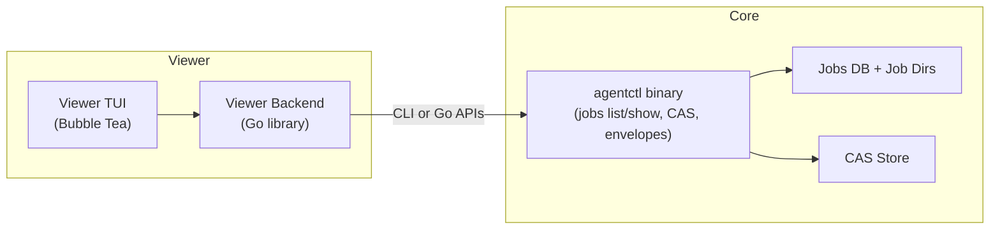

## 1. Overview

### 1.1 Problem

Debugging complex multi-agent runs and skills is hard with raw agentctl JSON output and low-level jobs commands.

### 1.2 Goal

Provide a **separate, read-only TUI viewer** (beads_viewer-style) that:

- Lists jobs and their status.
- Shows detailed result envelopes, progress, and stderr.
- Visualizes task/agent graphs and CAS artifacts.

The viewer must not change the core envelope contract or mutate jobs/CAS/memory.

### 1.3 Non‑Goals

- No envelope emission from the viewer (it’s human-facing, not a Core Profile endpoint).
- No job cancellation/deletion from the viewer in v1.
- No remote/network features; viewer operates on local agentctl state.

---

## 2. Architecture

### 2.1 Components

- **Core (agentctl)**  
  - Jobs DB + job dirs.  
  - CAS store.  
  - Read-model/CLI from Spec A (jobs list/show etc.).

- **Viewer backend (Go library)**  
  - Wrapper that calls either:
    - Direct Go APIs (internal/view/jobs), or
    - Shells out to agentctl jobs ... and parses envelopes (to decouple versions).

- **Viewer TUI (Bubble Tea + Lipgloss)**  
  - Full-screen terminal UI, similar ergonomics to beads_viewer:
    - Left: jobs list.
    - Right: details.
    - Alternate panes for graph and artifact views.

### 2.2 Data Access Strategy

Two options (decision required):

- **Option 1: CLI-based (preferred for contract‑safety)**  
  - Viewer invokes agentctl jobs list/show in-process or via exec.Command.
  - Pros: strict separation, respects envelope guarantees; viewer follows Core spec.
  - Cons: more JSON (un)marshalling.

- **Option 2: Direct Go imports**  
  - Viewer imports internal/view/jobs, internal/storage/cas, etc.
  - Pros: simpler, no subprocess management.
  - Cons: tighter coupling; any internal change can break viewer.

Spec default: **start with Option 1** and only fall back to Option 2 if performance or ergonomics require it.

---

## 3. Views & Interactions (MVP)

### 3.1 Jobs List View

- **Data**: JobSummary[] from jobs list.
- **Columns**: state, command, workspace, created_at, duration, error summary.
- **Interactions**:
  - ↑/↓, PgUp/PgDn: move selection.
  - /: filter jobs by text query (matches command, workspace, state).
  - Enter: open details view.

### 3.2 Job Detail View

- **Data**: JobDetail from jobs show.
- **Layout**:
  - Envelope header: command, status, workspace, skill_version, cas_digest, cache/memory info.
  - Data preview: pretty-printed JSON (truncated).
  - Tabs or sections for:
    - Progress timeline (from progress.ndjson).
    - stderr (from stderr.log).
    - artifacts summary.

### 3.3 Task/Agent Graph View (v1 or v1.1)

- **Data**: future jobs graph output or a dedicated API mapping jobs → tasks/agents.
- **Behavior**:
  - Node selection (up/down/left/right).
  - Node details (type, status, summary).
  - Optional metrics (critical path, degree) reusing [tasksgraph](cci:7://file:///Users/jkatigbak/repos/personal/agentctl/internal/Users/jkatigbak/repos/personal/agentctl/internal/analysis/tasksgraph:0:0-0:0).

### 3.4 Artifacts View

- **Data**: ArtifactSummary[] + on-demand CAS previews.
- **Behavior**:
  - List of artifacts for the job.
  - For text-like kinds: inline preview in right pane.
  - For binary/large: only metadata + an “export to file” action (if we allow writing outside agentctl dirs, needs separate policy).

---

## 4. Diagram

---

## 5. Rollout Plan

1. **Phase 1 – Skeleton viewer**
   - New module cmd/agentctl_viewer/:
     - Loads agentctl config.
     - Calls agentctl jobs list and prints a simple text table (no Bubble Tea yet).
   - Smoke tests: ensures it runs against existing jobs.

2. **Phase 2 – Bubble Tea TUI + jobs list/detail**
   - Implement core Bubble Tea model:
     - Jobs list pane + simple detail pane (envelope header only).
   - Keyboard navigation + filtering.
   - Tests: unit tests for model transitions; golden snapshots for rendered views (where feasible).

3. **Phase 3 – Progress, stderr, artifacts**
   - Wire in progress and stderr from JobDetail.
   - Add artifacts tab + CAS preview rules.
   - Tests: verify large/binary artifacts are not inlined.

4. **Phase 4 – Graph view (optional)**
   - Once Spec A’s jobs graph (or equivalent) is implemented, add graph pane:
     - Node navigation.
     - Node detail overlay.

---

## 6. Rollback Plan

- Viewer is a **separate binary**:
  - To rollback: stop building/publishing agentctl_viewer (and/or mark as experimental).
- No on-disk changes; removing viewer leaves core state and contracts untouched.
- If CLI-based data access is used, those commands remain useful for scripting even if the viewer is removed.

---

## 7. Open Questions

1. **Binary name & distribution**  
   - agentctl-viewer vs agentctl_beads vs agentctl ui subcommand?
2. **Coupling to Core**  
   - How tightly can we bind to internal APIs vs envelopes?
3. **Security / policy**  
   - If we ever add “export artifact to arbitrary path”, what policy validator (like PathValidator) must we use?
4. **Task graph UX**  
   - Is graph essential for v1, or do we ship jobs+artifacts first as a simpler “envelope inspector”?
