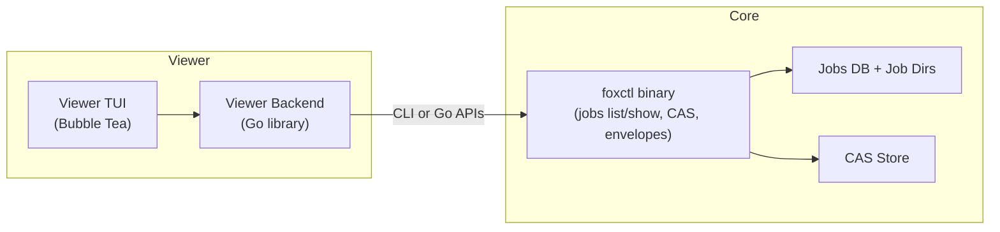

Archive note: `cmd/foxctl_viewer/` now lives under
`archive/cmd/foxctl_viewer/`. Current terminal companion-agent work targets
`cmd/foxctl_tui/` and `internal/interfaces/tui/`.


## 1. Overview


### 1.1 Problem


Debugging complex multi-agent runs and skills is hard with raw foxctl JSON output and low-level jobs commands.


### 1.2 Goal


Provide a **separate, read-only TUI viewer** (beads_viewer-style) that:


- Lists jobs and their status.
- Shows detailed result envelopes, progress, and stderr.
- Visualizes task/agent graphs and CAS artifacts.


The viewer must not change the core envelope contract or mutate jobs/CAS/memory.


### 1.3 Non‑Goals


- No envelope emission from the viewer (it’s human-facing, not a Core Profile endpoint).
- No job cancellation/deletion from the viewer in v1.
- No remote/network features; viewer operates on local foxctl state.


---


## 2. Architecture


### 2.1 Components


- **Core (foxctl)**  
  - Jobs DB + job dirs.  
  - CAS store.  
  - Read-model/CLI from Spec A (jobs list/show/graph etc.).


- **Viewer binary**  
  - Shipped as `foxctl-viewer`, separate from the main `foxctl` CLI.


- **Viewer backend (Go library)**  
  - Uses direct Go imports for core foxctl state.
  - May shell out to `foxctl` CLI for external skills that only expose
    envelopes.


- **Viewer TUI (Bubble Tea + Lipgloss)**  
  - Full-screen terminal UI, similar ergonomics to beads_viewer:
    - Left: jobs list.
    - Right: details.
    - Alternate panes for graph and artifact views.


### 2.2 Data Access Strategy


- **Core foxctl state (jobs, CAS, runservice, tasksgraph, overseer)**  
  - Viewer backend uses direct Go imports:
    - `internal/view/jobs` (read model from core spec),
    - `internal/storage/jobs`, `internal/storage/cas`,
    - `internal/intelligence/analysis/tasksgraph`, overseer/agent runtime as needed.

- **External skills and extensions**  
  - Viewer treats envelopes as the contract boundary:
    - Consumes `result.json` envelopes from jobs.
    - May shell out to `foxctl` CLI commands that emit envelopes.
  - Viewer does not import individual skill packages.

### 2.3 Viewer Backend Interface

The TUI depends on a narrow Go interface implemented by the viewer
backend:

```go
type Service interface {
    ListJobs(ctx context.Context, f JobFilters) ([]JobSummary, error)
    GetJobDetail(ctx context.Context, id string, opts DetailOptions) (JobDetail, error)
    GetJobGraph(ctx context.Context, id string) (JobGraph, error)
}
```

`JobSummary`, `JobDetail`, `JobFilters`, and `DetailOptions` come from
`internal/view/jobs`. `JobGraph` mirrors the `jobs graph` JSON schema:

```go
type JobGraph struct {
    JobID    string      `json:"job_id"`
    RootNode string      `json:"root_node_id,omitempty"`
    Nodes    []GraphNode `json:"nodes"`
    Edges    []GraphEdge `json:"edges"`
}
```

The TUI only depends on this interface and associated types; it does not
reach directly into storage or CAS packages.


---


## 3. Views & Interactions (MVP)


### 3.1 Jobs List View


- **Data**: JobSummary[] from jobs list.
- **Columns**: state, command, workspace, created_at, duration, error summary.
- **Interactions**:
  - ↑/↓, PgUp/PgDn: move selection.
  - /: filter jobs by text query (matches command, workspace, state).
  - Enter: open details view.


### 3.2 Job Detail View


- **Data**: JobDetail from jobs show.
- **Layout**:
  - Envelope header: command, status, workspace, skill_version, cas_digest, cache/memory info.
  - Data preview: pretty-printed JSON (truncated).
  - Tabs or sections for:
    - Progress timeline (from progress.ndjson).
    - stderr (from stderr.log).
    - artifacts summary.


### 3.3 Task/Agent Graph View (v1 requirement)


- **Data**: `jobs graph` output (as defined in the core spec) or a
  dedicated API mapping jobs → tasks/agents.
- **Behavior**:
  - Node selection (up/down/left/right).
  - Node details (type, status, summary).
  - Optional metrics (critical path, degree) reusing [tasksgraph](cci:7://file://internalinternal/intelligence/analysis/tasksgraph:0:0-0:0).


### 3.4 Artifacts View


- **Data**: ArtifactSummary[] + on-demand CAS previews.
- **Behavior**:
  - List of artifacts for the job.
  - For text-like kinds: inline preview in right pane.
  - For binary/large: only metadata + an “export to file” action (if we allow writing outside foxctl dirs, needs separate policy).


---


## 4. Diagram





---


## 5. Rollout Plan


1. **Phase 1 – Skeleton viewer**
   - New module cmd/foxctl_viewer/:
     - Loads foxctl config.
     - Calls foxctl jobs list and prints a simple text table (no Bubble Tea yet).
   - Smoke tests: ensures it runs against existing jobs.


2. **Phase 2 – Bubble Tea TUI + jobs list/detail**
   - Implement core Bubble Tea model:
     - Jobs list pane + simple detail pane (envelope header only).
   - Keyboard navigation + filtering.
   - Tests: unit tests for model transitions; golden snapshots for rendered views (where feasible).


3. **Phase 3 – Progress, stderr, artifacts**
   - Wire in progress and stderr from JobDetail.
   - Add artifacts tab + CAS preview rules.
   - Tests: verify large/binary artifacts are not inlined.


4. **Phase 4 – Graph view (optional)**
   - Once Spec A’s jobs graph (or equivalent) is implemented, add graph pane:
     - Node navigation.
     - Node detail overlay.


---


## 6. Rollback Plan


- Viewer is a **separate binary**:
  - To rollback: stop building/publishing foxctl_viewer (and/or mark as experimental).
- No on-disk changes; removing viewer leaves core state and contracts untouched.
- If CLI-based data access is used, those commands remain useful for scripting even if the viewer is removed.


---


## 7. Open Questions


1. **Binary name & distribution**  
   - foxctl-viewer vs foxctl_beads vs foxctl ui subcommand?
2. **Coupling to Core**  
   - How tightly can we bind to internal APIs vs envelopes?
3. **Security / policy**  
   - If we ever add “export artifact to arbitrary path”, what policy validator (like PathValidator) must we use?
4. **Task graph UX**  
   - Is graph essential for v1, or do we ship jobs+artifacts first as a simpler “envelope inspector”?
