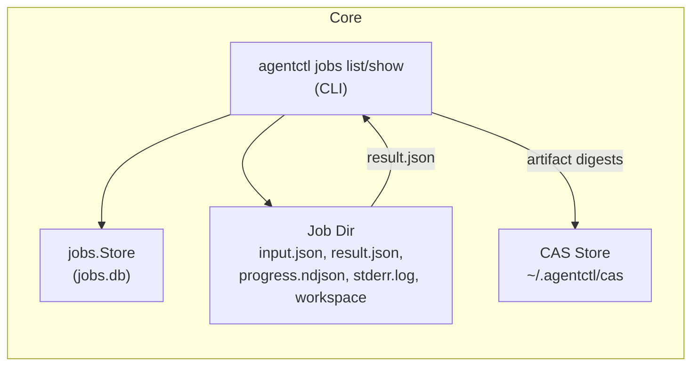

## 1. Overview

### 1.1 Problem

agentctl already has a robust jobs system (SQLite + job dirs), CAS, and envelope validation, but:

- There is no **stable, documented JSON shape** for job listings or “job detail”.
- There is no first-class **task/agent graph** export per job.
- Existing `agentctl jobs` subcommands are mainly plumbing (`result`, `stderr`, `wait`, `tail`, `cancel`).

This makes it hard to build a beads_viewer-style inspector or other tooling.

### 1.2 Goals

- Define **read-only core APIs** and **CLI JSON commands** for:
  - Listing jobs (queue + history).
  - Fetching a job’s result envelope, workspace, progress events, stderr, and CAS artifacts.
  - (Optionally) exporting a **task/agent graph view** for a job.
- Keep **envelope wire contract unchanged**; use the existing protocol layer.
- Avoid any on-disk schema changes unless explicitly justified.

### 1.3 Non‑Goals

- No mutation of job state, CAS, or memory via new APIs.
- No new scheduler behavior or job types.
- No changes to Core Profile v1 envelope fields/semantics.

---

## 2. Current State (Reference)

- **Job record**: [internal/storage/jobs/types/types.go](cci:7://file:///Users/jkatigbak/repos/personal/agentctl/internal/storage/jobs/types/types.go:0:0-0:0)
  - `Job { id, command, args_json, args_hash, state, result_path, error, created_at, updated_at }`
  - SQLite schema in [internal/storage/jobs/persist/store.go](cci:7://file:///Users/jkatigbak/repos/personal/agentctl/internal/storage/jobs/persist/store.go:0:0-0:0) (`jobs` table + indexes).
- **Job directories**: `~/.agentctl/jobs/<id>/`
  - `input.json`, `result.json`, `progress.ndjson`, `stderr.log`, `workspace`, optional `artifacts.json`.
- **Execution**: `internal/storage/jobs/executor`, `internal/runservice`
  - `result.json` is always a validated Core Profile v1 envelope.
  - `meta.workspace`, `meta.skill_version`, `meta.source` set via `protocol.AnnotateRunBytes`.
- **Progress**:
  - `ProgressEvent { ts, message, percent, meta }` in NDJSON.
  - [TailProgress](cci:1://file:///Users/jkatigbak/repos/personal/agentctl/internal/storage/jobs/store.go:210:0-221:1) streams it.
- **CAS & artifacts**:
  - `internal/storage/cas` with verifying [Get](cci:1://file:///Users/jkatigbak/repos/personal/agentctl/internal/storage/jobs/store.go:112:0-115:1).
  - `handleArtifacts` pins `data.artifact` / `data.artifacts[]` digests.
- **Task graph**:
  - [internal/analysis/tasksgraph](cci:7://file:///Users/jkatigbak/repos/personal/agentctl/internal/Users/jkatigbak/repos/personal/agentctl/internal/analysis/tasksgraph:0:0-0:0) computes metrics over `internal/storage/tasks.Task`.
  - Mapping between “job” and “task graph” is not yet a documented contract.

---

## 3. Proposed Additions

### 3.1 Internal Read Model APIs

Introduce a small **read-only view layer** (package name TBD, e.g. `internal/view/jobs`):

- **JobSummary**

  ```go
  type JobSummary struct {
      ID         string        `json:"id"`
      Command    string        `json:"command"`      // e.g. "skill:text/grep"
      State      string        `json:"state"`        // queued|running|ok|error|canceled
      CreatedAt  time.Time     `json:"created_at"`
      UpdatedAt  time.Time     `json:"updated_at"`
      Workspace  string        `json:"workspace,omitempty"`
      ResultPath string        `json:"result_path,omitempty"`
      Error      string        `json:"error,omitempty"`
      Duration   time.Duration `json:"duration,omitempty"` // derived if ResultPath exists
  }
  ```

- **JobDetail**

  ```go
  type JobDetail struct {
      Job       JobSummary           `json:"job"`
      Envelope  envelope.Envelope    `json:"envelope,omitempty"`
      Progress  []jobs.ProgressEvent `json:"progress,omitempty"`
      Artifacts []ArtifactSummary    `json:"artifacts,omitempty"`
  }

  type ArtifactSummary struct {
      Digest string `json:"digest"` // sha256:...
      Kind   string `json:"kind"`
      Size   int64  `json:"size_bytes"`
      Pinned bool   `json:"pinned"`
  }
  ```

- **API surface**

  ```go
  func ListJobs(ctx context.Context, limit int, filters JobFilters) ([]JobSummary, error)
  func GetJobDetail(ctx context.Context, id string, opts DetailOptions) (JobDetail, error)
  ```

Where filters might include:

- `State []string`
- `CommandPrefix string` (e.g. `skill:`)
- `Workspace string`
- `Since/Until time.Time`

`DetailOptions` toggles inclusion of progress, artifacts, and envelope.

All of this must reuse **existing** primitives:

- [jobs.Store.List](cci:1://file:///Users/jkatigbak/repos/personal/agentctl/internal/storage/jobs/store.go:107:0-110:1), [Get](cci:1://file:///Users/jkatigbak/repos/personal/agentctl/internal/storage/jobs/store.go:112:0-115:1), [Result](cci:1://file:///Users/jkatigbak/repos/personal/agentctl/internal/storage/jobs/store.go:117:0-131:1), [TailProgress](cci:1://file:///Users/jkatigbak/repos/personal/agentctl/internal/storage/jobs/store.go:210:0-221:1).
- `fsutil.JobDir` to find `workspace`, `stderr.log`.
- CAS [Store](cci:2://file:///Users/jkatigbak/repos/personal/agentctl/internal/storage/jobs/store.go:25:0-29:1) to read artifact metadata.

### 3.2 JSON CLI Commands

Define **envelope-based** commands that use the read model:

1. `agentctl jobs list`

   - **Command**: `agentctl jobs list [--limit N] [--state ...] [--command-prefix ...] [--workspace ...]`
   - **Output**: Core Profile v1 envelope:

     ```jsonc
     {
       "version": 1,
       "status": "ok",
       "command": "agentctl.jobs.list",
       "data": {
         "jobs": [ JobSummary, ... ]
       },
       "meta": {
         "ts": "...",
         "source": "run"
       }
     }
     ```

2. `agentctl jobs show <job-id>`

   - **Output**:

     ```jsonc
     {
       "version": 1,
       "status": "ok",
       "command": "agentctl.jobs.show",
       "data": JobDetail,
       "meta": {
         "ts": "...",
         "source": "run"
       }
     }
     ```

   - Error cases: `error.code` like `EJOB_NOT_FOUND`, `EJOB_RESULT_MISSING` etc.

3. `agentctl jobs graph <job-id>`

   - Returns a **task/agent graph view** for the job (nodes + edges + basic metadata).
   - This command is a prerequisite for the task/agent graph pane in `agentctl-viewer`.

### 3.3 CAS Preview Rules

- Viewer consumers **must not** bypass [cas.Store.Get](cci:1://file:///Users/jkatigbak/repos/personal/agentctl/internal/storage/jobs/store.go:112:0-115:1)’s verifying reader.
- Inline previews are only allowed if:
  - `size_bytes <= inline_preview_kb * 1024` (reuse or align with `inline_output_kb`).
  - `kind` is text-like (`text/*`, `application/json`, etc.).
- On digest mismatch, the CLI should emit an **error envelope** with `ECAS_DIGEST_MISMATCH`.

### 3.4 Job Graph Schema (`agentctl jobs graph`)

The `agentctl jobs graph <job-id>` command returns a task/agent graph view
for a single job. The envelope data shape:

```jsonc
{
  "job_id": "01J123…",
  "root_node_id": "task-1",
  "nodes": [
    {
      "id": "task-1",
      "kind": "agent",                   // agent|tool|skill|job|other
      "label": "overseer",
      "status": "ok",                    // queued|running|ok|error|canceled|unknown
      "parent_id": null,
      "depends_on": ["task-2", "task-3"],
      "summary": "orchestrate repo index",
      "metrics": {
        "critical_path_score": 3,
        "pagerank": 0.12,
        "in_degree": 1,
        "out_degree": 2
      },
      "timing": {
        "started_at": "2025-12-01T…Z",
        "finished_at": "2025-12-01T…Z",
        "duration_ms": 1532
      }
    }
  ],
  "edges": [
    { "from": "task-1", "to": "task-2", "kind": "depends_on" },
    { "from": "task-1", "to": "task-4", "kind": "spawns" },
    { "from": "task-4", "to": "task-7", "kind": "calls" }
  ]
}
```

The CLI wraps this in a Core Profile v1 envelope:

```jsonc
{
  "version": 1,
  "status": "ok",
  "command": "agentctl.jobs.graph",
  "data": { /* as above */ },
  "meta": {
    "ts": "…",
    "source": "run",
    "workspace": "…"
  }
}
```

`nodes[].metrics` should reuse values from `tasksgraph.Insights` where
possible (PageRank, critical path score, in/out-degree).

All JSON-facing helpers in this read model MUST normalize nil slices/maps
to empty (`[]` / `{}`) so envelopes never emit `null` where an empty
collection is expected (see Gotcha R2).

---

## 4. Diagram



---

## 5. Rollout Plan

1. **Phase 1: Internal read model**
   - Implement `JobSummary`, `JobDetail`, `ListJobs`, `GetJobDetail` in an internal package.
   - Unit tests, using temp jobs root + CAS.
2. **Phase 2: `agentctl jobs list/show` commands**
   - Cobra commands wired to read model.
   - Output envelopes validated via `envelope.Validate` in tests.
3. **Phase 3: CAS preview + artifact summaries**
   - Wire CAS metadata into `ArtifactSummary`.
   - Add tests for pinned vs. GC-eligible artifacts.
4. **Phase 4: `jobs graph` (required for viewer v1)**
   - Implement `agentctl jobs graph` using the schema above, backed by
     `tasksgraph` and the overseer/agent runtime.
   - Add tests that validate the JSON shape and ensure metrics are
     populated (or explicitly zero-valued) in a stable way.

---

## 6. Rollback Plan

- Commands are additive. Rollback by:
  - Removing `jobs list/show`/`graph` subcommands.
  - Deprecating and then deleting the read model package.
- No DB migrations or on-disk changes; removing commands leaves existing jobs data untouched.

---

## 7. Open Questions

1. **Workspace column**  
   - Is the `workspace` file in job dir sufficient, or should it be duplicated into the `jobs` table for easier querying?
2. **Task/agent graph mapping**  
   - How exactly do we map jobs → tasks → agents (source of truth: tasks
     store vs overseer logs vs in-memory structures), and what additional
     persistence—if any—is required to make `jobs graph` robust?
3. **Result envelope size**  
   - Do we need a `--no-progress` / `--no-artifacts` flag to keep `jobs show` output small for scripting?
```

---


