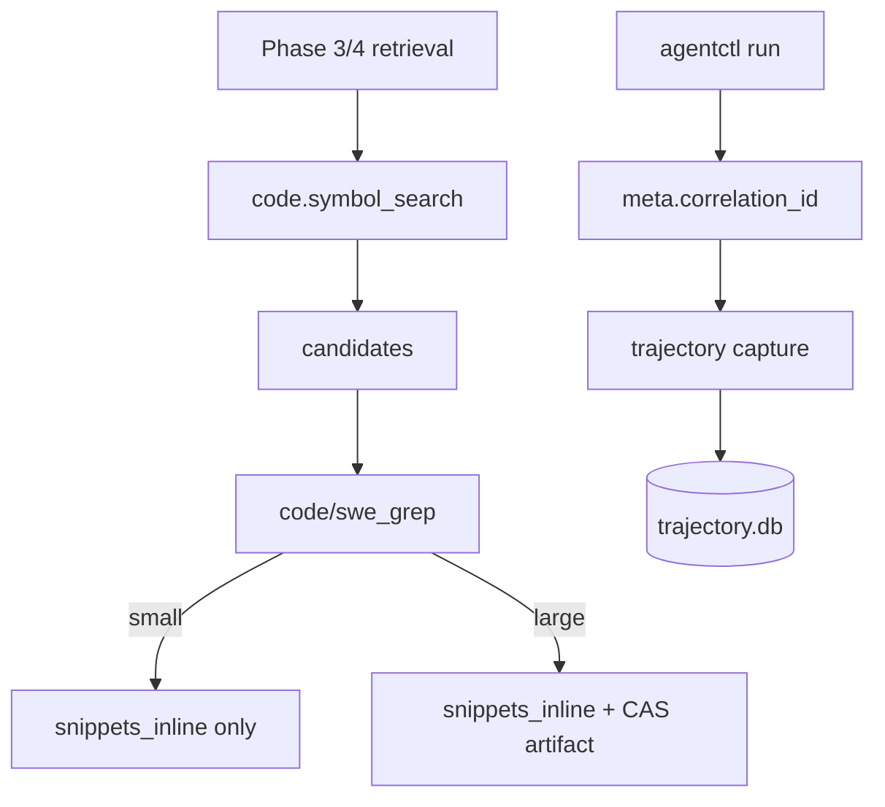

# Universal SWE Grep Follow-ups (Doc Drift + Incomplete Tasks)

## Goal

Track and execute follow-ups for the Universal SWE Grep funnel so we:

- Align implementation with canonical specs.
- Remove spec/impl drift in `docs/spec/*` and `docs/impl_plan/*`.
- Have a single, reviewable checklist for the remaining incomplete work.

This spec is intended to be the **source of truth** for the follow-up PRs.

Related impl plan: `docs/impl_plan/universal_swe_grep_followups_impl_plan.md`

## Decision: Artifactization Policy

The `code/swe_grep` skill must use **inline-threshold artifactization**:

- Keep all snippet results in `data.snippets_inline` when the overall output
  fits within configured inline thresholds.
- Only emit a CAS artifact (`data.artifact`, and optionally `meta.cas_digest`
  matching it) when the output would exceed inline limits.

Inline thresholds must be derived from existing configuration
(`inline_output_kb`) and/or the skill manifest’s `io.inline_output_kb`.

## Non-goals

- No envelope shape changes.
- No new `meta.*` fields.
- No new dependencies.

## Background / Current Drift Summary

### 1) `code/swe_grep` spec drift

- **Error codes drift**
  - Spec requires:
    - `E_SWE_GREP_NO_CANDIDATES`
    - `E_FILE_NOT_FOUND`
    - `E_GUARD_VIOLATION`
  - Current implementation returns generic codes (`EARG`, `ENOTFOUND`,
    `EPOLICY`).

- **Artifactization drift**
  - Spec: emit `data.artifact` only when results exceed inline thresholds.
  - Current implementation always emits a CAS artifact when snippets exist.

- **Tests drift**
  - Integration tests currently assume `artifact` is always present.

### 2) `code.symbol_search` tool drift

- The agent runtime advertises `code.symbol_search`, and the tool implementation
  queries named memory for `type="code_symbol"` entries.

### 3) Symbol call graph drift

- Canonical spec describes persisted call edges (`code_symbol_call` entries with
  `source_id`/`target_id`).
- Current implementation persists `code_symbol_call` entries and callers/callees
  traversal in `code.symbol_search` is enabled.

### 4) Post-review file list drift

- The post-review harness supports `PostReviewEvent.Files`, but in the real
  review-gate flow the file list is still empty until the diff application layer
  is wired (see deferred work D1).

### 5) Trajectory capture drift

- Trajectory capture correlation is sourced from `meta.correlation_id` and
  persisted into trajectory storage as `trace_id`.

## Proposed Changes

### A) Bring `code/swe_grep` into spec conformance

#### A1. Error code alignment

Update `skills/code_swe_grep` to return:

- `E_SWE_GREP_NO_CANDIDATES` for empty/unusable candidates.
- `E_GUARD_VIOLATION` for path validation failures (workspace escape / symlink
  escape / guard violations).
- `E_FILE_NOT_FOUND` when a validated candidate path does not exist.

#### A2. Inline-threshold artifactization

Implement threshold-based behavior per
`docs/spec/code_symbol_index_and_swe_grep.md` §5.3:

- If results fit inline:
  - Omit `data.artifact*` fields.
- If results exceed inline:
  - Persist NDJSON to CAS.
  - Populate `data.artifact`.
  - `meta.cas_digest` is optional; if set it MUST match `data.artifact`.

#### A3. Tests + goldens

- Update `test/integration/swe_grep_test.go`:
  - Add a small-output case that asserts `artifact` is omitted.
  - Keep a large-output case that asserts `artifact` is present.
- Add `test/golden/envelopes/ok-code_swe_grep-inline.json` and
  `test/golden/envelopes/ok-code_swe_grep-cas.json`.
- Add a `test/golden/swe_grep/*.ndjson` fixture for artifact validation.

### B) Implement `code.symbol_search` over the symbol index

Status: Completed

- Replace the stub in `internal/agent/tools/code_tools.go` with a real
  implementation that queries named memory for `type="code_symbol"` entries.
- Provide a minimal v1 ranking strategy that is deterministic and safe.
- For `mode="callers"|"callees"`, explicitly document behavior:
  - Either implement via `code_symbol_call` entries (if call edges are added),
    or return an empty candidate list until call edges are implemented.

### C) Resolve symbol call graph representation

Status: Completed

Pick one approach and align both code + spec:

- **Option 1 (preferred if callers/callees are required):** persist
  `code_symbol_call` entries with a best-effort resolver.
- **Option 2:** explicitly defer `code_symbol_call` and update canonical docs to
  state that call edges are not persisted in v1.

Regardless, the docs must match the implementation.

### D) Populate `PostReviewEvent.Files` from the diff application layer

- Implement a diff application layer that can provide:
  - paths
  - change_kind
  - digests
- Wire that into post-review event production.

### E) Trajectory capture and export follow-ups

#### E1. Fix trajectory-spec naming drift

`docs/spec/dspy_trajectory_capture.md` documents:

- `meta.correlation_id` is used as the correlation key for capture.
- Trajectory storage uses the term `trace_id` internally, sourced from
  `meta.correlation_id`.

#### E2. Capture agent tool calls

- Persist agent tool calls/results as trajectory events (`tool_call` and
  `tool_result`), including retrieval-specific kinds (`graph_search`,
  `swe_grep`) where appropriate.

#### E3. Implement `trajectory.export`

- Implement export per `docs/spec/dspy_trajectory_capture.md` §7.
- Add golden episodes under `test/golden/trajectories/`.

## Design Diagram

## Rollout Plan

| Step | Action                                                    | Validation                                         |
| ---- | --------------------------------------------------------- | -------------------------------------------------- |
| 1    | Update docs/spec + docs/impl_plan to remove known drift   | `go test ./...` (docs-only change should be no-op) |
| 2    | Fix `code/swe_grep` error codes + artifact thresholding   | `CGO_ENABLED=0 go test ./...`                      |
| 3    | Add/adjust swe_grep goldens + integration tests           | golden tests + `go test ./...`                     |
| 4    | Implement real `code.symbol_search` (completed)           | tool unit tests + agent integration tests          |
| 5    | Align call graph representation (code + spec) (completed) | unit + integration tests                           |
| 6    | Implement `trajectory.export`                             | unit tests + golden episodes                       |

## Rollback Plan

- Revert the PR(s).
- No on-disk migrations are required for the documentation-only changes.

## Test Plan

- `CGO_ENABLED=0 go test ./...`
- `make lint`

## Approval

To proceed with implementation, change `status:` above to `Approved`.
