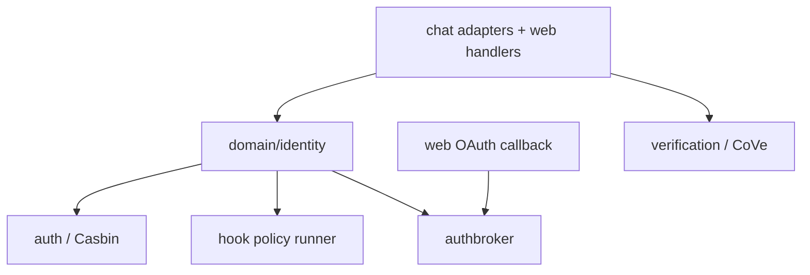

foxctl's auth and identity system handles authentication, authorization, token brokerage, and identity propagation across CLI, web, and adapter surfaces. This page describes the current model, known boundaries, and security invariants.

## Runtime topology

## Package responsibilities

| Package | Responsibility | Primary types/functions |
|---|---|---|
| `internal/domain/identity` | Canonical principal model + context propagation | `Principal`, `Subject()`, `ConversationKey()`, `WithPrincipal`, `FromContext` |
| `internal/auth` | Casbin authorization for HTTP and hook/tool resources | `NewEnforcer`, `Enforce`, `Middleware`, `PolicyHookRunner` |
| `internal/auth/broker` | OAuth token/auth-request lifecycle and encrypted persistence | `Broker`, `Store`, `TokenRow`, `AuthRequestRow`, `Encrypt/Decrypt`, `OpenSQLite/OpenPostgres` |
| `internal/intelligence/verification` | Chain-of-Verification (baseline → claims → parallel verify → refine) | `CoVe`, `Spawner`, `CoVeRequest`, `CoVeResponse` |

## Identity propagation

Identity travels through request and runtime boundaries via a single principal carrier:

1. **Adapter or handler constructs `identity.Principal`** with `Platform`, `UserID`, and tenant/actor fields when available.
2. **Principal is attached to `context.Context`** via `identity.WithPrincipal`.
3. **Authorization and hook logic reads from the same context** via `identity.FromContext`.
4. **Conversation and session routing** uses `Principal.ConversationKey(...)` for tenant-aware keys.

This contract keeps identity consistent across chat adapters, web handlers, hooks, and tool execution. There is no secondary identity channel — the principal in context is the single source of truth.

## Authorization (Casbin)

The authorization layer uses an embedded Casbin model with a CSV adapter.

| Item | Current behavior |
|---|---|
| Enforcer backend | Embedded Casbin model + CSV adapter (`NewEnforcer`) |
| Subject mapping | `Principal.Subject()` — formats as `user:<platform>:<id>` or `actor:<id>` |
| Tenant mapping | Empty tenant maps to `*` domain |
| HTTP middleware resource | `api:<path>` with `read`/`write` action derived from HTTP method |
| Hook policy resource | `tool:<name>` with `execute` action |
| Fallback mode | Nil enforcer and anonymous principals pass through |

### Resource and action naming

Casbin policies use stable resource and action prefixes:

- `api:*` for HTTP routes, with actions `read` and `write`
- `tool:*` for hook and tool resources, with action `execute`

This naming is durable and auditable. Changes to resource or action strings require policy migration.

### Known boundary

`NewPostgresEnforcer` is currently a placeholder and returns not-implemented. The production enforcer uses the embedded model + CSV adapter.

## OAuth broker

The auth broker (`internal/auth/broker`) manages OAuth token lifecycle and encrypted persistence.

| Area | Current behavior |
|---|---|
| Provider abstraction | `microsoft_graph`, `google`, `github` via `Provider` enum |
| Token keying | `(tenant_id, subject, provider, scopes_hash)` |
| Scope normalization | `ScopesHash(scopes, audience)` sorts scopes before hashing |
| Encryption | AES-256-GCM via `Encrypt`/`Decrypt`; key must be 32 bytes |
| Storage backends | SQLite and Postgres implementations of `Store` |
| Cleanup | Expired token and auth-request delete APIs |

### Known boundary

The `/api/oauth/callback` handler exists but is currently stubbed — it is not yet wired to `Broker.CompleteAuth`. This is a documented TODO, not a hidden gap.

## Verification subsystem

`internal/intelligence/verification` is identity-adjacent, not identity-owning. It implements Chain-of-Verification (CoVe) for claim checking:

| Stage | Function |
|---|---|
| Baseline generation | Draft initial answer |
| Claim extraction | Parse verifiable claims |
| Parallel verification | Worker pool checks each claim |
| Refinement | Produces corrected final answer |

Primary integration surface: `skills/cove_verify` (`verification/cove_verify`).

Verification is an explicit opt-in workflow. It does not run automatically on every response and does not introduce hidden policy side effects.

## Security invariants

| Invariant | Why it matters |
|---|---|
| Principal is the single identity carrier across layers | Avoids subject drift between adapters, middleware, and hooks |
| Resource/action naming is stable (`api:*`, `tool:*`) | Keeps Casbin policy durable and auditable |
| OAuth blobs are encrypted at rest | Reduces token disclosure risk |
| Tenant-aware conversation keys | Prevents cross-tenant key collisions |
| Verification is explicit opt-in workflow logic | Avoids hidden policy side effects |

## Auth in the API server

All routes that modify state enforce principal propagation through the auth middleware. The middleware:

1. Extracts or constructs a `Principal` from the request
2. Attaches it to the request context
3. Evaluates Casbin policy for the requested resource and action
4. Allows or denies based on the enforcer result

See [API server](/architecture/api-server/) for the full route surface and [Protocol v1](/reference/protocol-v1/) for envelope shapes.

## Related docs

- [System architecture](/architecture/system/) — subsystem topology
- [API server](/architecture/api-server/) — HTTP route surface and auth middleware
- [Runtime architecture](/architecture/runtime/) — runtime boundaries
- [Design principles](/architecture/design-principles/) — engineering rules
