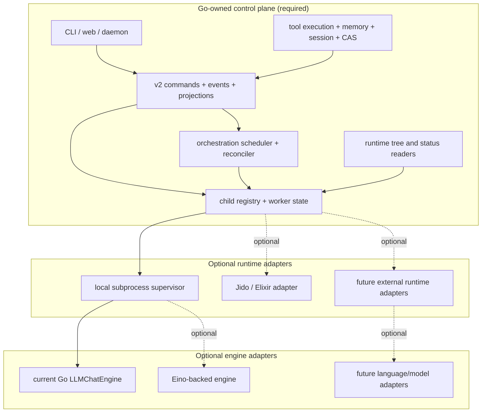

foxctl is in a hybrid runtime period. The production default is Go-native: Go owns lifecycle, orchestration state, runtime trees, and tool execution. Jido is an optional runtime adapter that provides BEAM/OTP supervision for operators who want it.

## Runtime stance

| Area | Production stance |
|---|---|
| Go-native runtime | Default ownership path for v2 orchestration surfaces |
| Jido bridge | Optional integration path, not a replacement for Go-owned behavior |
| Classic agent daemon | Current behavior still documented where commands use it |
| Skills runtime | Boundary-owned execution with JSON envelopes |
| Tool policy | Deny-by-default profiles and explicit tool allowance |

## Go-native ownership model

The target architecture keeps control-plane truth in Go and treats external runtimes as adapters that execute work but do not own state.

The key rule is that adapters execute work, but they do not own control-plane truth.

### What must be Go-owned

| Concern | Current dependency | Required Go ownership |
|---|---|---|
| Child spawn | Jido bridge / `runtime.spawn_child` | Go `RuntimeSpawner` plus durable child/worker registry |
| Child lifecycle | Jido runtime state polling | Go supervisor state, heartbeats, exit records, and reconcile loop |
| Runtime tree | `runtime.get_children` / `runtime.state` | Tree and status derived from Go registry + projections |
| Web/API runtime views | Optional Jido client in handlers | API handlers read Go projections/registry directly |
| `agent ask` default transport | Mailbox or Jido dispatcher split | Go mailbox/daemon default; external adapters explicitly configured |
| Execution layer selection | `ExecutionLayerJido` remains special | Jido becomes one adapter choice rather than a privileged path |

### Runtime vs engine layers

These are separate layers and should stay separate in planning:

**Runtime layer** is responsible for:
- Spawning workers
- Tracking parent/child relationships
- Tracking worker health, exit status, and heartbeat
- Reconciling runtime facts into v2 events and projections
- Serving runtime trees to CLI/web/API consumers

**Engine layer** is responsible for:
- LLM calls
- Tool-call loop
- Streaming and token accounting
- Model/provider adapters

The runtime layer must move to Go-native ownership first. The engine layer can stay on the current `LLMChatEngine` while that happens. Eino is a future engine option, not a prerequisite for runtime parity.

### Stable contracts for backend pluggability

If the goal is future language flexibility, define the seams in Go and keep adapters behind them:

- `RuntimeSpawner` for child creation
- Worker registry/state reader for status and trees
- Reconcile input contract for append-only v2 event emission
- Explicit lifecycle hooks for start, heartbeat, completion, failure, and cancel
- `engine.AgentEngine` for the classic mailbox/runtime path
- `runner.Model` for the v2 synchronous turn pipeline
- Shared Go-owned tool execution through `engine.ToolExecutor` or the v2 tool executor

Policy and semantics stay in Go: tool catalog, envelopes, memory/session/CAS semantics, agent hierarchy policy, and orchestration decisions.

### Recommended dependency order

1. **Normalize runtime ownership in Go** — define the registry/state model for child workers, runtime trees, and lifecycle facts.
2. **Implement the default Go runtime adapter** — subprocess-backed workers with bounded supervision and durable state.
3. **Move reconcile and web/API tree loading onto Go-owned state** — remove hard dependency on Jido runtime inspection.
4. **Demote Jido to an optional adapter** — keep it available, but only when explicitly configured.
5. **Generalize backend adapter seams** — make it straightforward to plug in another external runtime or language worker.
6. **Only then swap or add engine implementations** — Eino becomes a replaceable engine option once runtime ownership is solved.

## Jido hybrid runtime

The current hybrid shape is deliberate: Jido is the runtime substrate, and foxctl remains the semantic system of record.

### Ownership split

**Jido owns:**
- Agent process lifecycle
- Parent/child hierarchy
- Runtime signal delivery
- Subtree inspection and await behavior
- Orchestration runtime substrate for overseer-style dispatch

**foxctl owns:**
- `code_*` skills (semantic search, smart search, context grep, codemaps)
- `memory_*` retrieval and persistence
- `session_*` recall and timeline retrieval
- Layered companion context shaping
- Kanban/control-plane state, v2 events, and projections

### Runtime boundaries

Inside foxctl, `internal/v2/adapters/jido` translates Go-side requests into JSON-RPC runtime calls:

- `runtime.start_agent`
- `runtime.spawn_child`
- `runtime.signal`
- `runtime.await`
- `runtime.get_children`
- `runtime.state`

Inside Jido, the bridge exposes actions that call back into foxctl:

- `agent.ask`
- `foxctl.tool.run`
- `foxctl.companion.context`
- `foxctl.child.spawn`

### Socket model

There are two Unix sockets in the clean production shape:

| Socket | Purpose |
|---|---|
| `FOXCTL_JIDO_SOCKET` | JSON-RPC socket exposed by the Jido bridge |
| `FOXCTL_DAEMON_SOCKET` | foxctl daemon socket used by bridge-side `daemon_rpc` tool execution |

The Jido bridge socket is the runtime-control boundary. The foxctl daemon socket is the semantic-execution boundary. Keeping them separate lets you isolate transport failures and keep tool/memory/session execution authoritative on the Go side.

### Tool policy hand-off

Jido start/spawn payloads carry bridge-side tool execution policy through `plugin_config`:

- `plugin_config.binary`
- `plugin_config.workspace`
- `plugin_config.transport = daemon_rpc`
- `plugin_config.daemon = true`
- `plugin_config.tool_command.profile`
- `plugin_config.tool_command.allowed_tools`
- `plugin_config.tool_command.default_timeout_ms`

This payload is derived from the shared v2 catalog/profile model on the Go side, so Jido-facing agent startup inherits the same portable-core vs extension-tool boundary used by v2 runtime governance.

### Control-plane flow

1. foxctl enqueues or projects work into the kanban/control-plane model.
2. v2 orchestration decides dispatch and converts that into Jido runtime child-spawn requests.
3. Jido owns the live child tree and runtime lifecycle.
4. Jido children call back into foxctl for `code_*`, `memory_*`, `session_*`, and companion context.
5. Runtime outcomes reconcile back into append-only v2 events and projections.

### Where Jido fits after runtime parity

Jido remains useful for:
- BEAM/OTP supervision
- Operators who want Elixir-managed worker trees
- Experimentation with external runtime substrates

Jido should no longer be required for:
- Default orchestration dispatch
- Runtime tree inspection
- Parent/child registry truth
- Web/API runtime state
- The canonical tool/memory/session path

## Component lifecycle patterns

Long-lived services in foxctl expose a `Run(ctx context.Context) error` signature. This provides predictable startup/shutdown and testable loops. Examples include the daemon, web server, and orchestration reconciler.

Key lifecycle rules:

- Async queues are bounded with explicit backpressure policy
- Hot read paths use immutable snapshots (`atomic.Value` / `atomic.Pointer`)
- Context cancellation is respected throughout the call stack
- Component shutdown is graceful and observable

## Documentation rules

- Name the active dispatcher/runtime for smoke tests and bug reports. Do not use classic `agent run` evidence to claim Jido bridge behavior.
- Keep protocol envelope fields exact. The envelope contract is sacred — never change `meta.*` fields without spec updates.
- Keep `internal/*` package placement aligned with the package topology map. `internal/v2/*` is reserved for the agent/runtime/orchestration lane, not a generic destination for all new code.

## Related docs

- [System architecture](/architecture/system/) — subsystem topology and package map
- [Auth and identity](/architecture/auth-and-identity/) — principal propagation
- [Agent lifecycle](/agents/lifecycle/) — spawn, inspect, ask, watch, resume
- [Agent orchestration](/agents/orchestration/) — overseer hierarchy and depth constraints
- [Design principles](/architecture/design-principles/) — engineering rules
- [Package topology](https://github.com/joshka0/foxctl/blob/main/docs/architecture/package-topology.md) — canonical `internal/*` placement
