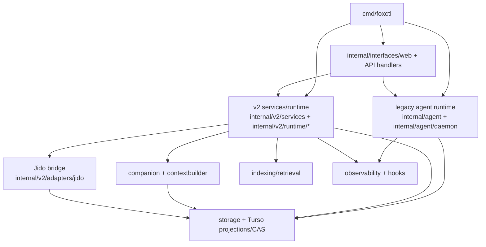

foxctl is a Go-based multi-agent framework, CLI, and control plane with a hybrid
runtime. This page describes the major subsystems, how they interact, and where
code lives in the repo.

## Subsystem overview

The diagram above shows the current runtime topology. The CLI routes to both legacy and v2 surfaces. The web API sits in front of both. Storage, context, indexing, and observability are shared layers.

## Core subsystems

### CLI

The CLI is the primary user surface. It parses commands, calls services, and prints envelopes or human-readable tables. Key entry points:

- `foxctl run <skill>` — job-tracked skill execution
- `foxctl agent spawn` — create and start a new agent
- `foxctl index repo build` — build the repo graph index
- `foxctl web serve` — start the HTTP API server

See the [CLI reference](/reference/cli/) for the full command surface.

### Legacy agent runtime

The legacy runtime is mailbox-driven and still handles some CLI flows:

| Package | Responsibility |
|---|---|
| `internal/agent` | Mailbox-driven sessions, overseer hierarchy |
| `internal/agent/daemon` | Classic foreground daemon loop and mailbox polling |
| `internal/runtime/execution/agentmanager` | Legacy spawn/kill and runtime management fallback |

These packages are being incrementally replaced by the v2 stack. See [Agent lifecycle](/agents/lifecycle/) and [Agent orchestration](/agents/orchestration/) for how agents work today.

### V2 command and orchestration stack

The v2 stack is the newer agent/runtime/orchestration lane:

| Package | Responsibility |
|---|---|
| `internal/v2/core/*` | Typed v2 commands and command routing |
| `internal/v2/services` | Run, ask, spawn, list, kill services |
| `internal/v2/runtime/runner` | Turn execution and worker lifecycle |
| `internal/v2/runtime/orchestration` | Event-sourced orchestration and staged dispatch |
| `internal/v2/runtime/supervisor` | Worker supervision and health tracking |
| `internal/v2/runtime/contextbuilder` | Layered context assembly for sessions |

See [Runtime architecture](/architecture/runtime/) for how v2 and Jido fit together.

### Jido execution bridge

`internal/v2/adapters/jido` provides a JSON-RPC bridge to the Jido runtime. It is the optional runtime adapter for BEAM/OTP-backed orchestration. Jido owns agent process lifecycle and parent/child trees; foxctl owns tool semantics, memory, and control-plane state.

### Companion and context assembly

| Package | Responsibility |
|---|---|
| `internal/context/companion` | Conversation memory and live context assembly |
| `internal/v2/runtime/contextbuilder` | Layered context building for active sessions |
| `internal/v2/runtime/enrichers` | Async derived artifacts and companion bridge integration |

See [ACA context architecture](/context/aca/) for the broader context model.

### Memory core and curator

| Package | Responsibility |
|---|---|
| `internal/context/memorycore` | Typed, provenance-bearing memory records |
| `internal/storage/memory` | Durable memory persistence |
| `skills/memory_query` | Memory retrieval skill |
| `skills/memory_curator_report` | Curator reports and gated apply workflows |

See [Memory and continuity](/memory/continuity/) for how memory works.

### State and persistence

| Package | Responsibility |
|---|---|
| `internal/storage/*` | Durable stores, CAS, mailbox/task/session persistence |
| `internal/v2/adapters/turso/*` | v2 events and projections backed by Turso/libsql |

Supported backends include SQLite, libsql, Turso, and PostgreSQL. See [Storage and CAS](/storage/cas-and-persistence/).

### Retrieval and indexing

The intelligence family spans six sub-concerns that should be routed separately:

| Subfamily | Packages | Role |
|---|---|---|
| Ingest/builders | `intelligence/indexing`, `intelligence/searchindex` | Post-review indexing pipelines, persisted retrieval-document model |
| Search/query/recall | `intelligence/retrieval`, `intelligence/retrieval/v2`, `intelligence/repoquery`, `intelligence/searchquery`, `intelligence/searchrank` | Fused search, repo-index recall, query planning, cross-source ranking |
| Evidence gathering | `intelligence/codecontext`, `intelligence/codemap/context` | Snippet extraction and code-evidence collection |
| Synthesis/planning | `intelligence/codemap`, `intelligence/refactor`, `intelligence/analysis/tasksgraph` | Semantic codemaps, hotspot analysis, graph-derived planning |
| Oversight | `intelligence/analysis/overseer` | Post-review coordination, task scoring, indexer fanout |
| Verification | `intelligence/verification` | Claim-checking and verification-specific pipelines |

Placement rules for new intelligence code:
- Indexing and persisted index work belongs in `intelligence/indexing` or `intelligence/searchindex`, not under generic retrieval
- Query parsing, repo-index recall, lexical/vector fusion belong in the search/query/recall slice
- Snippet and file evidence collection belongs in evidence-gathering packages, not in synthesis packages
- Synthesized codemaps and planning artifacts belong in synthesis packages after evidence has already been gathered

See [Search and index](/retrieval/search-and-index/) and [Repoindex and DAG grep](/retrieval/repoindex-and-dag-grep/).

### Interface layers

| Package | Responsibility |
|---|---|
| `internal/interfaces/web` | HTTP API server and handlers |
| `internal/interfaces/chatadapter` | Chat platform integrations |
| `internal/interfaces/openapi` | OpenAPI skill and plugin surfaces |
| `internal/providers` | LLM provider integrations |

See [API server](/architecture/api-server/) and [Chat platforms](/integrations/chat-platforms/).

### Observability and hooks

| Package | Responsibility |
|---|---|
| `internal/runtime/observability` | Trace and event propagation |
| `internal/runtime/hooks` | Hook execution |
| `internal/context/updater` | Proactive context surfacing |

See [Observability](/operations/observability/) and [Hooks](/integrations/hooks/).

### Console and terminal runtime

The console family splits into session primitives and application/runtime behavior:

| Package | Responsibility |
|---|---|
| `internal/console` | Console session contract, lifecycle, persistence primitives, and correlation tracking |
| `internal/console/app` | Console application runtime, LLM runner, stream parsing, and session-turn execution |
| `internal/interfaces/web/consolews` | WebSocket transport surface for console sessions |

The runtime-terminal family handles pane allocation and mux backends:

| Package | Responsibility |
|---|---|
| `internal/runtime/terminal/agentpane` | Pane-scoped PTY wrappers, submit-mode rendering, and mux-agnostic pane allocation |
| `internal/runtime/terminal/tmuxbridge` | tmux pane/session creation, labeling, and tmux-specific presentation |
| `internal/runtime/terminal/zellijbridge` | Zellij pane creation and submit behavior |
| `internal/interfaces/gateway/webterm` | Browser-facing WebSocket-to-PTY terminal room |
| `internal/interfaces/gateway/sshterm` | SSH terminal access for the same room model, authenticated through Tailscale WhoIs |

The key ownership rule is: `agentpane` owns runtime-terminal lifecycle (mux-neutral), while `webterm` and `sshterm` are interface entrypoints into that runtime, not terminal lifecycle owners.

### Context subfamily map

The context family mixes five distinct concerns that should be routed separately:

| Subfamily | Packages | Role |
|---|---|---|
| Control plane | `context/contextplane` | ACA-style orientation, proposals, promotion helpers, and task history |
| Assembly | `context/companion` | Live prompt/context assembly and conversation memory coordination |
| History | `context/transcriptpipeline`, `context/contextplane/taskhistory`, `storage/transcriptcache` | Transcript import, claim derivation, task-oriented history views, and transcript artifact caching |
| Runtime helpers | `context/sessionkit`, `context/updater`, `storage/contextbuffer`, `storage/contextvar` | Session utilities, proactive context surfacing, injection buffering, and context-variable persistence |
| Knowledge | `context/knowledge`, `storage/knowledge` | Durable knowledge registries, sync, and embedded knowledge packs |

New context work should not route into `internal/v2` — the context family is a peer family, not legacy runtime scaffolding.

### Foundations

| Package | Responsibility |
|---|---|
| `internal/domain` | Core domain contracts and value types |
| `internal/platform` | Cross-cutting platform/config/runtime utilities |
| `internal/protocol` | Wire/envelope/protocol helpers |
| `internal/tooling` | Runtime-neutral tooling and eval harnesses |

### Auth and identity

| Package | Responsibility |
|---|---|
| `internal/domain/identity` | Canonical principal model and context propagation |
| `internal/auth` | Casbin authorization for HTTP and hook/tool resources |
| `internal/auth/broker` | OAuth token lifecycle and encrypted persistence |

See [Auth and identity](/architecture/auth-and-identity/) for the full identity propagation contract.

## Package placement rule

Before introducing or extending `internal/*`, read the package topology map and place code by package family. `internal/v2/*` is **not** the default destination for new context, retrieval, storage, or interface code.

Stable families:

| Family | Purpose | Examples |
|---|---|---|
| `internal/domain` | Core domain contracts | `domain/agent`, `domain/envelope`, `domain/policy`, `domain/identity` |
| `internal/platform` | Platform utilities | `platform/config`, `platform/workspace` |
| `internal/storage` | Durable state and CAS | `storage/*` |
| `internal/auth` | Authn/authz and OAuth | `auth/*`, `auth/broker` |
| `internal/console` | Console session primitives | `console`, `console/app` |
| `internal/runtime` | Execution, terminal, hooks, observability | `runtime/engine`, `runtime/terminal`, `runtime/hooks`, `runtime/observability` |
| `internal/v2` | Agent/runtime/orchestration | `v2/core`, `v2/services`, `v2/runtime`, `v2/adapters` |
| `internal/context/*` | Context/memory/history | `context/companion`, `context/contextplane`, `context/transcriptpipeline` |
| `internal/intelligence/*` | Retrieval and code intelligence | `intelligence/indexing`, `intelligence/retrieval`, `intelligence/refactor` |
| `internal/interfaces/*` | API and transport layers | `interfaces/web`, `interfaces/chatadapter`, `interfaces/gateway` |
| `internal/tooling` | Standalone tools and evals | `tooling/evals`, `tooling/skillrun`, `tooling/tools` |
| `internal/providers` | External provider integrations | `providers/*`, `providers/llmcompat` |

### What v2 is not replacing

These package families are peers, not legacy scaffolding to be absorbed into `internal/v2`:

| Family | Reason |
|---|---|
| `internal/storage/*` | Shared persistence layer used by both legacy and v2 paths |
| `internal/context/*` | Context/memory/history plane, not old runtime scaffolding |
| `internal/intelligence/*` | Intelligence and retrieval plane |
| `internal/interfaces/*` | Interface and transport layers |
| `internal/domain`, `internal/platform`, `internal/protocol` | Foundations, not generation-specific runtime code |

### Legacy vs v2 replacement map

| Legacy package | Role | V2 replacement | Status |
|---|---|---|---|
| `internal/agent/runtime` | Mailbox-driven agent sessions | `internal/v2/runtime/*` + `internal/v2/services/*` | Active replacement |
| `internal/agent/daemon` | Classic foreground daemon loop | `internal/v2/runtime/{runner,orchestration,supervisor}` | Partial replacement |
| `internal/runtime/execution/agentmanager` | Legacy spawn/kill fallback | `internal/v2/services/{spawn,kill,list,run}` | Partial replacement |
| `internal/agent/tools` | Runtime-facing tools for classic agent stack | Should delegate to `internal/v2/services` | Partial replacement |

### Migration policy

Do not do a single large package rename. Use this order:

1. Keep `internal/v2` explicitly scoped to agent/runtime/orchestration work
2. Stop adding new top-level roots unless they clearly represent a stable family
3. Move packages only when already touching that area for real work
4. Consolidate one family at a time
5. Prefer documenting the target family first, then moving code incrementally

For the full package topology with migration epic details, see the canonical source at `docs/architecture/package-topology.md`.

## Architectural invariants

| Invariant | Why it matters |
|---|---|
| Envelope contract stability (`meta.*` and shape) | Prevents breakage across hooks, UI, and golden tests |
| Append-first v2 events plus projection reads | Keeps orchestration and ask state replayable |
| Jido bridge remains adapter-scoped | Prevents runtime transport concerns from leaking into v2 core contracts |
| Workspace-constrained IO | Prevents path escapes and unsafe file access |
| CAS-backed large outputs | Avoids oversized envelopes and preserves replayability |
| Context propagation (`context.Context`) | Enables cancellation and timeouts across both legacy and v2 stacks |

## Related docs

- [Runtime architecture](/architecture/runtime/) — Go-native vs Jido runtime
- [Auth and identity](/architecture/auth-and-identity/) — principal propagation and Casbin
- [API server](/architecture/api-server/) — HTTP route surface
- [Design principles](/architecture/design-principles/) — engineering rules
- [Package topology](https://github.com/joshka0/foxctl/blob/main/docs/architecture/package-topology.md) — canonical `internal/*` placement map
