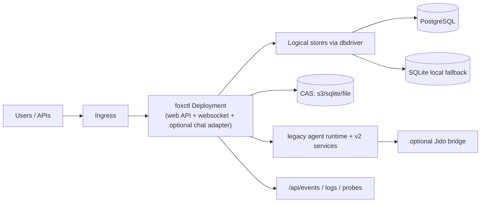

foxctl ships in-repo Kubernetes manifests in `deploy/kubernetes/` with a Kustomize base and overlays for different runtime and storage models.

## Manifest Structure

```
deploy/kubernetes/
  base/                    # Base manifest layer (legacy defaults)
    deployment.yaml        # Main foxctl deployment (3 replicas)
    configmap.yaml         # Base env vars
    secrets.yaml           # Secret references
    service.yaml           # Service exposure
    ingress.yaml           # Ingress routing
    workspace-deployment.yaml  # Optional workspace pod with git-sync
    embedding-worker.yaml  # Background embedding worker
    cronjobs.yaml          # Scheduled maintenance workloads
    rbac.yaml              # Service account and RBAC
    network-policy.yaml    # Network isolation
    pdb.yaml               # Pod disruption budget
    hpa.yaml               # Horizontal pod autoscaler
  overlays/
    local/                 # Single-node dev layout
    postgres/              # Production PostgreSQL + S3 CAS
    public-gui/            # GUI hosting with Better Auth gateway
    public-gui-local/      # Local GUI testing variant
```

## Choosing an Overlay

| Overlay | Use Case | Storage | Probes |
|---------|----------|---------|--------|
| `overlays/local` | Development, single-node testing | SQLite local, emptyDir | exec |
| `overlays/postgres` | Production shared state | PostgreSQL + S3 CAS | HTTP `/healthz`, `/readyz` |
| `overlays/public-gui` | Public `gui-agent` hosting | PostgreSQL + S3 CAS + auth gateway | HTTP |

## Architecture Overview



The web pod is the main entrypoint, serving:

- `/api/*` — application routes
- `/ws/console/*` — websocket connections
- Optional chat adapter ingress (Discord, Telegram, Teams)

## Quick Start

### Local development

```bash
kubectl apply -k deploy/kubernetes/overlays/local
```

This runs a single pod with local state in `emptyDir`, suitable for development and testing.

### Production with PostgreSQL

```bash
kubectl apply -k deploy/kubernetes/overlays/postgres
```

This overlay configures:

- `FOXCTL_DB_DRIVER: "postgres"` with connection from a Kubernetes secret
- `FOXCTL_CAS_DRIVER: "s3"` with S3 bucket and region
- HTTP health probes (`/healthz` for liveness, `/readyz` for readiness)

### Public GUI hosting

```bash
kubectl apply -k deploy/kubernetes/overlays/public-gui
```

Composes the PostgreSQL overlay and fronts the private foxctl service with a Better Auth gateway for public `gui-agent` access.

## Base Manifests

The base manifests in `deploy/kubernetes/base/` provide a working foundation with legacy defaults. **These defaults are not the recommended production setup** — use an overlay to override them.

### Base deployment

The core `deployment.yaml` runs 3 replicas with:

- Security: runs as non-root user (UID 1000), read-only root filesystem, all capabilities dropped
- Resource limits: 256Mi–1Gi memory, 100m–500m CPU
- Probes: exec-based `foxctl health` (liveness) and `foxctl health --ready` (readiness)
- Observability: `FOXCTL_OBS_DIR=/var/log/foxctl` with emptyDir volume
- Pod anti-affinity for availability zone spread
- Graceful shutdown with `foxctl drain` preStop hook

### Base ConfigMap

The base ConfigMap defaults to:

- `FOXCTL_DB_DRIVER: turso` (legacy — production uses `postgres`)
- Older CAS key names (`FOXCTL_CAS_BACKEND`, `FOXCTL_CAS_BUCKET`)

The PostgreSQL overlay replaces these with current keys.

### Base secrets

Secrets referenced by the deployment:

- `turso-url`, `turso-token` — Turso database connection (legacy)
- `embedding-base-url`, `embedding-api-key` — Embedding provider
- `rerank-base-url`, `rerank-api-key` — Reranking provider
- `oauth-enc-key` — OAuth encryption key

### Workspace deployment

`workspace-deployment.yaml` provides an optional dedicated pod with a git-sync sidecar that mounts source code into the foxctl pod's workspace.

### Embedding worker

`embedding-worker.yaml` runs a separate worker deployment for background embedding pipeline operations, with its own resource profile and probe configuration.

## PostgreSQL Overlay

`deploy/kubernetes/overlays/postgres/` updates the base for production use:

### ConfigMap patch

```yaml
FOXCTL_DB_DRIVER: "postgres"
FOXCTL_POSTGRES_MAX_CONNS: "20"
FOXCTL_POSTGRES_REQUIRE_VECTOR: "true"
FOXCTL_CAS_DRIVER: "s3"
FOXCTL_CAS_S3_BUCKET: "foxctl-cas-production"
```

### Deployment patch

- Sets `FOXCTL_POSTGRES_DSN` from a Kubernetes secret
- Replaces exec probes with HTTP probes:
  - `GET /healthz` (liveness)
  - `GET /readyz` (readiness)

This matches the current server behavior where `foxctl web serve` exposes these endpoints at the root level.

## Environment Variables

### Current (preferred)

| Variable | Purpose |
|----------|---------|
| `FOXCTL_DB_DRIVER` | Storage driver: `postgres`, `turso`, or `sqlite` |
| `FOXCTL_POSTGRES_DSN` | PostgreSQL connection string (from secret) |
| `FOXCTL_POSTGRES_MAX_CONNS` | Max database connections |
| `FOXCTL_POSTGRES_REQUIRE_VECTOR` | Require pgvector extension |
| `FOXCTL_CAS_DRIVER` | CAS driver: `s3`, `sqlite`, or `file` |
| `FOXCTL_CAS_S3_BUCKET` | S3 bucket name |
| `FOXCTL_CAS_S3_REGION` | S3 region |
| `FOXCTL_WORKSPACE` | Workspace root path |
| `FOXCTL_STORAGE_ROOT` | Storage root directory |
| `FOXCTL_OBS_DIR` | Observability output directory |
| `FOXCTL_EMBEDDING_PROVIDER` | Embedding provider name |
| `FOXCTL_EMBEDDING_MODEL` | Embedding model name |
| `FOXCTL_EMBEDDING_BASE_URL` | Embedding API base URL |
| `FOXCTL_EMBEDDING_API_KEY` | Embedding API key |
| `FOXCTL_RERANK_PROVIDER` | Reranking provider |
| `FOXCTL_JIDO_*` | Jido orchestration configuration (optional) |

### Legacy (still in base manifests)

| Variable | Replacement |
|----------|-------------|
| `FOXCTL_CAS_BACKEND` | `FOXCTL_CAS_DRIVER` |
| `FOXCTL_CAS_BUCKET` | `FOXCTL_CAS_S3_BUCKET` |

## Chat Adapters in Kubernetes

Chat adapters are selected at runtime via CLI flags, not in manifests:

```bash
foxctl web serve --chat discord
foxctl web serve --chat telegram
foxctl web serve --chat teams
```

For Teams webhooks, the endpoint `POST /api/teams/messages` must be reachable through your ingress and network policies.

## Multi-Pod Operation

For horizontal scaling, you need shared control-plane state:

- **PostgreSQL-backed stores** for sessions, agents, and coordination state
- **S3 CAS** for shared artifact storage
- **PostgreSQL companion turn lock** when available

Local SQLite mode works for dev and small deployments but does not provide shared-state semantics across replicas.

## Health and Readiness

The base manifests use exec probes:

```yaml
livenessProbe:
  exec:
    command: ["foxctl", "health"]
readinessProbe:
  exec:
    command: ["foxctl", "health", "--ready"]
```

The PostgreSQL overlay switches to HTTP probes:

```yaml
livenessProbe:
  httpGet:
    path: /healthz
    port: 8080
readinessProbe:
  httpGet:
    path: /readyz
    port: 8080
```

## Production Checklist

Before deploying to production:

- [ ] Confirm which overlay matches your storage strategy
- [ ] Confirm database driver and secret source are correct
- [ ] Confirm CAS driver and object storage configuration
- [ ] Confirm network policies allow required traffic
- [ ] Confirm observability directory is writable and has retention
- [ ] Confirm resource limits match your workload
- [ ] Verify rollback path before applying new manifests
- [ ] If using chat adapters, confirm the webhook endpoint is reachable

## Jido Orchestration (Optional)

Jido-backed orchestration requires additional `FOXCTL_JIDO_*` environment variables beyond the base manifests. These are not broadly documented in the base manifests yet. Enable only when you need the Jido bridge for advanced orchestration patterns.

## Runtime Notes

The runtime behind the web pod is hybrid:

- Legacy mailbox-driven agent runtime coexists with v2 projection and orchestration surfaces
- Context and observability subsystems run as part of the same process
- The embedding worker can run as a separate deployment for background processing

## Related Documentation

- [System architecture](/architecture/system) — subsystem overview
- [Observability](/operations/observability) — event surfaces and inspection
- [Troubleshooting](/operations/troubleshooting) — common deployment failures
- [CAS and persistence](/storage/cas-and-persistence) — storage backends
